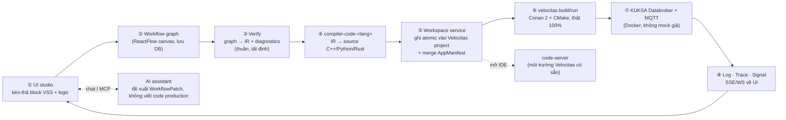
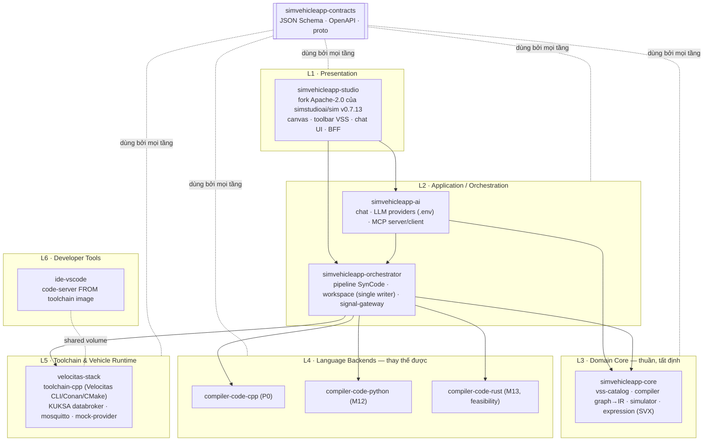

# SimVehicleApp — Vehicle No-Code Toolchain

> Kéo-thả block tín hiệu xe (VSS) thành workflow → biên dịch **tất định** (không qua LLM) sang Eclipse Velocitas Vehicle App (C++ → Python/Rust) → build/run thật trên KUKSA Databroker trong Docker → xem log/trace/tín hiệu realtime trên UI.
> Drag-and-drop vehicle-signal (VSS) blocks into a workflow → compile it **deterministically** (no LLM in the code path) into an Eclipse Velocitas Vehicle App (C++ → Python/Rust) → build & run it for real on a KUKSA Databroker inside Docker → watch logs/traces/live signals back in the UI.

---

## 1. Luồng end-to-end / End-to-end flow



| Bước | Dịch vụ sở hữu | Hợp đồng dữ liệu |
|---|---|---|
| ①→② | `simvehicleapp-studio` | `WorkflowGraph v1` |
| ③ | `simvehicleapp-core` (compiler) | `IR v1` + `Diagnostics v1` |
| ④ | `compiler-code-<lang>` | `GeneratedFileSet v1` |
| ⑤ | `simvehicleapp-orchestrator` (workspace) | Velocitas `AppManifest v3` (merge idempotent) |
| ⑥ | `velocitas-stack` (toolchain) | `Toolchain API v1` (`/jobs`) |
| ⑦→⑧ | `velocitas-stack` + `signal-gateway` | `TraceEvent/LogLine/SignalUpdate v1` |

---

## 2. Kiến trúc phân tầng / Layered architecture



**Nguyên tắc cốt lõi:** mỗi khối ở trên là **một repo con độc lập** (`modules/<tên>`), chỉ phụ thuộc `@simvehicleapp/contracts`, giao tiếp qua HTTP/SSE/WS — không import code chéo module. Đổi ngôn ngữ sinh code = đổi 1 module `compiler-code-<lang>`, không đụng tới studio/core/orchestrator. Chi tiết: [analysis/02-layers-and-modules.md](analysis/02-layers-and-modules.md).

---

## 3. Overview (English)

| | |
|---|---|
| **What it is** | A no-code / low-code studio that turns drag-and-drop logic over **COVESA VSS** vehicle signals into a real, buildable **Eclipse Velocitas** Vehicle App — not a toy simulation. |
| **Golden rule** | `workflow → deterministic compiler → canonical IR → language backend → source code`. LLMs may only *suggest* a `WorkflowPatch` for a human to review; they never touch the code-generation path. |
| **UI foundation** | Fork of [`simstudioai/sim`](https://github.com/simstudioai/sim) `v0.7.13` (Apache-2.0) — keeps the ReactFlow canvas, block registry, auth (Better Auth), realtime collab; drops the AI-agent/SaaS-integration surface (273 stock blocks → 221 deleted, 47 reviewed individually, see [11b](analysis/11b-block-inventory-and-migration.md)) and the proprietary Copilot backend. |
| **Vehicle target** | [Eclipse Velocitas](https://eclipse.dev/velocitas/) `vehicle-app-cpp-template` + `vehicle-app-cpp-sdk 0.7.1`, built with Conan 2 + CMake via the real `velocitas` CLI — no shortcuts, no mocked build. |
| **Signal model** | [COVESA VSS](https://covesa.github.io/vehicle_signal_specification/) v4.0 (1 197 signals: 287 branches, 425 actuators, 379 sensors, 106 attributes), loaded dynamically — changing the VSS release never requires a frontend rebuild. |
| **Runtime** | [Eclipse KUKSA Databroker](https://github.com/eclipse-kuksa/kuksa-databroker) `0.5.0` + Mosquitto MQTT, running for real in Docker; a custom `simvehicleapp-runtime` library (strand-based, no locks in generated code) handles timers, subscriptions, cancellation. |
| **Block catalog** | 9 groups — Trigger, Sensor, Actuator, Attribute, Logic & Math, Flow Control, State, Communication, Composite — 41 new `sv_*` block types, each mapped to a verified-real VSS path and (where relevant) to the Sim UI mechanism it was modelled after. |
| **Execution model** | **Hybrid compile-first**: the same canonical IR drives both a TypeScript **Simulator** (sub-second feedback, virtual clock) and the **native Velocitas binary** (real build/run) — a parity test suite keeps both in lock-step. |
| **Dev environment** | Docker Compose only — no VS Code Dev Container is required to run the studio or build vehicle apps (though an *exported* project still works with one). A `toolchain-cpp` image replays what the Velocitas devcontainer would do, with an offline-capable wheel/Conan/SDK cache. |
| **IDE** | Optional `code-server` (web VS Code) built `FROM` the same toolchain image — open it only when you want to hand-edit generated code or debug. |
| **AI assistant** | A chat panel (not the old Copilot) wired to your own LLM key from `.env` (Anthropic/OpenAI/Gemini/Ollama/OpenAI-compatible) plus an MCP server/client — it proposes workflow patches, it does not write production C++. |
| **Architecture record** | 33 ADRs (`analysis/adr/`), each re-verified against real upstream source (GitHub, npm registry, actual `.clang-format`/schema files) rather than assumption — see the 2026-10-01 review log in the ADR index. |
| **Status (2026-10-02)** | Planning + M0 foundations complete: all 6 technical spikes (headless offline build, databroker↔MQTT wiring, actuator set-semantics, mock-provider, minimal Sim stack, code-server+clangd) **passed against real running containers**, evidence in [`docs/spikes/M0-spikes-report.md`](docs/spikes/M0-spikes-report.md). M1 (studio refactor) has not started yet. |
| **License** | SimVehicleApp's own code: Apache-2.0. Built on Apache-2.0 upstream (Sim, Eclipse Velocitas, Eclipse KUKSA) and MPL-2.0 (COVESA VSS data). The Sim Enterprise (`ee/`) surface and anything AGPL (Scratch) are explicitly excluded — see [ADR-0004](analysis/adr/ADR-0004-license-compliance.md). |

---

## 4. Tổng quan (Tiếng Việt)

| | |
|---|---|
| **Là gì** | Một studio no-code/low-code biến thao tác kéo-thả logic trên tín hiệu xe **COVESA VSS** thành một **Vehicle App Eclipse Velocitas** thật, build/chạy được — không phải mô phỏng cho vui. |
| **Nguyên tắc tối thượng** | `workflow → compiler tất định → IR chuẩn → backend theo ngôn ngữ → mã nguồn`. LLM chỉ được phép *đề xuất* một `WorkflowPatch` để người dùng duyệt; không bao giờ chạm vào đường sinh code. |
| **Nền UI** | Fork từ [`simstudioai/sim`](https://github.com/simstudioai/sim) tag `v0.7.13` (Apache-2.0) — giữ canvas ReactFlow, cơ chế đăng ký block, auth (Better Auth), cộng tác realtime; bỏ toàn bộ bề mặt AI-agent/tích hợp SaaS (273 block gốc → xoá 221, xét riêng 47, xem [11b](analysis/11b-block-inventory-and-migration.md)) và backend Copilot độc quyền. |
| **Đích sinh code** | [Eclipse Velocitas](https://eclipse.dev/velocitas/) `vehicle-app-cpp-template` + `vehicle-app-cpp-sdk 0.7.1`, build bằng Conan 2 + CMake qua đúng CLI `velocitas` thật — không rút gọn, không giả lập build. |
| **Mô hình tín hiệu** | [COVESA VSS](https://covesa.github.io/vehicle_signal_specification/) v4.0 (1 197 tín hiệu: 287 nhánh, 425 actuator, 379 sensor, 106 attribute), nạp động — đổi bản VSS không cần build lại frontend. |
| **Runtime** | [Eclipse KUKSA Databroker](https://github.com/eclipse-kuksa/kuksa-databroker) `0.5.0` + Mosquitto MQTT, chạy thật trong Docker; thư viện `simvehicleapp-runtime` tự viết (dựa strand, code sinh ra không có lock) quản lý timer/subscription/huỷ. |
| **Catalog block** | 9 nhóm — Trigger, Sensor, Actuator, Attribute, Logic & Math, Flow Control, State, Communication, Composite — 41 loại block `sv_*` mới, mỗi loại gắn với 1 path VSS đã verify thật và (nếu có) cơ chế UI của Sim được tham khảo. |
| **Mô hình thực thi** | **Hybrid compile-first**: cùng một IR chuẩn vừa chạy **Simulator** TypeScript (phản hồi dưới 1 giây, đồng hồ ảo) vừa build ra **binary Velocitas thật** — có bộ test "semantic parity" giữ hai bên luôn khớp nhau. |
| **Môi trường dev** | Chỉ Docker Compose — không cần VS Code Dev Container để chạy studio hay build vehicle app (dù project **export ra** vẫn mở được bằng devcontainer). Image `toolchain-cpp` tái hiện đúng những gì devcontainer Velocitas làm, có cache offline (wheel/Conan/SDK). |
| **IDE** | `code-server` (VS Code chạy trên web) tuỳ chọn, build `FROM` cùng image toolchain — chỉ mở khi cần sửa tay code đã sinh hoặc debug. |
| **AI assistant** | Khung chat (thay Copilot cũ) gắn API key LLM riêng từ `.env` (Anthropic/OpenAI/Gemini/Ollama/OpenAI-compatible) cộng MCP server/client — chỉ đề xuất patch workflow, không viết C++ production. |
| **Hồ sơ kiến trúc** | 33 ADR (`analysis/adr/`), mỗi cái đã verify lại bằng source thật (GitHub, npm registry, file `.clang-format`/schema thật) thay vì suy đoán — xem log review 2026-10-01 trong mục lục ADR. |
| **Trạng thái (2026-10-02)** | Đã xong giai đoạn phân tích + nền tảng M0: cả 6 spike kỹ thuật (build offline không devcontainer, app nối databroker/MQTT, hành vi set() actuator, mock-provider, Sim chạy tối giản, code-server+clangd) **đã PASS trên container chạy thật**, bằng chứng ở [`docs/spikes/M0-spikes-report.md`](docs/spikes/M0-spikes-report.md). M1 (refactor studio) chưa bắt đầu. |
| **License** | Code riêng của SimVehicleApp: Apache-2.0. Dựa trên upstream Apache-2.0 (Sim, Eclipse Velocitas, Eclipse KUKSA) và MPL-2.0 (dữ liệu COVESA VSS). Bề mặt Sim Enterprise (`ee/`) và mọi thứ AGPL (Scratch) đều bị loại trừ tường minh — xem [ADR-0004](analysis/adr/ADR-0004-license-compliance.md). |

---

## 5. Cấu trúc thư mục / Repository layout

```
.
├── README.md  AGENTS.md  CLAUDE.md          # anh/chị đang đọc file này; AGENTS.md = luật cho AI coding agent
├── .claude/skills/                          # 14 skill chuyên biệt cho agent (xem AGENTS.md §3)
├── analysis/                                # 83 file: nghiên cứu, kiến trúc, 33 ADR, kế hoạch 15 milestone
│   ├── 00…16-*.md                           # research → requirements → architecture → … → roadmap → risks
│   ├── 11b-block-inventory-and-migration.md # kiểm kê 268 block Sim thật, giữ/xoá/tham khảo
│   ├── adr/ADR-0001…0042-*.md               # quyết định kiến trúc, mỗi cái có Context/Decision/Verification
│   ├── modules/*.md                         # đặc tả từng repo con
│   └── phases/M00…M14-*.md                  # task chi tiết + acceptance gate mỗi milestone
├── docs/
│   ├── BASELINE.md                          # SHA/digest mọi thành phần upstream đã pin
│   └── spikes/M0-spikes-report.md           # kết quả 6 spike kỹ thuật đã verify thật
├── docker-compose.yml                       # entrypoint duy nhất — chỉ include fragment từng module
├── modules/                                 # mỗi thư mục = 1 "repo" độc lập (xem ADR-0009)
│   ├── simvehicleapp-studio/                # fork Sim v0.7.13 (snapshot thật, 12 226 file)
│   ├── simvehicleapp-core/ · simvehicleapp-orchestrator/ · simvehicleapp-ai/ · simvehicleapp-contracts/
│   ├── compiler-code-cpp/ · compiler-code-python/ · compiler-code-rust/
│   ├── velocitas-stack/                     # toolchain image + template Velocitas vendored + databroker/mqtt
│   └── ide-vscode/                          # code-server FROM toolchain
├── scripts/sv                               # build | up | down | smoke | reset-caches
└── vehicle_no_code_studio_master_plan_v2.md # master plan gốc (tham chiếu lịch sử)
```

## 6. Bắt đầu (dev phase) / Getting started (dev phase)

```bash
cp .env.example .env            # chỉnh port nếu trùng máy đang dùng / adjust ports if already taken
scripts/sv build                # build image theo đúng thứ tự phụ thuộc / build images in dependency order
scripts/sv up                   # docker compose up -d
scripts/sv smoke                # S-1/S-2/S-3: tạo project offline → build → chạy app ↔ databroker/MQTT
```

> Giai đoạn hiện tại chỉ có hạ tầng (`velocitas-stack`, `ide-vscode`, snapshot `simvehicleapp-studio`) — chưa có UI vehicle thật (bắt đầu từ M1). Chi tiết lệnh/bẫy đã gặp: [`.claude/skills/docker-compose-stack/SKILL.md`](.claude/skills/docker-compose-stack/SKILL.md).

## 7. Đọc tiếp / Where to go next

| Vai trò | Đọc |
|---|---|
| Muốn hiểu toàn bộ hệ thống | [`analysis/README.md`](analysis/README.md) — bản đồ 83 tài liệu |
| Muốn xem kế hoạch triển khai | [`analysis/13-implementation-roadmap.md`](analysis/13-implementation-roadmap.md) — M0→M14 |
| Muốn xem mọi quyết định kiến trúc | [`analysis/adr/README.md`](analysis/adr/README.md) — 33 ADR + cây phụ thuộc |
| AI coding agent | [`AGENTS.md`](AGENTS.md) — luật cứng + quy trình + skill |

## 8. License

SimVehicleApp's own code is licensed **Apache-2.0** unless a module states otherwise. It builds on Apache-2.0 upstream software from Sim Studio, Inc. (`simstudioai/sim`), the Eclipse Velocitas and Eclipse KUKSA projects, and MPL-2.0 data from COVESA VSS. See each module's `NOTICE` file for full attribution; see [ADR-0004](analysis/adr/ADR-0004-license-compliance.md) for the license-compliance policy (no Sim Enterprise code, no AGPL/Scratch code, Open VSX-only editor extensions).
