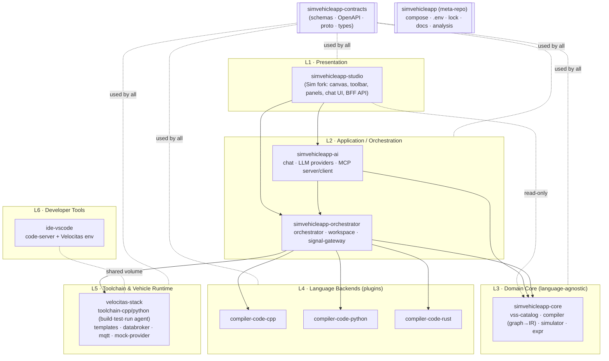
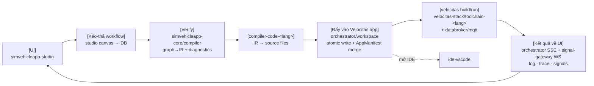

# 02 — Kiến trúc phân tầng & Module độc lập (multi-repo trong 1 hệ thống)

> Trả lời yêu cầu FR-PLT-03/04/05: *backend nhiều tầng, mỗi tầng/khối (`compiler-code-<lang>`, VS Code IDE, Velocitas…) là **repo con độc lập** nhưng **có đầy đủ trong hệ thống***.
> Quyết định dev hiện hành: [ADR-0009](adr/ADR-0009-dev-phase-module-folders.md); release: [ADR-0002](adr/ADR-0002-meta-repo-and-submodules.md), [ADR-0007](adr/ADR-0007-service-decomposition-and-contracts.md).
> Chi tiết từng module: thư mục [modules/](modules/README.md).

---

## 1. Nguyên tắc

1. **Một module = một ranh giới độc lập**. Dev: thư mục `modules/<m>` trong một repo; release: tách repo git theo ADR-0009.
2. **Root `docker-compose.yml`** include fragment của module đã hiện thực. Release thêm **git submodule** pin SHA + `simvehicleapp.lock.yaml`; hiện chưa có lock/scripts release. Module placeholder chưa phải service chạy được.
3. **Module chỉ phụ thuộc vào contract, không phụ thuộc code của nhau.** Contract nằm ở module `simvehicleapp-contracts` (JSON Schema + OpenAPI + proto + generated types). Mỗi module khai báo version contract nó hỗ trợ.
4. **Giao tiếp runtime qua mạng** (HTTP/JSON, SSE/WebSocket, gRPC tới KUKSA), không qua import thư viện chéo module.
5. **Phụ thuộc chỉ đi xuống** theo tầng (L1 → L6). Không có phụ thuộc ngược.
6. **Thay thế được (swappable):** một module có thể thay bằng implementation khác nếu tuân contract (ví dụ `compiler-code-cpp` ↔ `compiler-code-python`; `ide-vscode` ↔ IDE khác).

---

## 2. Các tầng (Layers)



| Tầng | Trách nhiệm | KHÔNG được làm |
|---|---|---|
| **L1 Presentation** | Canvas, toolbar VSS, property panel, Run console, Signal monitor, Chat UI; BFF route `/api/sv/*` proxy xuống L2/L3 | Không chứa logic compile, không biết C++/Python, không ghi filesystem workspace |
| **L2 Application** | Điều phối pipeline SynCode, quản lý project/generation/run, ghi workspace (single writer), stream tín hiệu; AI agent loop | Không tự sinh code ngôn ngữ; không build trực tiếp |
| **L3 Domain Core** | VSS catalog, validate, IR, diagnostics, simulator — **thuần, tất định, không I/O ngoài** | Không biết ngôn ngữ đích, không biết Docker |
| **L4 Backends** | IR → file set cho 1 ngôn ngữ + runtime library ngôn ngữ đó + overlay template | Không ghi đĩa (trả về nội dung file), không gọi mạng, không gọi LLM |
| **L5 Toolchain & Runtime** | Velocitas CLI/Conan/CMake build, test, run app; KUKSA databroker, MQTT, mock provider | Không biết workflow/IR; chỉ nhận "build project X", "run artifact Y" |
| **L6 Dev Tools** | IDE web trên cùng workspace, có sẵn toolchain | Không phải nguồn sự thật; không được Sim gọi API để tạo file |

---

## 3. Danh sách repo con (module)

| # | Repo | Tầng | Container(s) | Ngôn ngữ | Owner contract |
|---|---|---|---|---|---|
| 0 | `simvehicleapp` (meta) | infra | — (compose root) | YAML/Markdown | `simvehicleapp.lock.yaml` |
| 1 | `simvehicleapp-contracts` | shared | — (package npm/pypi/crate) | JSON Schema, OpenAPI, proto | tất cả schema |
| 2 | `simvehicleapp-studio` | L1 | `studio`, `realtime`, `migrations` | TS (Next.js/Bun) | BFF API |
| 3 | `simvehicleapp-core` | L3 | `vss-catalog`, `compiler` | TS (Bun) | Catalog API, Compiler API, IR |
| 4 | `simvehicleapp-orchestrator` | L2 | `orchestrator`, `workspace`, `signal-gateway` | TS (Bun) | Orchestrator API, Workspace API, Signal WS |
| 5 | `simvehicleapp-ai` | L2 | `ai-assistant` | TS (Bun) | Chat API, MCP server |
| 6 | `compiler-code-cpp` | L4 | `codegen-cpp` | TS (generator) + C++ (runtime) | Backend Plugin API |
| 7 | `compiler-code-python` | L4 | `codegen-python` | TS + Python | Backend Plugin API |
| 8 | `compiler-code-rust` | L4 | `codegen-rust` | TS + Rust | Backend Plugin API |
| 9 | `velocitas-stack` | L5 | `toolchain-cpp`, `toolchain-python`, `databroker`, `mqtt`, `mock-provider` | Dockerfile + Bun agent | Toolchain API |
| 10 | `ide-vscode` | L6 | `ide-cpp` (/`ide-python`) | Dockerfile + settings | IDE URL contract |

> Vì sao tách `compiler-code-<lang>` khỏi `velocitas-stack`? — Codegen là **logic thuần** (thay đổi thường xuyên, test nhanh, image nhỏ), còn toolchain là **môi trường nặng** (image vài GB, thay đổi theo version Velocitas). Tách ra để: nâng cấp Velocitas không phải release lại generator và ngược lại; IDE dùng lại toolchain image mà không kéo theo generator.

---

## 4. Ma trận phụ thuộc (được phép ✔ / cấm ✘)

| từ \ tới | contracts | studio | core | orchestrator | ai | compiler-code-* | velocitas-stack | ide |
|---|---|---|---|---|---|---|---|---|
| studio | ✔ | — | ✔ (HTTP, read) | ✔ (HTTP) | ✔ (HTTP/SSE) | ✘ | ✘ | ✔ (chỉ mở URL) |
| core | ✔ | ✘ | — | ✘ | ✘ | ✘ | ✘ | ✘ |
| orchestrator | ✔ | ✘ | ✔ | — | ✘ | ✔ (HTTP) | ✔ (HTTP) | ✘ |
| ai | ✔ | ✘ | ✔ | ✔ | — | ✘ | ✘ | ✘ |
| compiler-code-* | ✔ | ✘ | ✘ | ✘ | ✘ | — | ✘ | ✘ |
| velocitas-stack | ✔ | ✘ | ✘ | ✘ | ✘ | ✘ | — | ✘ |
| ide | ✘ | ✘ | ✘ | ✘ | ✘ | ✘ | ✔ (FROM image) | — |

Enforce: mỗi repo có CI job `contract-only-deps` kiểm tra `package.json`/`Cargo.toml`/`requirements` không phụ thuộc module khác ngoài `@simvehicleapp/contracts`.

---

## 5. Cấu trúc meta-repo `simvehicleapp`

> **Cập nhật 2026-10-01 ([ADR-0009](adr/ADR-0009-dev-phase-module-folders.md)):** trong giai đoạn dev, `modules/*` là **thư mục thường** trong một repo (không submodule), mỗi module có compose fragment riêng; compose gốc là **`docker-compose.yml`** ở root (thay cho thư mục `compose/`). Submodule + lock bên dưới là đích **release v1.0**; Compose tiếp tục dùng root include fragment do từng module sở hữu theo ADR-0009.

```
simvehicleapp/                         # = thư mục hiện tại (vehicle-no-code-studio)
├── README.md  AGENTS.md  CLAUDE.md
├── .claude/skills/                 # skill cho AI agent (xem ../.claude/skills)
├── analysis/                       # bộ phân tích & kế hoạch (tài liệu này)
├── docs/                           # BASELINE.md, ADR đã chấp nhận (copy từ analysis/adr khi Accepted), runbooks
├── simvehicleapp.lock.yaml            # version + git SHA + image digest của mọi module
├── docker-compose.yml             # include fragment của từng module
│                                  # config runtime nằm trong module sở hữu
├── .env.example
├── modules/                        # git submodules (mỗi thư mục là 1 repo độc lập)
│   ├── simvehicleapp-contracts/
│   ├── simvehicleapp-studio/
│   ├── simvehicleapp-core/
│   ├── simvehicleapp-orchestrator/
│   ├── simvehicleapp-ai/
│   ├── compiler-code-cpp/
│   ├── compiler-code-python/
│   ├── compiler-code-rust/
│   ├── velocitas-stack/
│   └── ide-vscode/
├── tests/e2e/                      # E2E xuyên module (Playwright + API)
└── scripts/ (bootstrap.sh, modules.sh sync|status|bump, lock-verify.sh)
```

### 5.1 `simvehicleapp.lock.yaml` (định dạng)
```yaml
lockVersion: 1
contracts: { version: 1.0.0 }
modules:
  simvehicleapp-studio:   { git: https://…/simvehicleapp-studio.git,   sha: <sha>, version: 0.1.0, image: ghcr.io/…/studio@sha256:… }
  compiler-code-cpp:   { git: …, sha: <sha>, version: 0.1.0, contracts: ">=1.0 <2.0", irVersions: ">=1.0 <2.0" }
  velocitas-stack:     { git: …, sha: <sha>, version: 0.1.0, velocitas: { cliVersion: v0.13.2, cppSdk: 0.7.1, databroker: 0.5.0 } }
upstream:
  sim: { repo: simstudioai/sim, tag: v0.7.13, sha: ad0b8678b5dc4b6d5703481d567f29c9facc6f67 }
  vehicle-app-cpp-template: { sha: 275e858e3de8f43d6b4c71a389e358dffe73b42b }
  vehicle-app-python-template: { sha: e7082f75d1831489462f6672b6858f7ea7708256 }
```
`scripts/lock-verify.sh` (CI): kiểm tra submodule SHA == lock, contract range tương thích (semver), image digest tồn tại.

### 5.2 Chuẩn tối thiểu cho mọi repo con ("Module Contract Checklist")
- `README.md`, `CONTRACT.md` (API/schema cung cấp & tiêu thụ + version), `CHANGELOG.md`, `LICENSE` (Apache-2.0), `NOTICE`.
- `Dockerfile` (nếu có container) + healthcheck `GET /healthz` + `GET /version` trả `{name, version, contracts, commit}`.
- `AGENTS.md` riêng của module (quy tắc local) + test chạy được độc lập (`bun test` / `ctest` / `pytest`).
- CI: lint, unit test, contract test (validate request/response với schema từ `simvehicleapp-contracts`), build image.
- Semver; breaking contract ⇒ bump major contract + ADR.

---

## 6. Luồng PO ánh xạ vào module



Mỗi mũi tên là một contract có version trong `simvehicleapp-contracts`:
| Mũi tên | Contract |
|---|---|
| B→C | `WorkflowGraph v1` (JSON Schema, dạng chuẩn hoá từ Sim BlockState/Edge) |
| C→D | `IR v1` (JSON Schema) + `Diagnostics v1` |
| D→E | `GeneratedFileSet v1` + `BackendCapabilities v1` |
| E→F | `Toolchain API v1` (`/jobs` build/test/run) |
| F→G | `TraceEvent v1`, `LogLine v1`, `SignalUpdate v1` |
| AI | `WorkflowPatch v1`, MCP tool schemas |
