# 03 — Thiết kế tổng thể hệ thống (System Architecture)

> Bản vẽ tổng thể theo C4 (Context → Container → Component) + sequence cho các luồng chính.
> Tầng & module: [02-layers-and-modules](02-layers-and-modules.md). Hạ tầng compose: [12-docker-compose-and-infra](12-docker-compose-and-infra.md).

---

## 1. C4 — System Context

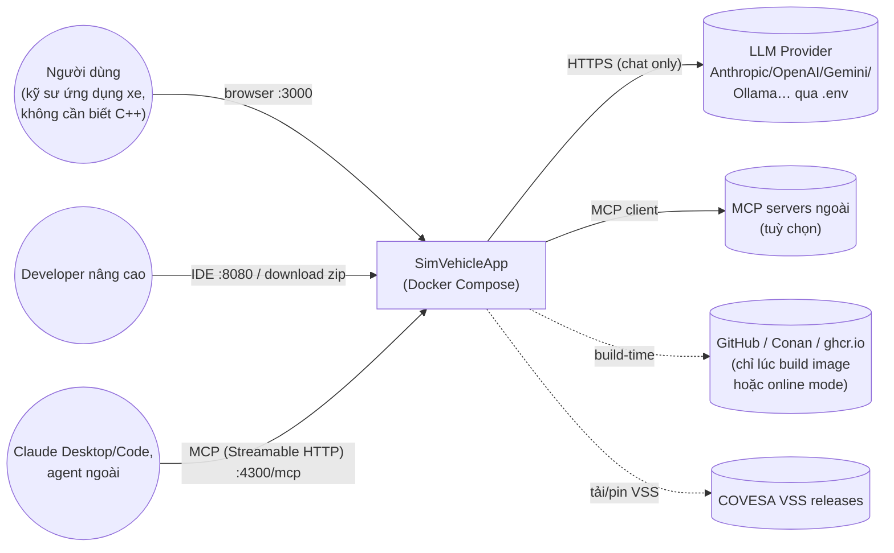

---

## 2. C4 — Container diagram

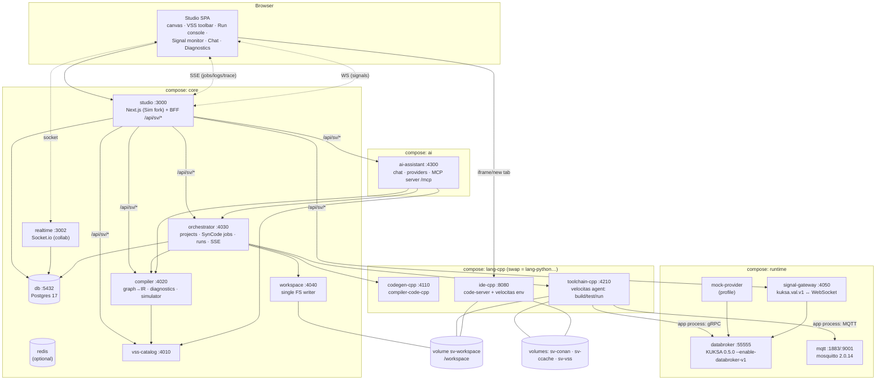

### 2.1 Bảng container
| Container | Module | Port (host bind 127.0.0.1) | Trách nhiệm | State |
|---|---|---|---|---|
| studio | simvehicleapp-studio | 3000 | UI + auth + lưu workflow (Sim DB) + BFF proxy | db |
| realtime | simvehicleapp-studio | 3002 | Socket collab của Sim | db |
| migrations | simvehicleapp-studio | — | Drizzle migrate (Sim + schema `sv`) | — |
| db | infra | 5432 (internal) | Postgres | `postgres_data` |
| vss-catalog | simvehicleapp-core | 4010 | Parse/cached VSS, tree/search/node API, modelHash | `sv-vss` |
| compiler | simvehicleapp-core | 4020 | Normalize graph, validate, IR, diagnostics, simulate | stateless |
| orchestrator | simvehicleapp-orchestrator | 4030 | Project, Generation, Run lifecycle; job queue; SSE | db (schema `sv`) |
| workspace | simvehicleapp-orchestrator | 4040 | Tạo project từ template, staging, atomic commit, AppManifest merge, zip export | `sv-workspace` |
| signal-gateway | simvehicleapp-orchestrator | 4050 | Subscribe/set VSS trên databroker, WS cho UI | stateless |
| codegen-cpp | compiler-code-cpp | 4110 | IR → C++ file set (thuần) | stateless |
| toolchain-cpp | velocitas-stack | 4210 | Agent chạy `velocitas`/Conan/CMake: init, build, test, run app, stream log | `sv-workspace`, `sv-conan`, `sv-ccache` |
| ide-cpp | ide-vscode | 8080 | code-server trên `/workspace/projects` | `sv-workspace`, `sv-ide-home` |
| databroker | velocitas-stack | 55555 | KUKSA Databroker | — |
| mqtt | velocitas-stack | 1883, 9001 | Mosquitto | — |
| mock-provider | velocitas-stack | — | Provider giả lập actuator/sensor (profile `mock`) | — |
| ai-assistant | simvehicleapp-ai | 4300 | Chat, agent loop, MCP server + client | db (schema `sv_ai`) |

---

## 3. Component view (các container quan trọng)

### 3.1 `compiler` (simvehicleapp-core)
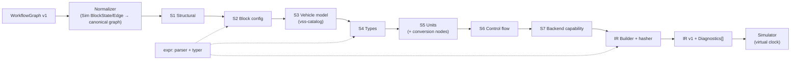

### 3.2 `orchestrator` (simvehicleapp-orchestrator)
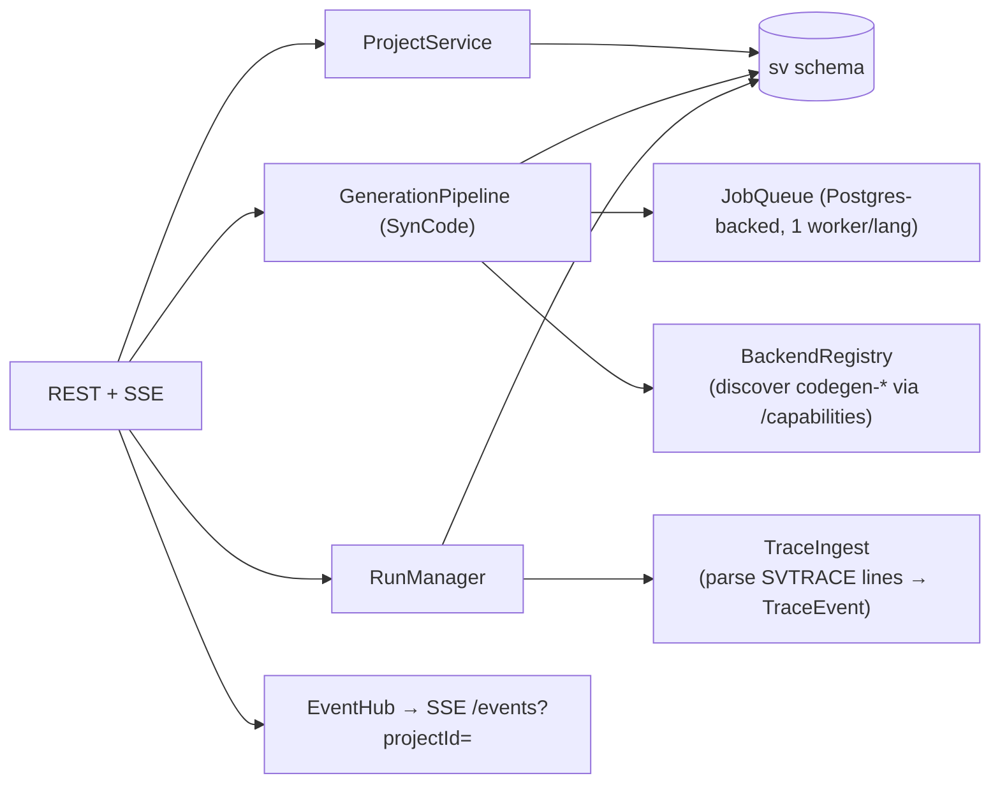

### 3.3 `toolchain-<lang>` agent (velocitas-stack)
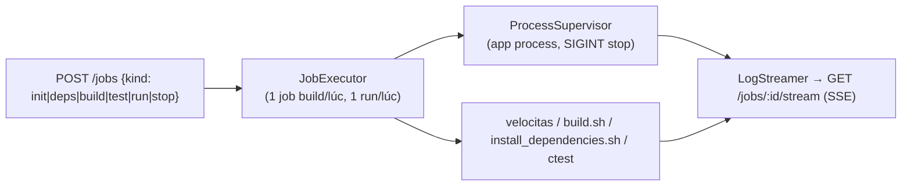

---

## 4. Luồng chính (Sequence)

### 4.1 Verify (validate nhanh — không build)
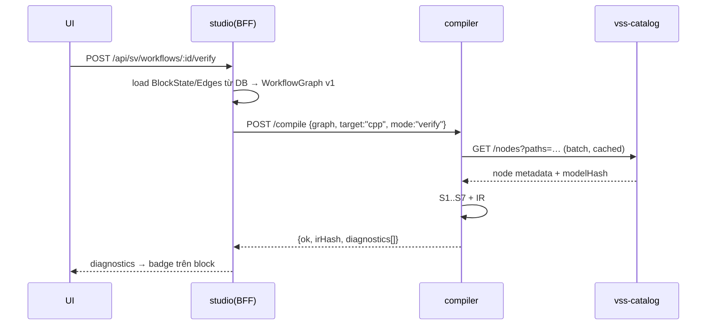

### 4.2 SynCode (generate → workspace → build → test)
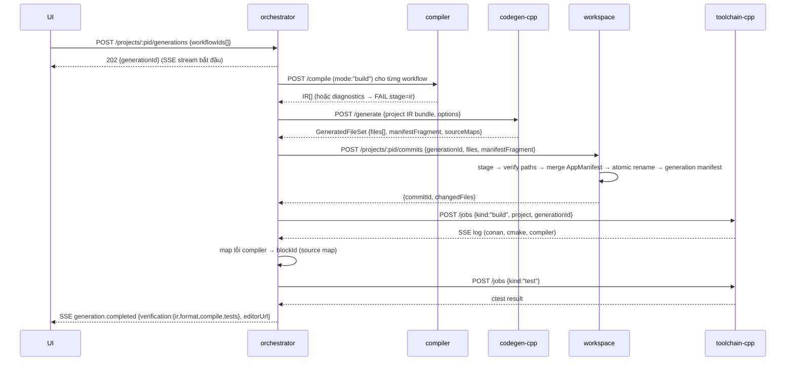

### 4.3 Live Run (headless, không mở IDE)
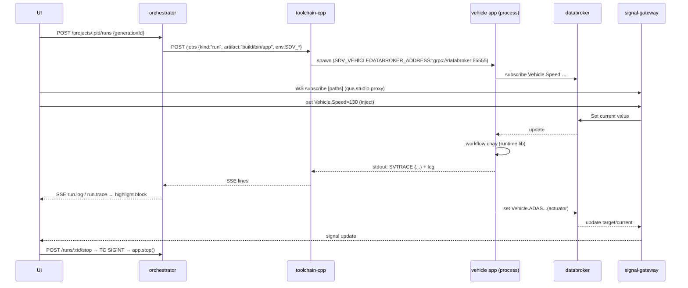

### 4.4 Simulate (không build, chạy IR)
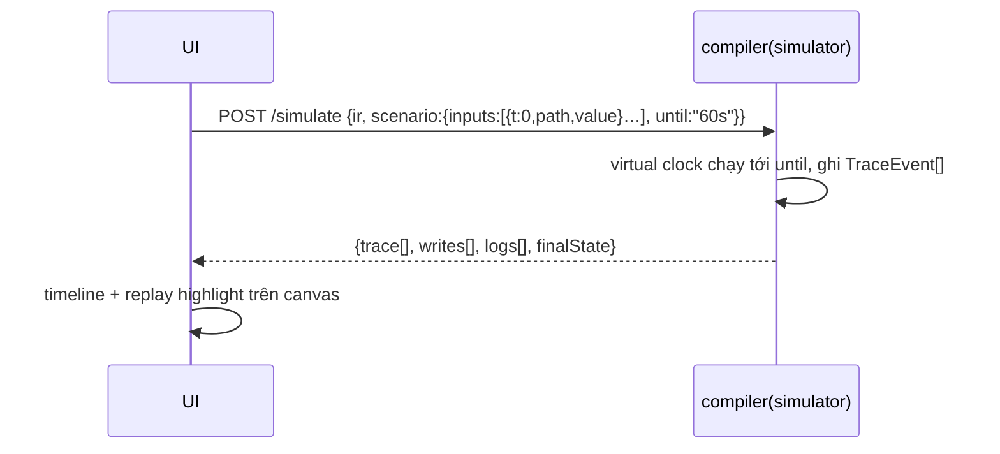

### 4.5 AI Chat tạo workflow
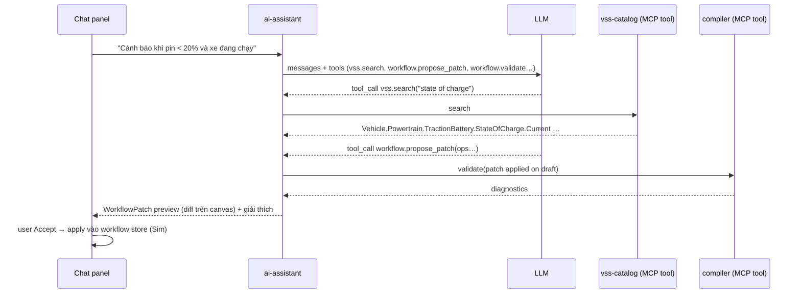

---

## 5. Mô hình dữ liệu (schema `sv` trong Postgres)

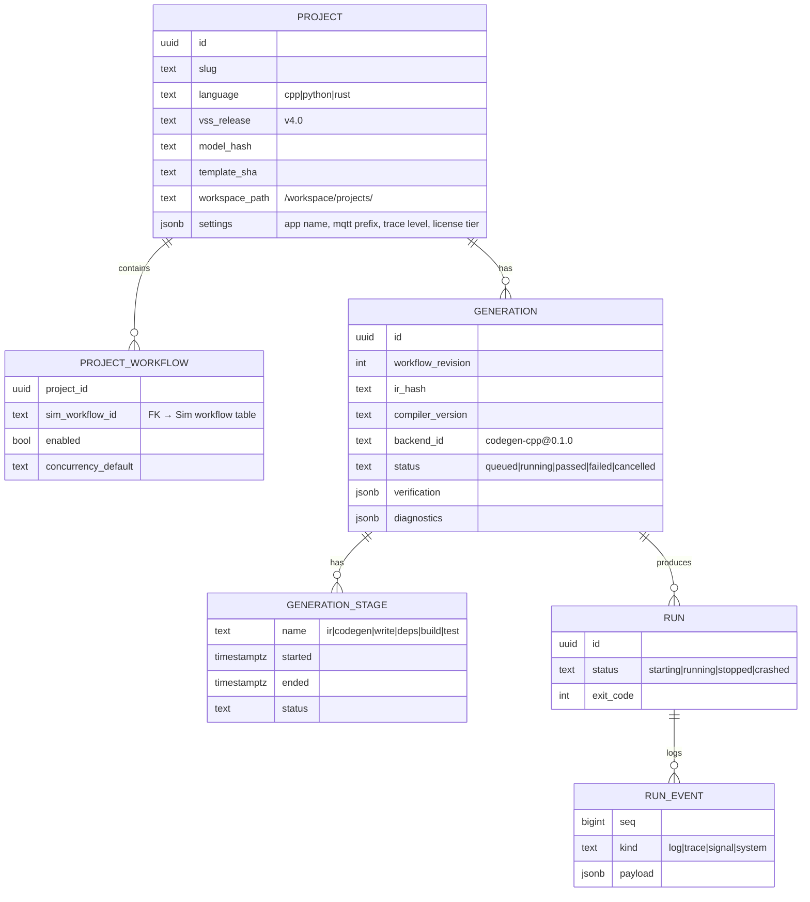
- Workflow graph **vẫn lưu ở bảng của Sim** (không nhân bản). `sv` chỉ lưu metadata project/generation/run.
- `RUN_EVENT` lưu có giới hạn (ring buffer 50k dòng/run, cấu hình).

---

## 6. Workspace layout (volume `sv-workspace`)

```
/workspace
├── projects/
│   └── <slug>/                        # = một Velocitas vehicle app (copy từ template pin)
│       ├── .velocitas.json            # đọc-chỉ với SimVehicleApp (chỉ tạo 1 lần lúc init)
│       ├── conanfile.txt  CMakeLists.txt  build.sh  install_dependencies.sh  requirements.txt
│       ├── app/
│       │   ├── AppManifest.json       # merge có kiểm soát
│       │   ├── CMakeLists.txt
│       │   ├── src/
│       │   │   ├── CMakeLists.txt     # overlay 1 lần: include(generated/generated.cmake) + user/
│       │   │   ├── generated/         # DO NOT EDIT — sở hữu bởi SynCode
│       │   │   ├── user/              # hook người dùng, không bao giờ bị ghi đè
│       │   │   └── simvehicleapp-runtime/# vendored runtime lib (pin version)
│       │   └── tests/ (utests/ + generated/)
│       ├── .simvehicleapp/project.json   # metadata project (id, language, versions)
│       └── build-linux-x86_64/ … build/   # output toolchain (không commit)
├── .sv/staging/<generationId>/        # staging nội bộ workspace-service
├── .sv/generations/<slug>/<generationId>.json
└── exports/<slug>-<generationId>.zip
```

---

## 7. API bề mặt (tóm tắt; schema đầy đủ trong `simvehicleapp-contracts`)

| Service | Endpoint | Mô tả |
|---|---|---|
| vss-catalog | `GET /releases`, `GET /tree?release=&prefix=&depth=`, `GET /search?q=&type=`, `GET /nodes?paths=`, `GET /model-hash?release=` | Toolbar & validator dùng chung |
| compiler | `POST /compile`, `POST /simulate`, `POST /lint`, `GET /blocks` (catalog block definitions), `GET /opcodes` | thuần |
| codegen-* | `GET /capabilities`, `POST /generate`, `GET /runtime/files`, `GET /template-overlay/files` | Backend Plugin contract (ADR-0020 §2) |
| workspace | `POST /projects` (init từ template), `POST /projects/:slug/commits`, `GET /projects/:slug/tree`, `POST /projects/:slug/export`, `POST /projects/:slug/rollback` | single writer |
| toolchain-* | `POST /jobs`, `GET /jobs/:id`, `GET /jobs/:id/stream`, `POST /jobs/:id/cancel` | build/test/run |
| orchestrator | `/projects`, `/projects/:id/generations`, `/projects/:id/runs`, `/events` (SSE) | ứng dụng |
| signal-gateway | `WS /signals` (subscribe/set/unsubscribe), `GET /snapshot?paths=` | realtime |
| ai-assistant | `POST /chat` (SSE stream), `GET /conversations`, `/mcp` (MCP Streamable HTTP) | AI |
| studio BFF | `/api/sv/*` → proxy có auth tới các service trên | biên giới bảo mật |

Tất cả service nội bộ **chỉ nghe trên network compose** (không publish port), trừ `studio`, `ide-*`, (tuỳ chọn) `ai-assistant/mcp` — và đều bind `127.0.0.1` mặc định.
