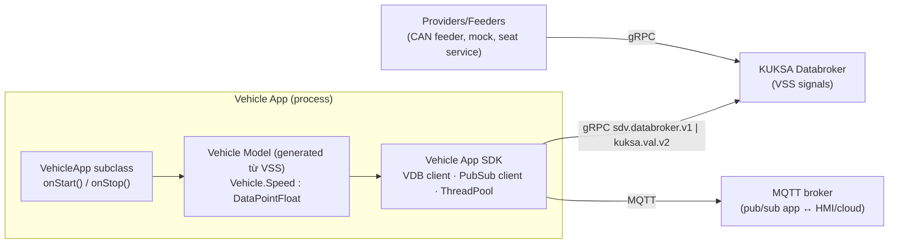

# 04 — Velocitas Deep Dive: Vehicle App hoạt động thế nào & no-code ánh xạ ra sao

> Mục tiêu: hiểu đủ sâu cấu trúc Velocitas Vehicle App để no-code **sinh ra code đúng như một developer Velocitas viết tay**.
> Dữ kiện nguồn: [00-research-findings §3](00-research-findings.md#3-eclipse-velocitas--cấu-trúc-thật). Quyết định: [ADR-0021](adr/ADR-0021-cpp-runtime-library.md), [ADR-0022](adr/ADR-0022-cpp-codegen-strategy.md), [ADR-0023](adr/ADR-0023-velocitas-project-layout-and-manifest.md), [ADR-0024](adr/ADR-0024-databroker-api-and-runtime-stack.md).

---

## 1. Mô hình Velocitas



- **VSS** = ngữ nghĩa dữ liệu xe (cây `Vehicle.*`). **Databroker** = nơi giữ giá trị hiện tại, phân phối subscribe, chuyển tiếp actuation tới provider.
- **Vehicle model** được sinh từ VSS (component `vehicle-signal-interface` → Conan package `vehicle-model/generated` cho C++, `gen/vehicle_model` cho Python). Tên member **trùng từng đoạn VSS path**: `Vehicle.Cabin.Seat.Row1.DriverSide.Position`.
- **AppManifest v3** khai báo các interface app cần: `vehicle-signal-interface` (datapoints required/provided + VSS src), `pubsub` (reads/writes topics), `grpc-interface` (proto + methods).
- **App lifecycle**: `main()` tạo app → `run()` → SDK kết nối databroker → gọi `onStart()` → app đăng ký subscription / topic → chạy tới khi `stop()` (SIGINT/SIGTERM).

---

## 2. Các pattern lập trình Velocitas & cách block ánh xạ

| Pattern (dev viết tay) | C++ SDK 0.7.1 | Python SDK 0.15.7 | Block SimVehicleApp | IR opcode |
|---|---|---|---|---|
| **Event: signal đổi** | `subscribeDataPoints(QueryBuilder::select(Vehicle.Speed).build())->onItem(cb)` | `await self.Vehicle.Speed.subscribe(cb)` | Trigger *On Signal Changed* | `event.signal_changed` |
| Event với điều kiện phía broker | `QueryBuilder::select(dp).where(dp).gt(x)` (chỉ sdv v1) | `.where("…")` | (không dùng — xem §4) | — |
| **Read 1 lần (await)** | `Vehicle.Speed.get()->await().value()` | `(await self.Vehicle.Speed.get()).value` | Sensor *Read Signal* | `vehicle.read` |
| **Write actuator** | `Vehicle.X.set(v)->await()` | `await self.Vehicle.X.set(v)` | Actuator *Set* | `vehicle.write` |
| **Batch write** | `Vehicle.setMany().add(a,v).add(b,w).apply()->await()` | (lặp set) | Actuator *Set Many* | `vehicle.write_many` |
| **Pub/Sub nhận** | `subscribeToTopic(t)->onItem(cb)` | `@subscribe_topic(t)` | Trigger *On MQTT Message* | `event.mqtt_message` |
| **Pub/Sub gửi** | `publishToTopic(t, json)` | `await self.publish_event(t, json)` | *MQTT Publish*, *HMI Notify* | `comm.mqtt_publish` |
| **Timer định kỳ** | `ThreadPool::enqueue(RecurringJob…)` hoặc thread riêng | `asyncio` task + `sleep` | Trigger *Every N ms* | `event.timer` |
| **Delay** | `Job::create(fn, delay)` | `await asyncio.sleep()` | *Wait* | `control.wait` |
| **Polling** (đọc định kỳ) | timer + `get()` | loop + `get()` | *Every* + *Read* (có lint gợi ý dùng subscribe) | `event.timer`+`vehicle.read` |
| **Logging** | `velocitas::logger().info(...)` | `logger.info(...)` | *Log* | `comm.log` |
| **State giữa các event** | member variable | attribute | *Variable* get/set | `state.get/set` |
| **Lỗi async** | `->onError(cb)`, `AsyncException` | exception | (runtime xử lý, block có output `error`) | — |

> Kết luận: **mọi thứ trong Vehicle App là event-driven** (callback từ subscription/topic/timer). Workflow no-code = tập các *handler* gắn vào trigger, bên trong có thể có chờ (delay/stable/wait-until) → cần một **runtime quản lý "run instance"** (giống thread của Scratch, coroutine của Python) — đây là lý do có Runtime Library ([ADR-0021](adr/ADR-0021-cpp-runtime-library.md)).

---

## 3. Vấn đề đồng thời trong C++ SDK & giải pháp

- Callback `onItem` được SDK gọi trên thread gRPC/ThreadPool; hai subscription có thể bắn **song song** → dev viết tay thường quên mutex → race.
- `get()->await()` **chặn** thread đang gọi; gọi trong callback có thể giữ thread của pool.

**Giải pháp SimVehicleApp (runtime):**
1. Mọi callback SDK chỉ làm một việc: `strand.post(event)`.
2. **Một strand (event loop 1 thread) cho mỗi app** chạy toàn bộ logic workflow → code sinh ra **không cần lock**, thứ tự sự kiện tất định.
3. Thao tác I/O (get/set) gọi **bất đồng bộ**: runtime dùng `AsyncResult` callback của SDK (`onResult`/`onError`) rồi post kết quả về strand; generated code viết theo kiểu *continuation* (state machine) — không bao giờ `await()` trên strand.
4. Timer do runtime quản lý (min-heap theo `steady_clock` trên chính strand) — có thể thay bằng virtual clock trong test.

---

## 4. Quyết định về subscribe & điều kiện
- **Không đẩy điều kiện `WHERE` xuống broker**: `kuksa.val.v2` **không hỗ trợ query có WHERE** (SDK báo lỗi "Queries (containing WHERE clauses) not allowed with kuksa.val.v2"). Để tương thích cả hai API, điều kiện (rising/falling/threshold) được đánh giá trong runtime.
- Nhiều trigger cùng một path ⇒ runtime **gộp thành 1 subscription** và fan-out.
- `event.signal_changed` có `debounceMs` và `mode ∈ {any, rising, falling, crosses_above(x), crosses_below(x), becomes(value)}`.

---

## 5. Databroker API: v1 hay v2? (tóm tắt ADR-0024)
| Tiêu chí | `sdv.databroker.v1` (mặc định SDK) | `kuksa.val.v2` (`KUKSA_DATABROKER_API=kuksa.val.v2`) |
|---|---|---|
| Hỗ trợ C++ SDK | ✔ | ✔ |
| Hỗ trợ Python SDK 0.15.7 | ✔ | ✘ |
| `set()` actuator | ghi trực tiếp (không cần provider) | `Actuate` → **cần provider** đăng ký, nếu không `UNAVAILABLE` |
| Tương lai | deprecated | được phát triển |
**Chọn cho MVP:** `sdv.databroker.v1` trên databroker `0.5.0` với `--enable-databroker-v1` (đúng cấu hình Velocitas runtime-local). Chuẩn bị migration sang v2 (mock-provider đăng ký actuator) ở P2.

> **Spike bắt buộc M0 (S-3):** xác minh `set()` qua sdv v1 trên databroker 0.5.0 cập nhật *current* hay *target* value của actuator, để signal-gateway hiển thị đúng. Gateway subscribe cả `VALUE` và `ACTUATOR_TARGET` qua `kuksa.val.v1` nên hoạt động trong cả 2 trường hợp.

---

## 6. Velocitas không devcontainer — cách SimVehicleApp dựng môi trường

| Devcontainer làm | SimVehicleApp làm (velocitas-stack) |
|---|---|
| `FROM devcontainer-base-images/cpp:v0.4` | `toolchain-cpp` image `FROM` cùng base (pin digest) |
| `onCreateCommand`: `velocitas init`, `velocitas sync`, `setup-dependencies.sh` (clang-format-14, cppcheck, ccache, pip reqs), `install_dependencies.sh` | **Bake lúc build image** vào một "seed project" (copy template pin) ⇒ Conan cache + velocitas packages + vehicle model VSS 4.0 có sẵn ⇒ project mới chỉ cần copy & build (offline được) |
| `runtime-local up` (docker run --network host) | Compose services `databroker`, `mqtt`, `mock-provider` |
| `run-vehicle-app` (env 127.0.0.1) | Agent chạy binary với env `SDV_VEHICLEDATABROKER_ADDRESS=grpc://databroker:55555`, `SDV_MQTT_ADDRESS=mqtt://mqtt:1883`, `SDV_MIDDLEWARE_TYPE=native` |
| VS Code tasks | `ide-vscode` cung cấp `tasks.json` overlay "SimVehicleApp: Build / Run on stack / Tests" |

Chi tiết: [ADR-0025](adr/ADR-0025-headless-velocitas-toolchain.md), [modules/velocitas-stack](modules/velocitas-stack.md).

---

## 7. Hình dạng code C++ được sinh (mục tiêu)

```cpp
// app/src/generated/workflows/StableOverspeedWarning.cpp  — DO NOT EDIT (irHash: 3f2a…)
#include "StableOverspeedWarning.hpp"
namespace sv::gen {
void StableOverspeedWarning::bind(rt::Runtime& r, vehicle::Vehicle& v) {
  speed_   = r.signal(v.Speed);                                  // Vehicle.Speed  [node n1]
  warning_ = r.signal(v.Body.Lights.Hazard.IsSignaling);          // actuator boolean (VSS 4.0)
  r.onSignalChanged(speed_, {rt::Mode::Any, /*debounceMs*/0},
                    rt::Policy::CancelAndRestart, "n1",
                    [this](rt::Ctx& c) { step_n2(c); });
}
void StableOverspeedWarning::step_n2(rt::Ctx& c) {               // stable_for 2000 ms [n2]
  c.stableFor(speed_, 2000ms, "n2", [this](rt::Ctx& c) { step_n3(c); });
}
void StableOverspeedWarning::step_n3(rt::Ctx& c) {               // read + compare [n3,n4]
  c.read(speed_, "n3", [this](rt::Ctx& c, float s) {
    if (c.trace("n4", s > 120.0F)) c.write(warning_, true, "n5", rt::done);
  });
}
}
```
- Mỗi IR node → một hàm `step_<id>` hoặc một biểu thức inline; mọi lời gọi runtime mang `nodeId` để **trace** và **source map**.
- Kiểu dữ liệu lấy từ model (`DataPointFloat` → `float`), nên sai kiểu ⇒ lỗi compile C++ ⇒ đã được chặn trước ở S4 Types.
- App host: `SimVehicleApp : velocitas::VehicleApp` (runtime) gọi `bind()` từng workflow trong `onStart()`.

---

## 8. Python (dự kiến, M12)
```python
# app/src/generated/workflows/stable_overspeed_warning.py — DO NOT EDIT
async def bind(rt: Runtime, v: Vehicle) -> None:
    speed = rt.signal(v.Speed)
    warning = rt.signal(v.Body.Lights.Hazard.IsSignaling)
    @rt.on_signal_changed(speed, node="n1", policy=Policy.CANCEL_AND_RESTART)
    async def run(c: Ctx):
        if not await c.stable_for(speed, 2.0, node="n2"): return
        s = await c.read(speed, node="n3")
        if c.trace("n4", s > 120.0):
            await c.write(warning, True, node="n5")
```
Python có `async/await` tự nhiên → code sinh gọn; cancel = `task.cancel()`.

---

## 9. Checklist "đúng chuẩn Velocitas" cho code sinh ra
- [ ] Build bằng đúng `./install_dependencies.sh` + `./build.sh` của template (không tự viết CMake riêng ngoài overlay tối thiểu).
- [ ] AppManifest liệt kê **mọi** datapoint dùng (read → `required` access read; write → access write) và mọi topic MQTT.
- [ ] Không sửa `.velocitas.json` sau init; không sửa file có header "maintained by velocitas CLI".
- [ ] Dùng typed vehicle model (compile-time check path).
- [ ] Chạy được bằng Docker image của template (`app/Dockerfile`) ⇒ export có thể deploy như app Velocitas bình thường.
- [ ] Unit test (gtest) cho từng workflow chạy với mock vehicle access.
