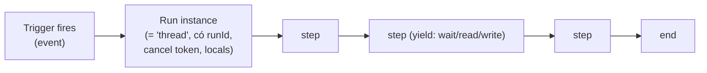

# 05 — Block Catalog & Execution Model

> Định nghĩa **đầy đủ các loại block** (cải tiến từ đề xuất gốc Sensor/Actuator/Logic), **ngữ nghĩa thực thi** (event, thread, chờ, vòng lặp, song song, huỷ) và cách mỗi block đi xuống IR → C++/Python.
> Quyết định: [ADR-0011](adr/ADR-0011-block-model-on-canvas.md), [ADR-0012](adr/ADR-0012-execution-semantics.md), [ADR-0013](adr/ADR-0013-dataflow-and-expression-language.md). IR: [06](06-ir-and-compiler.md).

---

## 1. Từ đề xuất gốc tới taxonomy cuối

Đề xuất gốc: *Sensor · Actuator · Logic*. Sau khi phân tích VSS (sensor/actuator/attribute) và pattern Velocitas (event, get, set, pub/sub, timer), taxonomy cuối gồm **9 nhóm** trên toolbar:

| Nhóm | Màu | Vai trò (khái niệm) | Tương đương Velocitas |
|---|---|---|---|
| **Triggers** | tím | Điểm bắt đầu một lần chạy (hat) | subscription/topic/timer/onStart |
| **Sensors** | xanh dương | Đọc giá trị (reporter + block đọc) | `get()`, giá trị trong reply |
| **Actuators** | cam | Ghi giá trị ra xe | `set()`, `setMany()` |
| **Attributes** | xám | Hằng số cấu hình xe (static) | `get()` 1 lần, cache |
| **Logic & Math** | xanh lá | Tính toán thuần | biểu thức C++ |
| **Flow Control** | vàng | Rẽ nhánh, chờ, lặp, song song | runtime scheduler |
| **State** | hồng | Biến, counter, bộ lọc, state machine | member variables |
| **Communication** | lam | MQTT, HMI notify, Log | `publishToTopic`, logger |
| **Composite** | nâu | Block semantic đa-VSS (curated), sub-workflow | nhóm các bước trên |

Sensor/Actuator/Attribute **sinh động từ VSS** (không có file TS cho từng tín hiệu — xem [ADR-0011](adr/ADR-0011-block-model-on-canvas.md)); các nhóm còn lại là block tĩnh curated.

---

## 2. Catalog block chi tiết (v1)

Ký hiệu cột: **P** = ưu tiên (P0 MVP, P1, P2); **Out** = output có thể tham chiếu bằng `<Tên block.field>`.

### 2.1 Triggers
| Block `type` | Tên UI | Thuộc tính | Out | Opcode | P |
|---|---|---|---|---|---|
| `sv_on_app_start` | When app starts | — | — | `event.app_start` | P0 |
| `sv_on_signal_changed` | When signal changes | `path` (sensor/actuator/any readable), `mode` any/rising/falling/crosses_above/crosses_below/becomes, `threshold?`, `debounceMs` (0), `concurrency` | `value`, `previous`, `timestamp` | `event.signal_changed` | P0 |
| `sv_on_timer` | Every … | `intervalMs` (≥ 10), `initialDelayMs`, `concurrency` (mặc định `ignore`) | `tick`, `timestamp` | `event.timer` | P0 |
| `sv_on_condition` | When condition becomes true | `expr` (bool, tham chiếu signal), `debounceMs` | `timestamp` | `event.condition` (edge-triggered, runtime tự subscribe các signal trong expr) | P1 |
| `sv_on_mqtt` | When MQTT message | `topic`, `payloadType` text/json, `concurrency` (mặc định `queue`) | `payload`, `topic` | `event.mqtt_message` | P0 |

Thuộc tính chung `concurrency` ∈ `restart` (huỷ lần chạy cũ, chạy lại — mặc định cho signal), `ignore` (bỏ qua nếu đang chạy — mặc định cho timer), `queue` (xếp hàng, giới hạn `queueMax`=8), `parallel` (cho phép nhiều run, giới hạn `maxRuns`=4).

### 2.2 Sensors / Attributes (sinh từ VSS)
| Block `type` | Tên UI (động) | Thuộc tính | Out | Opcode | P |
|---|---|---|---|---|---|
| `sv_read_signal` | Read ⟨Speed⟩ | `path` (khoá khi kéo từ toolbar), `source` latest-from-trigger/fresh-read | `value`, `timestamp` | `vehicle.read` | P0 |
| `sv_read_attribute` | ⟨VehicleIdentification.VIN⟩ | `path` | `value` | `vehicle.read_attribute` (đọc 1 lần khi start, cache) | P0 |
| (reporter) | tham chiếu `<Vehicle.Speed>` trực tiếp trong expr | — | — | `vehicle.read` ngầm (fresh) | P1 |

### 2.3 Actuators (sinh từ VSS)
| Block `type` | Tên UI | Thuộc tính | Out | Opcode | P |
|---|---|---|---|---|---|
| `sv_set_actuator` | Set ⟨Hazard.IsSignaling⟩ | `path` (chỉ actuator), `value` (expr, kiểu theo datatype; enum → dropdown `allowed`), `awaitAck` (true) | `ok`, `error` | `vehicle.write` | P0 |
| `sv_set_many` | Set several | danh sách {path, value} | `ok`, `failed[]` | `vehicle.write_many` | P1 |
| `sv_toggle` | Toggle ⟨boolean actuator⟩ | `path` | `value` | `vehicle.read`+`logic.not`+`vehicle.write` (desugar ở compiler) | P1 |

### 2.4 Logic & Math
| Block `type` | Tên UI | Thuộc tính | Out | Opcode | P |
|---|---|---|---|---|---|
| `sv_compare` | Compare | `left`, `op` (> < ≥ ≤ = ≠), `right` | `result: boolean` | `logic.compare` | P0 |
| `sv_bool` | And / Or / Not / Xor | `op`, `inputs[]` | `result` | `logic.and/or/not/xor` | P0 |
| `sv_math` | Math | `op` (+ − × ÷ % min max abs round floor ceil), `a`, `b?` | `result` | `math.*` | P0 |
| `sv_expression` | Expression | `expr` (ngôn ngữ biểu thức, [ADR-0013](adr/ADR-0013-dataflow-and-expression-language.md)) | `result` (kiểu suy luận) | `expr` (sub-tree IR) | P0 |
| `sv_scale` | Map range | `value`, `inMin,inMax,outMin,outMax`, `clamp` | `result` | `math.scale` | P1 |
| `sv_clamp` | Clamp | `value, min, max` | `result` | `math.clamp` | P1 |
| `sv_in_range` | In range / Hysteresis | `value`, `low`, `high`, `mode` range/hysteresis | `result`, `state` | `logic.in_range` / `logic.hysteresis` (có state) | P1 |
| `sv_lookup` | Lookup table | `value`, `table[{when, then}]`, `default` | `result` | `logic.lookup` | P1 |
| `sv_constant` | Constant | `type`, `value` | `value` | `const` | P0 |
| `sv_convert` | Convert unit/type | `value`, `to` | `result` | `unit.convert`/`type.cast` (tường minh) | P1 |
| `sv_array_length` | Array Length | `array` (ref kiểu `T[]`) | `length: uint32` | `array.len` | P0 |
| `sv_array_at` | Array Element At | `array`, `index: int32`, `default?` | `value: T` (theo kiểu phần tử) | `array.at` | P0 |
| `sv_array_contains` | Array Contains | `array`, `value` (literal/ref cùng kiểu phần tử) | `result: boolean` | `array.contains` | P1 |

3 block trên thao tác trên giá trị **mảng** (`T[]`) — chỉ xuất hiện ở sensor/attribute kiểu mảng (vd `Vehicle.OBD.PidsA`), không có ở actuator (xác nhận 0/1197+ node VSS thật). Chi tiết đầy đủ (ngữ pháp SVX, diagnostic, codegen bounds-check): [ADR-0018](adr/ADR-0018-vss-array-and-full-datatype-coverage.md).

### 2.5 Flow Control
| Block `type` | Tên UI | Thuộc tính | Nhánh ra (handle) | Opcode | P |
|---|---|---|---|---|---|
| `sv_if` | If / Else | `condition` (expr bool) | `then`, `else` | `control.branch` | P0 |
| `sv_switch` | Switch | `value`, `cases[]` | `case-i`, `default` | `control.switch` | P1 |
| `sv_wait` | Wait | `durationMs` | next | `control.wait` | P0 |
| `sv_wait_until` | Wait until | `condition`, `timeoutMs` | `ok`, `timeout` | `control.wait_until` | P1 |
| `sv_stable_for` | Stable for | `condition` (expr bool, mặc định "giá trị trigger không đổi"), `durationMs` | `stable`, `broken` (tuỳ chọn) | `control.stable_for` | P0 |
| `sv_repeat` | Repeat N (container) | `count` (≤ 10 000), `intervalMs?` | body, next | `control.repeat` | P1 |
| `sv_while` | While (container) | `condition`, `maxIterations` (bắt buộc), `intervalMs` (≥ 1 mặc định 0 = yield mỗi vòng) | body, next | `control.while` | P1 |
| `sv_parallel` | Run in parallel (container, dùng subflow `parallel` của Sim) | `join` all/any/none | next (sau join) | `control.parallel` + `control.join` | P1 |
| `sv_stop` | Stop | `scope` this-run / workflow / app | — | `control.stop` | P0 |
| `sv_throttle` | Rate limit | `minIntervalMs` | pass, dropped | `control.throttle` | P2 |

### 2.6 State
| Block | Thuộc tính | Opcode | P |
|---|---|---|---|
| `sv_var_set` / `sv_var_get` | `name` (khai báo ở panel Variables với kiểu + giá trị đầu), `value` | `state.set`/`state.get` | P0 |
| `sv_counter` | `name`, `op` inc/dec/reset, `step` | `state.counter` | P1 |
| `sv_filter` | moving average / low-pass (exponential) / median: `value`, `window` / `alpha` ([ADR-0049](adr/ADR-0049-filter-state-machine-subworkflow.md) §1) | `state.filter` | P2 |
| `sv_rate` | rate of change per s — **hoãn** (ADR-0049 §5) | `state.rate` | P2 |
| `sv_state_machine` | biến trạng thái, transitions `{from, when, to}` | desugar `control.branch` + `state.set` (ADR-0049 §2, không `fsm.*`) | P2 |

### 2.7 Communication
| Block | Thuộc tính | Opcode | P |
|---|---|---|---|
| `sv_log` | `level` debug/info/warn/error, `message` (template `{<Speed.value>}`) | `comm.log` | P0 |
| `sv_mqtt_publish` | `topic`, `payload` (text/json template), `qos`, `retain` | `comm.mqtt_publish` | P0 |
| `sv_hmi_notify` | `severity`, `title`, `message` → publish JSON tới `simvehicleapp/<app>/hmi` (topic cấu hình) | `comm.hmi_notify` (desugar → mqtt_publish) | P0 |
| `sv_grpc_call` | `service`, `method`, `args` (từ AppManifest grpc-interface) | `service.grpc_call` | P2 |

### 2.8 Composite
| Block | Mô tả | P |
|---|---|---|
| `sv_battery_status`, `sv_door_status`, `sv_climate_status` | Block curated đa-VSS (category `composite`, BlockSpec `members`) — compiler desugar thành chuỗi `vehicle.read` ([ADR-0045](adr/ADR-0045-curated-multi-vss-blocks.md)); chỉ đọc | P2 |
| `sv_call_workflow` | Gọi workflow khác như hàm (inputs/outputs) | P2 |

---

## 3. Ngữ nghĩa thực thi (Execution Semantics)

### 3.1 Khái niệm

- **Workflow** = 1 hoặc nhiều **trigger**, mỗi trigger dẫn tới một **chuỗi bước** (stack) nối bằng control edge.
- Mỗi lần trigger bắn tạo một **run instance** (giống "thread" trong Scratch / coroutine) có: `runId`, cancel token, snapshot output của trigger (`value`, `previous`, `timestamp`), bộ locals (output của block đã chạy trong run).
- **Yield points:** `control.wait`, `wait_until`, `stable_for`, `vehicle.read` (fresh), `vehicle.write` (awaitAck), `comm.mqtt_publish` (không chờ), mỗi vòng `while/repeat`. Giữa hai yield, bước chạy **nguyên tử** trên strand — không có race.
- **Tất định:** tất cả run của một app chạy trên **một strand**, thứ tự theo (thời điểm sự kiện, seq tăng dần).

### 3.2 Chính sách đồng thời (concurrency policy) của trigger
| Policy | Khi trigger bắn lúc run cũ đang chờ | Use case |
|---|---|---|
| `restart` | cancel run cũ (dọn timer), tạo run mới | "Stable overspeed": tốc độ đổi → đếm lại |
| `ignore` | bỏ qua sự kiện mới | timer định kỳ nặng |
| `queue` | xếp hàng (≤ `queueMax`, tràn → drop cũ nhất + warning trace) | xử lý lệnh MQTT tuần tự |
| `parallel` | chạy song song (≤ `maxRuns`) | độc lập theo từng event |

### 3.3 Dữ liệu (dataflow)
- **Control edge** (của Sim) quyết định *thứ tự*. **Dữ liệu** lấy bằng **tham chiếu** `<Tên block.field>` hoặc `<Vehicle.Path>` trong ô thuộc tính (giữ đúng mô hình Sim).
- Quy tắc phạm vi: chỉ được tham chiếu output của block **đã chắc chắn chạy trước** trong cùng run (dominator trên control graph) → nếu không, lỗi `DATA_REF_NOT_DOMINATING`.
- Tham chiếu `<Vehicle.Speed>` trong expr = đọc *giá trị mới nhất đã biết* (cache của runtime từ subscription); nếu path chưa được subscribe, compiler tự thêm subscription "cache-only" (không trigger) → đảm bảo không block.
- Output của trigger dùng `<Trigger name.value>`.

### 3.4 Thời gian
- Đơn vị nội bộ: **milliseconds** (int64), đồng hồ đơn điệu (`steady_clock`).
- Simulator dùng **virtual clock** ([ADR-0017](adr/ADR-0017-simulator.md)); runtime C++ có `IClock` để unit test.

### 3.5 Vòng lặp & an toàn
- `while` **bắt buộc** `maxIterations` (mặc định 1000); vượt → dừng run, trace `LOOP_GUARD_TRIPPED`.
- Mỗi vòng lặp là yield point (không chiếm strand liên tục).
- Không có đệ quy; `sv_call_workflow` cấm chu trình gọi (lỗi `CALL_CYCLE`).

### 3.6 Lỗi runtime
- `vehicle.write` lỗi (UNAVAILABLE/NOT_FOUND/ACCESS_DENIED) → output `error` có giá trị; nếu block không nối nhánh lỗi → run log error + tiếp tục (policy `continue`) hoặc dừng (`stop`, cấu hình ở block, mặc định `continue`).
- Mất kết nối databroker → runtime log + tự reconnect (SDK) + trace `VDB_DISCONNECTED`; run đang chờ read → timeout mặc định 2000 ms → nhánh error.

### 3.7 Clean-room đối với Scratch
Dùng khái niệm chung (hat/stack/reporter/thread/yield) nhưng **tên, opcode, format, code của SimVehicleApp hoàn toàn tự định nghĩa**. Xem [ADR-0012 §Clean-room](adr/ADR-0012-execution-semantics.md).

---

## 4. Lint realtime trên canvas (không cần bấm Verify)
| Code | Mức | Điều kiện |
|---|---|---|
| `TRIGGER_WITHOUT_ACTION` | warning | Trigger không có bước nào phía sau |
| `BLOCK_UNREACHABLE` | warning | Block không nối với trigger nào |
| `BLOCK_PROPERTY_MISSING` | error | Thiếu thuộc tính required |
| `VEHICLE_WRITE_READ_ONLY` | error | Set vào sensor/attribute |
| `POLLING_PREFER_SUBSCRIPTION` | info | Timer + read cùng path → gợi ý On Signal Changed |
| `ENUM_VALUE_NOT_ALLOWED` | error | Giá trị không thuộc `allowed` |
| `VALUE_OUT_OF_RANGE` | warning | Hằng số ngoài `min/max` của VSS |
Lint chạy qua `POST /lint` (compiler, debounce 300 ms) — hiển thị badge trên block.

---

## 5. Golden Workflow Corpus (VSS 4.0 — path đã verify)

| ID | Tên | Mô tả ngắn | Bao phủ |
|---|---|---|---|
| **GW-A** | Stable Overspeed Warning | On `Vehicle.Speed` changed (restart) → Stable for 2000 ms (`<Speed.value> > 120`) → Set `Vehicle.Body.Lights.Hazard.IsSignaling` = true → HMI notify; nhánh: `Speed` crosses_below 110 → set false | subscription, restart/cancel, stable_for, compare, unit km/h, actuator write, mqtt |
| **GW-B** | Low Battery HMI Warning | On `Vehicle.Powertrain.TractionBattery.StateOfCharge.Current` changed → If `< 20` và `Vehicle.IsMoving` → HMI notify (warn) + Set `Vehicle.Cabin.Light.InteractiveLightBar.Color` = "RED" | percent unit, reference reporter, if/else, string actuator |
| **GW-C** | Auto Wipers | On `Vehicle.Body.Raindetection.Intensity` changed (debounce 500) → Lookup (0–10→OFF, 10–40→INTERVAL, 40–70→MEDIUM, >70→FAST) → Set `Vehicle.Body.Windshield.Front.Wiping.Mode` | enum `allowed`, lookup, debounce |
| **GW-D** | Auto Door Lock | On `Vehicle.Speed` crosses_above 15 → Set many `Vehicle.Cabin.Door.Row{1,2}.{DriverSide,PassengerSide}.IsLocked` = true | crossing mode, set_many |
| **GW-E** | Periodic Telemetry | Every 1000 ms (ignore) → Publish JSON `{speed:<Vehicle.Speed>, soc:<…SoC.Current>}` tới `simvehicleapp/telemetry` | timer, reporter cache, mqtt json |
| **GW-F** | Welcome Sequence | App start → Parallel{ Set AmbientLight Row1 DriverSide IsLightOn=true; Wait 500 → Set Intensity=80 } → join all → Log "welcome done" | app_start, parallel/join, wait |
| **GW-G** | Window Close on Rain | When condition becomes true (`Raindetection.Intensity > 30 && Speed < 5`) → Repeat for 4 windows (set Position=0) → Wait until all Position==0 (timeout 10 s) → log | condition trigger, repeat, wait_until/timeout |

Mỗi golden có: `graph.json` (Sim state), `ir.json` (snapshot), `cpp/` (snapshot generated), `scenario.yaml` (input trace), `expected.trace.json` (simulator), dùng cho parity ([ADR-0042](adr/ADR-0042-semantic-parity-testing.md)).

---

## 6. UI {#ui}

```
┌──────────────────────────────────────────────────────────────────────────────┐
│ SimVehicleApp ▸ Project: comfort-app (C++ · VSS 4.0)   [Verify] [Simulate] [SynCode] [Run ▸] [Stop ■] [Open IDE] [Export ⤓] │
├───────────────┬───────────────────────────────────────────────┬──────────────┤
│ Toolbar       │                 Canvas (ReactFlow)            │ Properties   │
│ ▸ Triggers    │   [When Vehicle.Speed changes]──▶[Stable 2s]  │ / Diagnostics│
│ ▸ Vehicle ▾   │            ──▶[If >120]──then▶[Set Hazard]    │ / Variables  │
│   🔎 search   │                                               │              │
│   Vehicle     │                                               │              │
│   ├ Speed  S  │                                               │              │
│   ├ Cabin ▸   │                                               │              │
│   └ Body ▸    │                                               │              │
│ ▸ Logic       │                                               │              │
│ ▸ Flow        │                                               │              │
│ ▸ State       │                                               │              │
│ ▸ Comm        │                                               │              │
├───────────────┴───────────────────────────────────────────────┴──────────────┤
│ Bottom dock: [Problems] [Simulation timeline] [Run console] [Signals] [Build log]      │
└──────────────────────────────────────────────────────────────────────────────┘
Right drawer (toggle): 💬 Assistant (chat, MCP tools, patch preview)
Banner cố định: "Ứng dụng cấp cao trên KUKSA — không thay thế hệ thống an toàn (ASIL)."
```
- Nút **SynCode** nằm cạnh Run/Debug/Delete (R7).
- Kéo một tín hiệu từ cây Vehicle: thả lên canvas mở menu nhanh `Read | When changes | Set` (Set chỉ hiện với actuator).
