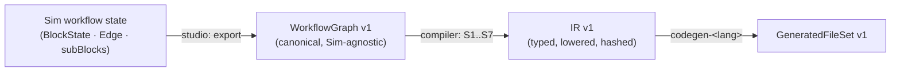

# 06 — Canonical IR v1 & Compiler Pipeline

> IR là **hợp đồng** giữa L3 (core) và L4 (compiler-code-<lang>). Mọi backend chỉ đọc IR, không đọc graph Sim.
> Quyết định: [ADR-0014](adr/ADR-0014-ir-v1.md), [ADR-0015](adr/ADR-0015-type-and-unit-system.md), [ADR-0016](adr/ADR-0016-diagnostics-catalog.md). Block → opcode: [05](05-blocks-and-execution-model.md).

---

## 1. Ba lớp dữ liệu



### 1.1 WorkflowGraph v1 (đầu vào compiler)
Tách compiler khỏi chi tiết nội bộ Sim (Sim đổi schema ⇒ chỉ sửa adapter trong studio).
```json
{
  "graphVersion": "1.0.0",
  "workflowId": "wf_7Hk…", "revision": 31, "name": "Stable Overspeed Warning",
  "vss": { "release": "v4.0", "modelHash": "sha256:…" },
  "variables": [ { "name": "warnActive", "type": "boolean", "initial": false } ],
  "blocks": [
    { "id": "b1", "type": "sv_on_signal_changed", "name": "Speed changed",
      "props": { "path": "Vehicle.Speed", "mode": "any", "debounceMs": 0, "concurrency": "restart" },
      "parentId": null, "blockVersion": 1 },
    { "id": "b2", "type": "sv_stable_for", "name": "Stable 2s",
      "props": { "condition": "<Speed changed.value> > 120", "durationMs": 2000 } }
  ],
  "edges": [ { "id": "e1", "from": "b1", "fromHandle": "next", "to": "b2", "toHandle": "in" } ]
}
```
Sinh ra bởi `studio` adapter `toWorkflowGraph(BlockState[], Edge[])` — **hàm thuần, có golden test**.

---

## 2. IR v1 — cấu trúc

```json
{
  "irVersion": "1.0.0",
  "compilerVersion": "0.1.0",
  "workflowId": "wf_7Hk…", "workflowRevision": 31, "name": "StableOverspeedWarning",
  "modelHash": "sha256:…", "sourceGraphHash": "sha256:…", "irHash": "sha256:…",
  "signals": [
    { "id": "s0", "path": "Vehicle.Speed", "vssType": "sensor", "dataType": "float", "unit": "km/h", "access": ["read","subscribe"] },
    { "id": "s1", "path": "Vehicle.Body.Lights.Hazard.IsSignaling", "vssType": "actuator", "dataType": "boolean", "unit": null, "access": ["write"] }
  ],
  "topics": [ { "id": "t0", "topic": "simvehicleapp/comfort-app/hmi", "direction": "write" } ],
  "state": [ { "id": "v0", "name": "warnActive", "type": "boolean", "initial": false } ],
  "triggers": [
    { "id": "n1", "opcode": "event.signal_changed", "signal": "s0",
      "props": { "mode": "any", "debounceMs": 0 }, "concurrency": { "policy": "restart" },
      "outputs": { "value": { "type": "float", "unit": "km/h" }, "previous": { "type": "float", "unit": "km/h" }, "timestamp": { "type": "int64", "unit": "ms" } },
      "entry": "n2", "src": { "blockId": "b1" } }
  ],
  "nodes": [
    { "id": "n2", "opcode": "control.stable_for",
      "args": { "condition": { "$expr": { "op": ">", "l": { "$ref": "n1.value" }, "r": { "$const": 120, "type": "float", "unit": "km/h" } } },
                "durationMs": { "$const": 2000, "type": "int64" } },
      "next": { "stable": "n3" }, "src": { "blockId": "b2" } },
    { "id": "n3", "opcode": "vehicle.write", "args": { "signal": "s1", "value": { "$const": true, "type": "boolean" } },
      "next": { "done": "n4", "error": null }, "src": { "blockId": "b3" } },
    { "id": "n4", "opcode": "comm.mqtt_publish", "args": { "topic": "t0", "payload": { "$template": ["Overspeed: ", { "$ref": "n1.value" }, " km/h"] } },
      "next": {}, "src": { "blockId": "b4", "inserted": false } }
  ],
  "diagnostics": []
}
```

### 2.1 Quy tắc IR
- **Control-flow là đồ thị có hướng** qua trường `next` (mỗi handle ra ↦ node id | null). Không có `edges[]` data riêng: data là **biểu thức cây** (`$expr`, `$ref`, `$const`, `$template`, `$signal`) → backend sinh biểu thức trực tiếp.
- `$ref` chỉ trỏ tới output của trigger/node **dominate** node hiện tại (đã kiểm ở S6).
- Container (`control.parallel`, `control.repeat`, `control.while`) có `body: { entry: nodeId }` + `next`.
- Mọi node có `src.blockId` (traceability); node do compiler chèn có `src.inserted: true` + `src.reason` (vd `unit-conversion`).
- **Chuẩn hoá tất định:** id node đánh lại theo thứ tự DFS ổn định từ trigger (sort theo `blockId` khi hoà), key JSON sort, số dạng canonical (không `1.0` vs `1`) → `irHash = sha256(canonical JSON trừ trường irHash/metadata thời gian)`.
- IR **không có** `generatedAt` (timestamp để ở Generation record, không ở IR) → đảm bảo NFR-01.

### 2.2 Bảng opcode v1 (đầy đủ)
| Nhóm | Opcode | Args | Outputs / Handles |
|---|---|---|---|
| event | `event.app_start` | — | entry |
| | `event.signal_changed` | signal, mode, threshold?, debounceMs | value, previous, timestamp |
| | `event.timer` | intervalMs, initialDelayMs | tick, timestamp |
| | `event.condition` | expr(bool), debounceMs | timestamp |
| | `event.mqtt_message` | topic, payloadType | payload, topic |
| vehicle | `vehicle.read` | signal, fresh(bool) | value, timestamp · handles done/error |
| | `vehicle.read_attribute` | signal | value |
| | `vehicle.write` | signal, value | handles done/error |
| | `vehicle.write_many` | [{signal, value}] | failed[] · done/error |
| control | `control.branch` | condition | then/else |
| | `control.switch` | value, cases[] | case_i/default |
| | `control.wait` | durationMs | next |
| | `control.wait_until` | condition, timeoutMs | ok/timeout |
| | `control.stable_for` | condition, durationMs | stable/broken |
| | `control.repeat` | count, intervalMs | body, next · output index |
| | `control.while` | condition, maxIterations, intervalMs | body, next |
| | `control.parallel` | branches[{entry}], join all/any/none | next |
| | `control.stop` | scope run/workflow/app | — |
| | `control.throttle` | minIntervalMs | pass/dropped |
| state | `state.get` `state.set` `state.counter` `state.filter` `state.rate` | … | value |
| logic/math | `logic.*` `math.*` `unit.convert` `type.cast` | như expr | result |
| comm | `comm.log` `comm.mqtt_publish` | level/message · topic/payload/qos/retain | next |
| service | `service.grpc_call` (P2) | service, method, args | result · done/error |

Logic/math **thường được nhúng trong `$expr`** thay vì node riêng; block `sv_compare`, `sv_math`… được compiler **gộp** vào biểu thức của node tiêu thụ (giảm code sinh).

---

## 3. Pipeline compiler (S1–S7)

| Stage | Kiểm tra | Mã lỗi tiêu biểu |
|---|---|---|
| S0 Parse | JSON schema WorkflowGraph; giới hạn kích thước (≤ 2 000 block, ≤ 1 MB) | `GRAPH_SCHEMA_INVALID`, `GRAPH_TOO_LARGE` |
| S1 Structural | edge dangling, handle không tồn tại, block type unknown, container hợp lệ | `GRAPH_DANGLING_EDGE`, `BLOCK_TYPE_UNKNOWN`, `HANDLE_UNKNOWN` |
| S2 Block config | property required, kiểu literal, parse expr | `BLOCK_PROPERTY_MISSING`, `EXPR_SYNTAX`, `BLOCK_VERSION_UNSUPPORTED` |
| S3 Vehicle model | path tồn tại trong release, access đúng, enum `allowed`, min/max | `VEHICLE_PATH_NOT_FOUND`, `VEHICLE_WRITE_READ_ONLY`, `ENUM_VALUE_NOT_ALLOWED`, `MODEL_HASH_MISMATCH` |
| S4 Types | suy luận & kiểm tra kiểu biểu thức; **không cast ngầm** trừ widening an toàn (int→float) | `TYPE_MISMATCH`, `TYPE_NARROWING_REQUIRES_CAST` |
| S5 Units | cùng dimension khác unit → chèn `unit.convert`; khác dimension → lỗi | `UNIT_DIMENSION_MISMATCH`, (info) `UNIT_CONVERSION_INSERTED` |
| S6 Control flow | chu trình không qua container, `$ref` không dominate, trigger không có action, parallel hợp lệ, while có guard | `CONTROL_FLOW_CYCLE`, `DATA_REF_NOT_DOMINATING`, `TRIGGER_WITHOUT_ACTION`, `LOOP_GUARD_MISSING` |
| S7 Backend capability | opcode + IR version được backend đích hỗ trợ (qua `GET /capabilities`, cache) | `OPCODE_UNSUPPORTED_BY_BACKEND`, `IR_VERSION_UNSUPPORTED` |

- `mode: "lint"` chạy S0–S3 + một phần S6 (nhanh, bỏ qua S7); `mode: "verify"` chạy đủ; `mode: "build"` = verify + trả IR.
- Compiler **thuần**: không đọc file, không mạng ngoài trừ catalog (được inject qua interface `VehicleModelProvider` → test với fixture).

---

## 4. Expression language (tóm tắt, chi tiết ở [ADR-0013](adr/ADR-0013-dataflow-and-expression-language.md))
```
expr     := ternary
ternary  := or ('?' expr ':' expr)?
or       := and ('||' and)*          and := not ('&&' not)*       not := '!' not | cmp
cmp      := sum (('=='|'!='|'<'|'<='|'>'|'>=') sum)?
sum      := prod (('+'|'-') prod)*   prod := unary (('*'|'/'|'%') unary)*
unary    := '-' unary | primary
primary  := number unit? | string | 'true' | 'false' | ref index? | call | '(' expr ')'
ref      := '<' name ('.' field)* '>'           // <Speed changed.value> | <Vehicle.Speed> | <var.warnActive>
index    := '[' expr ']'                         // <PidsA.value>[0]  — chỉ hợp lệ khi ref có kiểu T[] (ADR-0018)
call     := ident '(' args ')'                   // abs min max clamp round floor ceil scale in_range now_ms
                                                  // + len · at · contains (thao tác mảng T[], ADR-0018)
number unit := 120 km/h | 2 s | 500 ms | 20 %    // literal có đơn vị (tuỳ chọn)
```
Chi tiết thao tác trên giá trị mảng (`T[]`): [ADR-0018](adr/ADR-0018-vss-array-and-full-datatype-coverage.md).
- Parser viết tay (Pratt), **không `eval`**, không truy cập hàm ngoài whitelist → an toàn & tất định.
- Kết quả là AST typed → lowering thành `$expr` trong IR.

---

## 5. Type & Unit (tóm tắt [ADR-0015](adr/ADR-0015-type-and-unit-system.md))
- Kiểu: `boolean, int8..int64, uint8..uint64, float, double, string, T[]` (theo VSS) + nội bộ `duration(ms)`, `timestamp(ms)`, `json`. `T[]` **read-only** trong UI (không actuator nào kiểu mảng trong VSS thật); `int64`/`uint64` mã hoá dạng chuỗi trong mọi JSON (tránh mất chính xác) — chi tiết [ADR-0018](adr/ADR-0018-vss-array-and-full-datatype-coverage.md).
- Quy tắc số: phép toán hai số nguyên → kiểu rộng hơn; có float/double → `double` trong biểu thức, **cast tường minh khi ghi vào actuator hẹp hơn** (compiler chèn `type.cast` với clamp + diagnostic info khi hằng số vượt range).
- Unit: bảng từ `units.yaml` + `quantities.yaml` của VSS release; conversion hỗ trợ (km/h↔m/s↔mph, celsius↔fahrenheit↔K, percent↔ratio, ms↔s↔min, W↔kW, Wh↔kWh).

---

## 6. Diagnostics format (không đổi so với master plan, bổ sung trường)
```json
{ "code": "VEHICLE_WRITE_READ_ONLY", "severity": "error", "stage": "vehicle-model",
  "blockId": "b7", "field": "path",
  "message": "Vehicle.Speed là sensor, không thể ghi.",
  "suggestion": "Chọn một VSS actuator.", "docs": "diagnostics#VEHICLE_WRITE_READ_ONLY" }
```
Catalog đầy đủ + quy tắc bất biến mã: [ADR-0016](adr/ADR-0016-diagnostics-catalog.md).

---

## 7. Versioning
- `graphVersion`, `irVersion`, `blockVersion` (từng block) đều semver. Block có migration `vN→vN+1` chạy khi mở workflow (trong studio) và trong compiler S2 (từ chối nếu không migrate được).
- Backend khai báo `irVersions: ">=1.0 <2.0"`; compiler từ chối nếu không khớp (S7).
