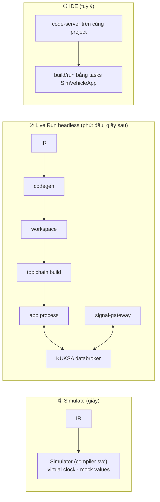
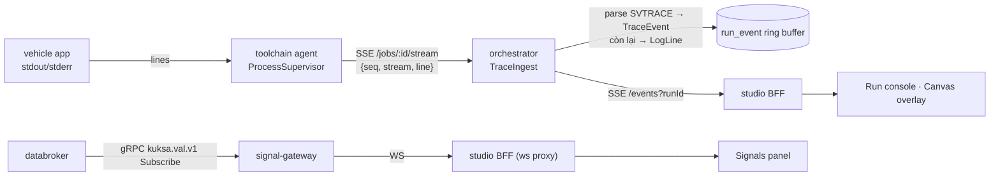
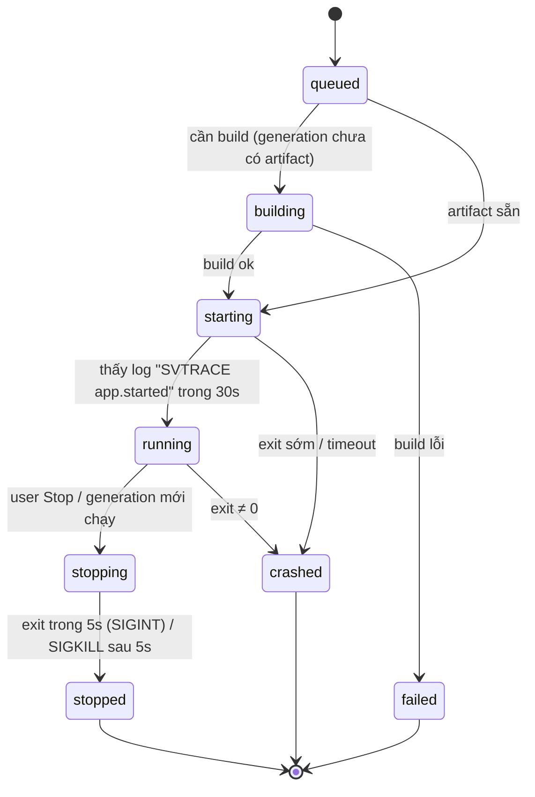

# 08 — Run / Debug / Observe: chọn hướng thiết kế & chi tiết

> Trả lời câu hỏi của PO: *"Sim đang chạy kiểu runtime; luồng no-code → sinh code → build/run trên Velocitas nên thiết kế theo hướng nào?"*
> Quyết định: [ADR-0006](adr/ADR-0006-compile-first-execution-model.md), [ADR-0017](adr/ADR-0017-simulator.md), [ADR-0024](adr/ADR-0024-databroker-api-and-runtime-stack.md), [ADR-0027](adr/ADR-0027-live-run-logs-and-trace.md).

---

## 1. Các phương án đã phân tích

| # | Phương án | Mô tả | Ưu | Nhược | Kết luận |
|---|---|---|---|---|---|
| A | **Dùng executor của Sim** (runtime JS) | Workflow chạy trong Node executor của Sim, gọi databroker qua client JS | Có sẵn UI debug của Sim | Không phải Velocitas app; semantics DAG "chạy 1 lần" của Sim không hợp với event-driven liên tục; không export được; không đúng yêu cầu | ✘ |
| B | **Chỉ compile** | Workflow → C++ → build → chạy; debug bằng log | Đúng mục tiêu sản phẩm | Vòng lặp chậm (build C++ 30 s–vài phút) cho mỗi lần thử | Thiếu |
| C | **Interpreter Vehicle App** | Một Velocitas app viết sẵn đọc IR JSON và thông dịch lúc chạy | Chạy ngay không build; hot-reload | Không sinh code để người dùng tuỳ biến/export; datapoint động theo path (mất check compile-time); thêm 1 runtime thứ 3 phải giữ parity | Để P3 như "Quick Run" tuỳ chọn |
| **D** | **Hybrid compile-first** (chọn) | 1 IR duy nhất → (1) **Simulator TS** chạy IR tức thì với virtual clock; (2) **Codegen** → Velocitas app thật → build/run headless trên stack KUKSA thật; **parity test** giữ 2 bên nhất quán | Vòng lặp nhanh (simulate < 1 s) + sản phẩm thật (native app, export được) + debug bằng trace map về block | Phải duy trì simulator + runtime ngôn ngữ (giảm thiểu bằng conformance/parity) | ✔ |

**Chốt:** Phương án **D**. Executor của Sim **không** chạy vehicle workflow (giữ Sim executor chỉ cho phần UI còn dùng, rồi gỡ dần) — tránh rủi ro R1 của master plan.

---

## 2. Ba chế độ chạy trong UI



| Chế độ | Nút UI | Cần build? | Tín hiệu vào | Quan sát |
|---|---|---|---|---|
| ① Simulate | **Simulate** | Không | Scenario (timeline giá trị) do user nhập/ghi | Timeline, trace replay highlight block, writes, logs |
| ② Live Run | **SynCode** → **Run** | Có (incremental) | Signal panel inject vào databroker, mock-provider, MQTT publish tay | Run console (log), trace live highlight, Signals panel (current/target), MQTT tap |
| ③ IDE | **Open IDE** | Tuỳ user | như ② | như ② + debugger gdb trong IDE |

---

## 3. Luồng dữ liệu quan sát (observability path)



### 3.1 Contract sự kiện
```jsonc
// LogLine v1
{ "runId": "r_12", "seq": 1042, "ts": 1759200000123, "stream": "stdout", "level": "info", "msg": "…", "raw": "…" }
// TraceEvent v1 (từ dòng "SVTRACE {...}")
{ "runId": "r_12", "seq": 1043, "ts": 1759200000125, "wf": "wf_7Hk", "run": 42, "node": "n2",
  "blockId": "b2" /* orchestrator map qua sourceMap/IR */, "ev": "enter|exit|value|write|error|cancel|trigger",
  "data": { "value": 131.2 } }
// SignalUpdate v1 (signal-gateway)
{ "path": "Vehicle.Speed", "ts": 1759200000100, "value": 131.2, "field": "value|target" }
```

### 3.2 Mức trace
`off` (release/export mặc định) · `trigger` (chỉ trigger & kết quả cuối) · `node` (mọi node, dev mặc định). Cấu hình ở project settings → truyền vào `GenerateRequest.project.traceLevel` và biến môi trường `SV_TRACE_LEVEL` lúc chạy (runtime đọc env, override xuống không lên).

### 3.3 Canvas overlay
- Block đang `enter` → viền sáng; `error` → đỏ; badge đếm số lần chạy; tooltip giá trị gần nhất.
- Chế độ **Replay**: kéo timeline để phát lại TraceEvent (cả từ Simulate lẫn Live Run) — cùng một component vì cùng format.

---

## 4. Signal Gateway
- Kết nối databroker bằng **`kuksa.val.v1`** (bật mặc định trên 0.5.0) vì hỗ trợ đủ *current* + *target* value (xem [00 §3.8](00-research-findings.md#38-kuksa-databroker--protocol)).
- WS protocol (JSON): `{"op":"subscribe","paths":[…]}`, `{"op":"set","path":"Vehicle.Speed","value":130,"field":"value"}`, `{"op":"unsubscribe"}`; server đẩy `SignalUpdate`.
- **Inject** sensor = set *current value* (vai trò feeder). Chỉ cho phép khi run ở chế độ dev; path phải có trong catalog (không nhận path tuỳ ý — chống injection).
- Scenario player (P1): phát lại file `scenario.yaml` (giống golden) lên databroker thật → dùng cho integration test & parity.

---

## 5. Run lifecycle

- MVP: **1 run active / stack** (một databroker dùng chung). Run mới ⇒ tự dừng run cũ.
- P2: runtime stack riêng cho mỗi run (databroker+mqtt per run, network riêng) cho multi-user.

---

## 6. Debug nâng cao
- Map lỗi compile C++ → block: orchestrator parse `file:line` từ output GCC/Clang, tra `sourceMaps` → diagnostic `CPP_COMPILE_ERROR` với `blockId` (fallback: lỗi chung + link log).
- Crash (signal) → lấy 200 dòng log cuối + (nếu build Debug) backtrace từ `gdb -batch` trong toolchain (P2).
- Test sinh tự động (`app/tests/generated`) chạy scenario golden trên MockVehicle → lỗi test hiển thị như diagnostic `GENERATED_TEST_FAILED`.
