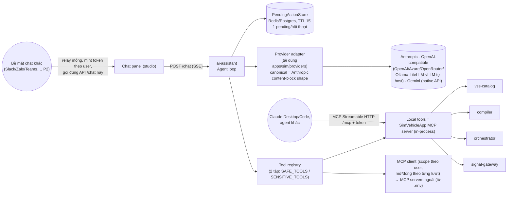

# 09 — AI Assistant (thay Copilot) & MCP

> FR-AI-01..05. Quyết định: [ADR-0030](adr/ADR-0030-ai-assistant-mcp.md). Module: [modules/simvehicleapp-ai](modules/simvehicleapp-ai.md).

---

## 1. Phạm vi & ranh giới
| AI ĐƯỢC làm | AI KHÔNG được làm |
|---|---|
| Hỏi đáp VSS/Velocitas, tìm tín hiệu | Sinh C++/Python/Rust cho sản phẩm |
| Đề xuất **WorkflowPatch** (tạo/sửa workflow) → user duyệt | Tự apply patch vào workflow đã lưu mà không có xác nhận (trừ khi user bật "auto-apply to draft") |
| Gọi tool: validate, simulate, syncode, run/stop, đọc log/trace, inject signal (dev) | Gọi thẳng workspace/toolchain (chỉ qua orchestrator) |
| Giải thích diagnostics/log | Thay đổi kết quả validate |

---

## 2. Kiến trúc


- **Một bộ tool duy nhất** được định nghĩa như MCP server `simvehicleapp` → vừa dùng nội bộ cho chat, vừa expose cho agent ngoài.
- Provider adapter: tái sử dụng code `apps/sim/providers/*` (Apache-2.0) tách ra package trong `simvehicleapp-ai` (không phụ thuộc runtime Next.js). **Canonical content-block** = shape `text`/`tool_use`/`tool_result` của Anthropic Messages API — provider OpenAI-compatible và Gemini dịch request/response của chính nó sang/từ shape này; lịch sử hội thoại lưu đúng theo shape đó (xem [ADR-0030 Notes 2026-10-02](adr/ADR-0030-ai-assistant-mcp.md)).
- **Gemini bắt buộc gọi native API** (`generativelanguage.googleapis.com/.../streamGenerateContent`, header `x-goog-api-key`) — **không** qua endpoint OpenAI-compatible của Google (key định dạng mới `AQ.` bị endpoint đó từ chối, đã verify bằng key thật).
- **MCP client mở theo từng lượt chat, scope theo user đang chat, đóng ngay khi lượt xong** — không dùng 1 connection/credential dùng chung cho nhiều user (áp dụng cho cả tool nội bộ lẫn `ext.*`).
- **Nếu sau này thêm bề mặt chat khác** (Slack, Zalo, Teams...): làm theo mẫu "relay mỏng" — mint token theo đúng quyền người dùng, gọi lại **chính** API `/chat` SSE này, không tạo bản sao thứ hai của agent loop (P2, chưa có nhu cầu ở v1).

## 3. Cấu hình `.env`
```dotenv
# ---- AI Assistant ----
SV_AI_ENABLED=true
SV_AI_PROVIDER=anthropic              # anthropic|openai-compatible|gemini
SV_AI_MODEL=claude-sonnet-5-5         # model id của provider đã chọn
ANTHROPIC_API_KEY=
# openai-compatible: dùng cho MỌI backend nói chuẩn OpenAI Chat Completions —
# OpenAI thật, Azure OpenAI/AI Foundry, OpenRouter, HOẶC một server tự host
# (Ollama/LiteLLM/vLLM) chạy ở máy/mạng khác — chỉ cần trỏ BASE_URL, không
# sửa code khi đổi provider/key phía sau URL đó.
OPENAI_COMPAT_BASE_URL=               # vd http://host.docker.internal:11434/v1, hoặc URL server tự host/tunnel
OPENAI_COMPAT_API_KEY=
# gemini: PHẢI dùng key mới định dạng "AQ." từ aistudio.google.com/api-keys
# (key cũ "AIzaSy..." ngừng hoạt động ~2026-09) — gọi native API, không qua
# lớp OpenAI-compatible của Google (xem ADR-0030 Notes 2026-10-02).
GEMINI_API_KEY=
SV_AI_MAX_TOOL_STEPS=6                # số vòng tool-use tối đa / lượt chat (đã hạ từ 12 theo kinh nghiệm thực tế)
SV_AI_RATE_LIMIT_PER_MINUTE=20        # theo user/session, KHÔNG theo IP, KHÔNG dùng chung giữa nhiều user
SV_AI_AUTO_APPLY_DRAFT=false
SV_AI_THINK=false                     # bật "extended thinking"/reasoning cho agent loop — mặc định TẮT (xem Notes ADR-0030: làm chậm & hỏng vòng tool-use ở ít nhất 1 model local đã test)
# ---- MCP ----
SV_MCP_SERVER_ENABLED=true            # expose /mcp cho agent ngoài
SV_MCP_SERVER_TOKEN=                  # bearer token bắt buộc nếu enabled
SV_MCP_CLIENTS=[{"name":"docs","transport":"http","url":"https://…/mcp","headers":{"Authorization":"Bearer …"}}]
```
Không có key ⇒ panel chat hiển thị hướng dẫn cấu hình, các tính năng khác không bị ảnh hưởng.

## 4. Bộ tool MCP `simvehicleapp` (v1)

Mỗi tool được gán **tĩnh** vào đúng 1 trong 2 tập hợp khai báo trong registry — `SAFE_TOOL_NAMES` (agent tự gọi, không hỏi) hoặc `SENSITIVE_TOOL_NAMES` (luôn qua xác nhận, xem §4a) — không suy luận động từ tên. Cột `structuredContent` = field máy đọc được tool phải trả kèm text, để UI/agent ngoài dùng chính xác thay vì suy từ câu trả lời LLM đã diễn giải lại.

| Tool | Input | Phân loại | `structuredContent` |
|---|---|---|---|
| `vss_search` | `query, type?, release?` | safe | — |
| `vss_get_signal` | `path` | safe | — |
| `blocks_list` | — | safe | — |
| `workflow_get` | `workflowId` | safe | — |
| `workflow_propose_patch` | `workflowId, ops[]` | safe (chỉ tạo *proposal*, không đổi workflow đã lưu) | `{patch: WorkflowPatch}` |
| `workflow_validate` | `workflowId \| draftGraph` | safe | `{diagnostics[]}` |
| `workflow_simulate` | `workflowId, scenario` | safe | `{trace[], writes[]}` |
| `diagnostics_explain` | `diagnostic` | safe | — |
| `run_logs` | `runId, sinceSeq?, filter?` | safe | — |
| `project_syncode` | `projectId, workflowIds?` | **sensitive** (ghi workspace + build thật) | `{generationId, verification}` |
| `run_start` | `projectId` | **sensitive** (chạy app thật trên databroker) | `{runId, editorUrl}` |
| `run_stop` | `runId` | **sensitive** | `{runId, exitCode}` |
| `signal_set` | `path, value` | **sensitive** (chỉ khi run dev; ghi giá trị vào databroker thật) | `{path, value, ts}` |

## 4a. Cơ chế xác nhận (confirmation flow)

1. Agent gặp `tool_use` cho tool `sensitive` → **trước tiên** kiểm tra `toolInput` so với `required` trong JSON Schema của tool đó. Thiếu field ⇒ trả tool-error bình thường ngay trong lượt hiện tại (để LLM hỏi lại/tự bổ sung) — **không** được tạo `pending_action` khi thiếu field (tránh nuốt mất câu trả lời làm rõ của người dùng vào vòng xác nhận-huỷ).
2. Đủ field ⇒ lưu `PendingAction {actionId, conversationId, toolName, toolInput, createdAt}` vào store (Redis hoặc bảng `sv_ai.pending_action`), TTL 15 phút, kèm **con trỏ `conversationId → actionId`** để đảm bảo **chỉ 1 pending action/hội thoại**. Trả SSE event `pending_action` cho UI.
3. UI hiện thẻ xác nhận, cho phép sửa nhẹ `toolInput` trước khi gửi (`editedInput`).
4. `POST /conversations/:id/actions/:actionId/confirm {editedInput?}` → dùng `editedInput` nếu có (luôn ghi đè input LLM đề xuất) để gọi tool thật, xoá pending action, agent tiếp tục lượt với `tool_result`.
5. `POST /conversations/:id/actions/:actionId/cancel` → trả `tool_result` dạng huỷ cho LLM, xoá pending action.
6. **Khi đang có pending action cho hội thoại đó, mọi tin nhắn văn bản mới bị chặn/điều hướng về xác nhận-hoặc-huỷ** — giao thức tool-use của LLM yêu cầu mọi `tool_use` phải nhận `tool_result` trước khi gửi lượt kế tiếp, nên không thể vừa chờ xác nhận vừa nhận câu hỏi mới.
7. Agent ngoài gọi qua MCP (không qua chat UI) nhận lỗi `CONFIRMATION_REQUIRED {actionId}` cho tool sensitive, trừ khi token MCP có scope `actions:auto` (dùng cho tác vụ tự động hoá đã được admin cấp quyền rõ ràng).

## 5. WorkflowPatch v1
```json
{ "patchVersion": "1.0.0", "workflowId": "wf_7Hk", "baseRevision": 31,
  "ops": [
    { "op": "add_block", "ref": "t1", "type": "sv_on_signal_changed", "name": "SoC changed",
      "props": { "path": "Vehicle.Powertrain.TractionBattery.StateOfCharge.Current", "mode": "any" }, "position": "auto" },
    { "op": "add_block", "ref": "c1", "type": "sv_if", "props": { "condition": "<SoC changed.value> < 20 && <Vehicle.IsMoving>" } },
    { "op": "connect", "from": "t1", "fromHandle": "next", "to": "c1" },
    { "op": "set_props", "block": "b5", "props": { "durationMs": 3000 } },
    { "op": "remove_block", "block": "b9" }
  ],
  "rationale": "…" }
```
- `ref` là id tạm; studio ánh xạ sang id thật khi apply. `baseRevision` lệch ⇒ rebase hoặc từ chối.
- Trước khi trả cho UI, ai-assistant **luôn** gọi `workflow_validate` trên draft đã apply patch và đính kèm diagnostics; LLM được phép tự sửa tối đa `SV_AI_MAX_TOOL_STEPS`.
- UI hiển thị diff: block mới (viền xanh lá), sửa (vàng), xoá (đỏ gạch); nút **Accept / Reject / Edit**.
- Layout `position:"auto"` dùng auto-layout (ELK/dagre) ở studio.

## 6. System prompt (khung)
- Vai trò: trợ lý thiết kế workflow vehicle cho SimVehicleApp.
- Tài nguyên: danh sách block (từ `blocks_list`), quy tắc semantics (tóm tắt 05 §3), VSS release của project, ranh giới an toàn (NFR-10).
- Luật: dùng tool để tra VSS, không bịa path; mọi thay đổi qua `workflow_propose_patch`; không viết code ngôn ngữ đích.

## 7. Lưu trữ & bảo mật
- Hội thoại lưu schema `sv_ai` (conversation, message, tool_call, proposal, pending_action) — có thể tắt (`SV_AI_PERSIST=false`).
- API key chỉ nằm trong env container `ai-assistant`; không bao giờ gửi xuống browser.
- **Rate limit theo user/session** (`SV_AI_RATE_LIMIT_PER_MINUTE`, mặc định 20) — khoá theo token/userId, **tuyệt đối không** theo IP hay dùng 1 hạn mức chung cho nhiều người (dùng chung sẽ khiến người dùng tự giới hạn lẫn nhau).
- Log lỗi tool **đầy đủ** (input, traceback) ở server, kể cả khi câu trả lời hiển thị cho người dùng đã được LLM diễn giải/rút gọn lại — tránh tình huống nguyên nhân thật (lỗi orchestrator/catalog…) chỉ còn lại một câu chung chung không debug được.
- Log prompt ẩn key; tuỳ chọn redact giá trị tín hiệu khi gửi LLM (`SV_AI_REDACT_VALUES`).
- Egress: chỉ container `ai-assistant` có network ra internet (codegen/compiler không có).
- Kết nối MCP (nội bộ lẫn `ext.*`) mở theo từng lượt chat, mang header định danh đúng user đang chat, đóng ngay khi lượt xong (không pool dài hạn dùng chung).
