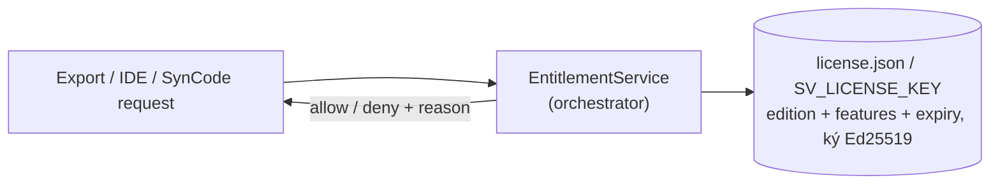

# 10 — IDE (VS Code server), Export/Download & Licensing

> FR-IDE-01/02, FR-EXP-01/02. Quyết định: [ADR-0028](adr/ADR-0028-ide-code-server.md), [ADR-0031](adr/ADR-0031-export-and-licensing.md). Module: [modules/ide-vscode](modules/ide-vscode.md).

---

## 1. IDE — `ide-vscode`

### 1.1 Image
```dockerfile
# ide-vscode/cpp/Dockerfile
ARG TOOLCHAIN_IMAGE=ghcr.io/<org>/simvehicleapp/toolchain-cpp:<ver>   # từ velocitas-stack (đã có velocitas CLI, conan cache, clang-format)
FROM ${TOOLCHAIN_IMAGE}
ARG CODE_SERVER_VERSION=4.139.1
RUN curl -fsSL https://github.com/coder/code-server/releases/download/v${CODE_SERVER_VERSION}/code-server_${CODE_SERVER_VERSION}_amd64.deb -o /tmp/cs.deb \
 && dpkg -i /tmp/cs.deb && rm /tmp/cs.deb
COPY extensions.txt /opt/sv/extensions.txt
RUN xargs -n1 code-server --extensions-dir /opt/sv/extensions --install-extension < /opt/sv/extensions.txt
COPY settings/ /opt/sv/settings/          # settings.json + tasks.json + launch.json overlay
COPY entrypoint.sh /usr/local/bin/sv-ide-entrypoint
USER vscode
EXPOSE 8080
ENTRYPOINT ["sv-ide-entrypoint"]          # --bind-addr 0.0.0.0:8080 --auth password --extensions-dir /opt/sv/extensions /workspace/projects
```
- **Extensions (Open VSX, license cho phép):** `llvm-vs-code-extensions.vscode-clangd`, `ms-vscode.cmake-tools`, `twxs.cmake`, `xaver.clang-format`, `rpdswtk.vsmqtt`, `matepek.vscode-catch2-test-adapter`, `bierner.markdown-mermaid`, `vadimcn.vscode-lldb` hoặc `webfreak.debug` (gdb). **Không** cài `ms-vscode.cpptools` (license MS chỉ cho VS Code chính thức).
- Build thật: IDE dùng **cùng toolchain image** ⇒ `./build.sh` trong terminal IDE cho kết quả giống toolchain agent (cùng Conan cache volume `sv-conan`).

### 1.2 Tasks overlay (thay cho "Local Runtime - *" của template, vốn cần docker)
| Task | Lệnh |
|---|---|
| SimVehicleApp: Build | `./build.sh` |
| SimVehicleApp: Test | `ctest --test-dir build --output-on-failure` |
| SimVehicleApp: Run on stack | `SDV_MIDDLEWARE_TYPE=native SDV_VEHICLEDATABROKER_ADDRESS=grpc://databroker:55555 SDV_MQTT_ADDRESS=mqtt://mqtt:1883 SV_TRACE_LEVEL=node ./build/bin/app` |
| SimVehicleApp: Databroker CLI | `docker`-less: `databroker-cli --server databroker:55555` (binary cài trong toolchain image) |
Overlay đặt ở `.vscode/` **của workspace root `/workspace/projects`** (multi-root) hoặc ghi vào project khi init (file do workspace-service tạo, không phải generated).

> Lưu ý xung đột: nếu user chạy app từ IDE trong lúc Live Run đang chạy, cả hai dùng chung databroker → orchestrator hiển thị cảnh báo "External process detected" (P2: khoá run).

### 1.3 Mở IDE từ Studio
- SynCode thành công → `editor.url = ${SV_IDE_PUBLIC_URL}/?folder=/workspace/projects/<slug>` (code-server hỗ trợ query `folder`).
- Auth: MVP `--auth password` (`SV_IDE_PASSWORD` trong .env). P2: reverse proxy + SSO forward-auth từ Better Auth.
- Không dùng API riêng của VS Code để tạo file (nguyên tắc 3.5 master plan).

---

## 2. Export / Download

### 2.1 Nội dung gói `<slug>-<generationId>.zip`
```
<slug>/
├── (toàn bộ Velocitas project: .velocitas.json, conanfile.txt, CMakeLists.txt, build.sh, app/…)
├── app/src/generated/ + app/src/user/ + app/src/simvehicleapp-runtime/ (vendored, có LICENSE runtime)
├── .devcontainer/                 # GIỮ NGUYÊN của template → người nhận có thể mở bằng VS Code Dev Containers như project Velocitas chuẩn
├── .simvehicleapp/
│   ├── workflows/<wf>.graph.json  # nguồn no-code (import lại được)
│   ├── workflows/<wf>.ir.json
│   ├── generation.json            # generationId, irHash, versions
│   └── license.json               # entitlement tại thời điểm export
├── README.SIMVEHICLE.md           # cách build/run (devcontainer hoặc docker), cách import lại
├── NOTICE  THIRD-PARTY-NOTICES.md
```
- Export **không** gồm thư mục build, cache.
- Bên trong SimVehicleApp không dùng devcontainer (FR-PLT-02), nhưng **gói export giữ devcontainer của template** để người nhận dùng workflow Velocitas chuẩn — không mâu thuẫn.

### 2.2 Luồng
`POST /api/sv/projects/:id/exports {generationId}` → orchestrator kiểm tra entitlement → workspace tạo zip (stream, loại trừ theo `.svexportignore`) → trả link tải 1 lần (TTL 15 phút).

---

## 3. Licensing / Entitlement (hook ngay từ đầu, enforce sau)


| Feature flag | Community (mặc định MVP = full) | Ví dụ gói giới hạn |
|---|---|---|
| `export.source` | ✔ | ✘ (chỉ binary/container image) |
| `export.runtimeSource` | ✔ | ✘ (runtime dạng lib prebuilt) |
| `ide.access` | ✔ | ✔ |
| `languages` | cpp, python | cpp |
| `maxProjects` | ∞ | 3 |
| `ai.assistant` | ✔ | ✔/✘ |
- MVP: `SV_LICENSE_MODE=full` ⇒ mọi check trả allow, nhưng **mọi điểm check đã gọi PDP** và được log ⇒ chỉ cần bật enforce.
- File `license.json` export kèm (điều khoản cho người nhận), header runtime ghi rõ license runtime.
- Tuân thủ upstream: code sinh ra + runtime của chúng ta có license do SimVehicleApp quyết định; phần template/SDK Velocitas giữ Apache-2.0 + NOTICE (bắt buộc).
