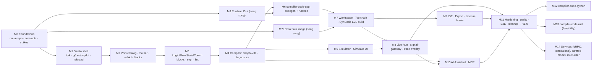

# 13 — Implementation Roadmap (thứ tự thực hiện)

> Kế hoạch tổng: 15 milestone (M0–M14), mỗi milestone có file chi tiết trong [phases/](phases/README.md) gồm: mục tiêu → ADR cần Accepted trước → task (mỗi task ≤ 1–2 ngày) → file/contract → test → DoD → **Acceptance Gate**.
> Luật vận hành: **không bắt đầu milestone phụ thuộc khi gate trước FAIL** (Master Plan Part 15). Báo cáo cuối mỗi milestone theo [template](phases/REPORT_TEMPLATE.md).
> File này **ít đổi** (kế hoạch). Tiến độ thật, theo dõi theo từng feature, cập nhật liên tục khi code: [`docs/ROADMAP.md`](../docs/ROADMAP.md).

---

## 1. Đồ thị phụ thuộc

**Đường găng (critical path):** M0 → M1 → M2 → M3 → M4 → M6 → M7 → M8 → M11.
**Song song hoá:** M6a (runtime C++ thuần, chỉ cần SDK) và M7a (toolchain image) bắt đầu ngay sau M0; M5 song song M6; M9 song song M8.

"Sau M0" nghĩa là gate M0 và DoD đã PASS, có report; không suy ra từ spike PASS. Hiện M0 còn contracts/fixtures, CI và review ADR bắt buộc (xem [tracking](../docs/ROADMAP.md)). Các nhánh song song vẫn cần ADR của task được Accepted.

---

## 2. Bảng milestone

| M | Tên | Kết quả chính | ADR phải Accepted | Ánh xạ Master Plan Phase | Ước lượng (người-tuần) |
|---|---|---|---|---|---|
| [M0](phases/M00-foundations.md) | Foundations | Repo dev + 10 thư mục module (ADR-0009), contracts v1 draft, BASELINE.md, spikes S-1..S-6 | 0001–0007, 0009 | 0, 1 | 3 |
| [M1](phases/M01-studio-shell.md) | Studio shell | Sim fork chạy trong compose, không `ee/`, không copilot, rebrand, toolbar trống vehicle | 0003, 0004, 0008 | 2 | 3 |
| [M2](phases/M02-vss-catalog-and-vehicle-blocks.md) | VSS & vehicle blocks | Catalog service, cây VSS trong toolbar, Read/Set/SignalChanged/Attribute blocks, `vss-path-selector` | 0010, 0011 | 3–7 | 4 |
| [M3](phases/M03-logic-flow-blocks.md) | Logic/Flow blocks | Toàn bộ block P0 (+P1 chọn lọc), expression editor, lint realtime | 0012, 0013, 0018 | 8, 9 | 4 |
| [M4](phases/M04-compiler-ir.md) | Compiler & IR | WorkflowGraph adapter, S0–S7, IR v1 + JSON Schema, diagnostics P0, golden IR GW-A..G | 0014, 0015, 0016, 0018 | 10–12 | 4 |
| [M5](phases/M05-simulator.md) | Simulator | Simulator IR + virtual clock, scenario editor, timeline, replay overlay | 0017 | 13 | 3 |
| [M6](phases/M06-cpp-backend-and-runtime.md) | C++ backend | runtime-cpp (strand, policies, trace, mock), codegen-cpp, golden C++ GW-A..G | 0020, 0021, 0022 | 14, 15 | 6 |
| [M7](phases/M07-workspace-toolchain-syncode.md) | SynCode E2E | workspace-service, AppManifest merge, toolchain-cpp agent, orchestrator pipeline, SynCode UI | 0023, 0025, 0026 | 16–20 | 5 |
| [M8](phases/M08-live-run-observability.md) | Live Run | runtime stack compose, run manager, signal-gateway, Run console, Signals panel, trace overlay | 0024, 0027 | 26 (một phần) | 4 |
| [M9](phases/M09-ide-export-license.md) | IDE & Export | ide-cpp image, tasks overlay, Open IDE, export zip, entitlement hooks | 0028, 0031 | 21 | 3 |
| [M10](phases/M10-ai-assistant-mcp.md) | AI & MCP | ai-assistant, MCP server tools, patch preview, provider .env, MCP clients | 0030 | (mới) | 4 |
| [M11](phases/M11-hardening-release.md) | Hardening → v1.0 | parity, E2E Playwright, perf, security, cleanup Sim dư, docs, release 1.0 | 0032, 0033, 0042 | 22, 26–28 | 5 |
| [M12](phases/M12-python-backend.md) | Python backend | compiler-code-python + toolchain-python + ide-python | 0040 | 29 | 4 |
| [M13](phases/M13-rust-backend.md) | Rust feasibility | báo cáo + prototype GW-A | 0041 | 30 | 3 |
| [M14](phases/M14-services-curated-multiuser.md) | Mở rộng | gRPC service block, standalone mode, curated multi-VSS blocks, multi-user workspaces, kuksa.val.v2 | 0043+ | 23–25 | 6+ |

**MVP (v1.0) = M0 → M11** ≈ 48 người-tuần; với đội 4 dev (1 FE, 2 BE/TS, 1 C++/Velocitas) ≈ 4–5 tháng lịch có song song. Đây là ước lượng kế hoạch, cần cập nhật theo throughput và thời gian build thực tế; Python/Rust và M14 nằm sau v1.0.

---

## 3. Spikes phải làm trong M0 (giảm rủi ro sớm)
| ID | Câu hỏi | Cách làm | Kết quả cần |
|---|---|---|---|
| S-1 | Build template C++ headless trong container không devcontainer, offline lần 2? | Dockerfile FROM `devcontainer-base-images/cpp:v0.4`, chạy chuỗi lệnh `app/Dockerfile`, rồi build lại với `VELOCITAS_OFFLINE=1` + network none | Thời gian cold/warm build; danh sách cache cần bake |
| S-2 | Databroker 0.5.0 trong compose (`--vss`, `--enable-databroker-v1`) + app template chạy với env hostname compose | compose 3 service + app sample | App nhận Vehicle.Speed khi set bằng databroker-cli |
| S-3 | `set()` của SDK (sdv v1) cập nhật current hay target? signal-gateway (kuksa.val.v1) thấy gì? | Set actuator từ app, subscribe v1 fields VALUE + ACTUATOR_TARGET | Bảng hành vi → cập nhật ADR-0024 |
| S-4 | mock-provider 0.4.1 cấu hình kết nối/API & phản hồi actuator | chạy với databroker 0.5.0 | Cấu hình đúng + quyết định bật mặc định hay không |
| S-5 | Sim v0.7.13 build & chạy bằng compose tối giản (không Trigger.dev, không pii) | compose prod rút gọn | Danh sách env bắt buộc & service bắt buộc |
| S-6 | code-server FROM toolchain image, clangd hoạt động với `compile_commands.json` của build Conan | build image, mở project | Cấu hình clangd (`--compile-commands-dir=build`) |

Kết quả spike ghi vào `docs/spikes/S-x.md` và cập nhật ADR liên quan (trạng thái Proposed → Accepted).

---

## 4. Quy tắc chuyển trạng thái ADR
`Proposed` (viết trong analysis/adr) → `Accepted` (sau review/spike, copy vào `docs/adr/` của meta-repo) → có thể `Superseded by ADR-xxxx`. Milestone chỉ bắt đầu khi ADR ghi ở cột "ADR phải Accepted" đã Accepted.

---

## 5. Định nghĩa "Product-ready v1.0" (exit M11)
- [ ] 7 golden workflow: simulate ✔, SynCode build ✔, generated tests ✔, live run ✔ trên databroker thật, parity ✔.
- [ ] Người dùng mới hoàn thành tutorial "Overspeed warning" < 10 phút (usability test 5 người).
- [ ] `scripts/bootstrap.sh` từ máy sạch (Linux/WSL2) tới UI chạy < 30 phút (bao gồm pull/build image), lần sau < 2 phút.
- [ ] Không còn `ee/`, copilot, pii, block AI trong codebase; license scan sạch; NOTICE đủ.
- [ ] Security checklist ([14 §5](14-testing-strategy.md#5-security-checklist)) pass.
- [ ] Tài liệu người dùng + tài liệu dev (BLOCK_SDK, ADD_NEW_BLOCK, IR_SPEC, DIAGNOSTICS_CATALOG, RUNTIME_API, BACKEND_PLUGIN) hoàn chỉnh.

### Bằng chứng đóng chuỗi sản phẩm

Mỗi hàng cần report của milestone tương ứng, ghi revision code, pin image/toolchain, lệnh và kết quả. Checklist trên không thay cho các gate phase (nightly 3 ngày, performance, release…).

| Kết quả người dùng cần | Milestone / bằng chứng |
|---|---|
| Vẽ workflow VSS, lưu/reload và thấy lỗi tại block | M1–M4: UI E2E, graph fixtures, diagnostics và IR golden |
| Simulate logic trước khi build | M5: GW-A..G, virtual clock và expected trace/writes |
| SynCode tạo app C++ Velocitas build/test được, lặp lại ra cùng bytes | M6–M7: generated file golden, determinism, build thật offline sau bake cache, rollback/fault injection |
| Live Run và xem log/trace/tín hiệu về canvas | M8: GW-A live smoke; M11: GW-A..G binary parity với simulator |
| Mở IDE đúng project, export rồi build lại | M9: E2E và export build trên môi trường sạch |
| Chat đề xuất patch có preview/xác nhận | M10: provider giả + MCP/patch tests; pipeline compile vẫn chạy không cần LLM |
| Cài từ máy sạch và phát hành tái lập được | M11-T10: split repo, lock, images, bootstrap và smoke từ clone sạch theo ADR-0009 |
