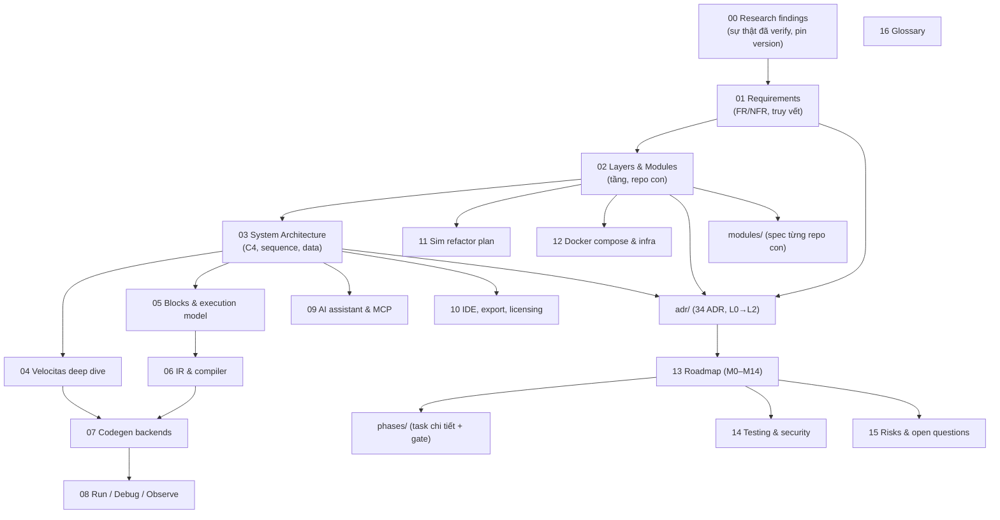

# SimVehicleApp — Bộ phân tích yêu cầu & kế hoạch (analysis/)

> Bộ tài liệu này đủ để một đội (người + AI agent) xây **SimVehicleApp**: vehicle no-code toolchain từ SimStudioAI + Eclipse Velocitas, chạy bằng Docker Compose, kiến trúc nhiều tầng với các repo con độc lập.
> Biên soạn 2026-09-30, dựa trên [Master Plan v2](../vehicle_no_code_studio_master_plan_v2.md) + research trực tiếp source upstream (xem [00](00-research-findings.md)).

## 1. Bản đồ tài liệu

## 2. Thứ tự đọc
| Vai trò | Đọc |
|---|---|
| PO / lead | 01 → 02 → 03 → 08 §1 → 13 → 15 |
| Kiến trúc sư | 00 → 02 → 03 → adr/README → toàn bộ ADR L0 |
| Dev FE (studio) | 05 → 11 → modules/simvehicleapp-studio → phases M1–M5, M7–M10 |
| Dev core/compiler | 05 → 06 → modules/simvehicleapp-core → ADR 0010–0017 |
| Dev C++/Velocitas | 04 → 07 → modules/compiler-code, velocitas-stack → ADR 0020–0025 |
| DevOps | 12 → modules/velocitas-stack, ide-vscode, simvehicleapp-meta → ADR 0005, 0024–0028 |
| AI agent | [../AGENTS.md](../AGENTS.md) → file phase đang làm → ADR liên quan → skills |

## 3. Danh mục
| File | Nội dung |
|---|---|
| [00-research-findings.md](00-research-findings.md) | Dữ kiện verify: Sim v0.7.13 (ee/ license, custom-blocks EE, copilot độc quyền), Velocitas template/SDK/CLI/runtime-local, KUKSA protocols, VSS 4.0 thống kê, Scratch AGPL, MCP, code-server; bảng pin |
| [01-requirements.md](01-requirements.md) | FR/NFR có ID, ngoài phạm vi, ma trận truy vết |
| [02-layers-and-modules.md](02-layers-and-modules.md) | 6 tầng, 10 repo con, ma trận phụ thuộc, meta-repo, lock file |
| [03-system-architecture.md](03-system-architecture.md) | C4 context/container/component, 5 sequence chính, ER, workspace layout, API |
| [04-velocitas-deep-dive.md](04-velocitas-deep-dive.md) | Mô hình Velocitas, pattern event/get/set/pubsub/timer/polling ↔ block, concurrency, headless |
| [05-blocks-and-execution-model.md](05-blocks-and-execution-model.md) | 9 nhóm block, catalog chi tiết, ngữ nghĩa run/yield/policy, lint, 7 golden workflow, UI |
| [06-ir-and-compiler.md](06-ir-and-compiler.md) | WorkflowGraph v1, IR v1, opcode, S0–S7, expression, type/unit, diagnostics |
| [07-codegen-backends.md](07-codegen-backends.md) | Backend plugin contract, C++ layout, runtime API, Python, Rust, thêm ngôn ngữ |
| [08-run-debug-observe.md](08-run-debug-observe.md) | **Trả lời "thiết kế hướng nào"**: hybrid compile-first; 3 chế độ chạy; log/trace/signals |
| [09-ai-assistant-mcp.md](09-ai-assistant-mcp.md) | Chat thay Copilot, `.env`, MCP tools, WorkflowPatch |
| [10-ide-export-licensing.md](10-ide-export-licensing.md) | code-server + Velocitas env, export template, entitlement |
| [11-sim-refactor-plan.md](11-sim-refactor-plan.md) | Giữ/thay/gỡ trong Sim, điểm mở rộng, rebrand |
| [11a-ee-clean-room-replacement.md](11a-ee-clean-room-replacement.md) | `ee/` là gì, license, ranh giới I/O, kế hoạch viết lại clean-room |
| [11b-block-inventory-and-migration.md](11b-block-inventory-and-migration.md) | **Kiểm kê từng block thật trong 268 block Sim** (xoá/giữ/tham khảo) + bảng 41 block mới ↔ cơ chế Sim tham khảo ↔ VSS |
| [12-docker-compose-and-infra.md](12-docker-compose-and-infra.md) | Profiles, compose khung, `.env.example`, bootstrap, bảo mật |
| [13-implementation-roadmap.md](13-implementation-roadmap.md) | M0–M14, đường găng, spikes, ước lượng, định nghĩa v1.0 |
| [14-testing-strategy.md](14-testing-strategy.md) | Kim tự tháp test, golden, parity, CI gates, security checklist |
| [15-risks-and-open-questions.md](15-risks-and-open-questions.md) | R1–R21, câu hỏi mở + mặc định |
| [16-glossary.md](16-glossary.md) | Thuật ngữ |
| [adr/](adr/README.md) | 34 ADR + template + cây quyết định |
| [modules/](modules/README.md) | Spec từng repo con |
| [phases/](phases/README.md) | Kế hoạch task chi tiết M0–M14 + report template |

## 4. Tóm tắt quyết định chính
1. **Hybrid compile-first**: IR là nguồn ngữ nghĩa duy nhất → Simulator (giây) + Codegen → Velocitas app thật (build/run headless trên KUKSA) + parity test. Không dùng executor của Sim ([ADR-0006](adr/ADR-0006-compile-first-execution-model.md)).
2. **Dev một repo, release multi-repo** theo [ADR-0009](adr/ADR-0009-dev-phase-module-folders.md): 10 thư mục module độc lập trong dev; submodule + lock khi release; chỉ phụ thuộc contracts; `compiler-code-<lang>`, `velocitas-stack`, `ide-vscode` tách riêng ([ADR-0002](adr/ADR-0002-meta-repo-and-submodules.md), [ADR-0007](adr/ADR-0007-service-decomposition-and-contracts.md)).
3. **Sim v0.7.13**, gỡ ngay `ee/` (license) và copilot (độc quyền); block vehicle là block generic tham số hoá VSS path, **không** dùng custom-blocks (EE) ([ADR-0003](adr/ADR-0003-upstream-baseline-and-fork-policy.md), [ADR-0004](adr/ADR-0004-license-compliance.md), [ADR-0011](adr/ADR-0011-block-model-on-canvas.md)).
4. **Velocitas không devcontainer**: toolchain image FROM `devcontainer-base-images/cpp:v0.4` với cache bake sẵn; runtime-local thay bằng services compose (databroker 0.5.0 `--enable-databroker-v1`, mosquitto 2.0.14) ([ADR-0024](adr/ADR-0024-databroker-api-and-runtime-stack.md), [ADR-0025](adr/ADR-0025-headless-velocitas-toolchain.md)).
5. **Runtime viết tay + code sinh nhỏ**: strand 1 luồng, policies, trace `SVTRACE` map về block ([ADR-0021](adr/ADR-0021-cpp-runtime-library.md)).
6. **Scratch chỉ khái niệm** (AGPL) — clean-room ([ADR-0012](adr/ADR-0012-execution-semantics.md)).
7. **AI = chat + MCP**, chỉ đề xuất WorkflowPatch, không sinh code ([ADR-0030](adr/ADR-0030-ai-assistant-mcp.md)).
