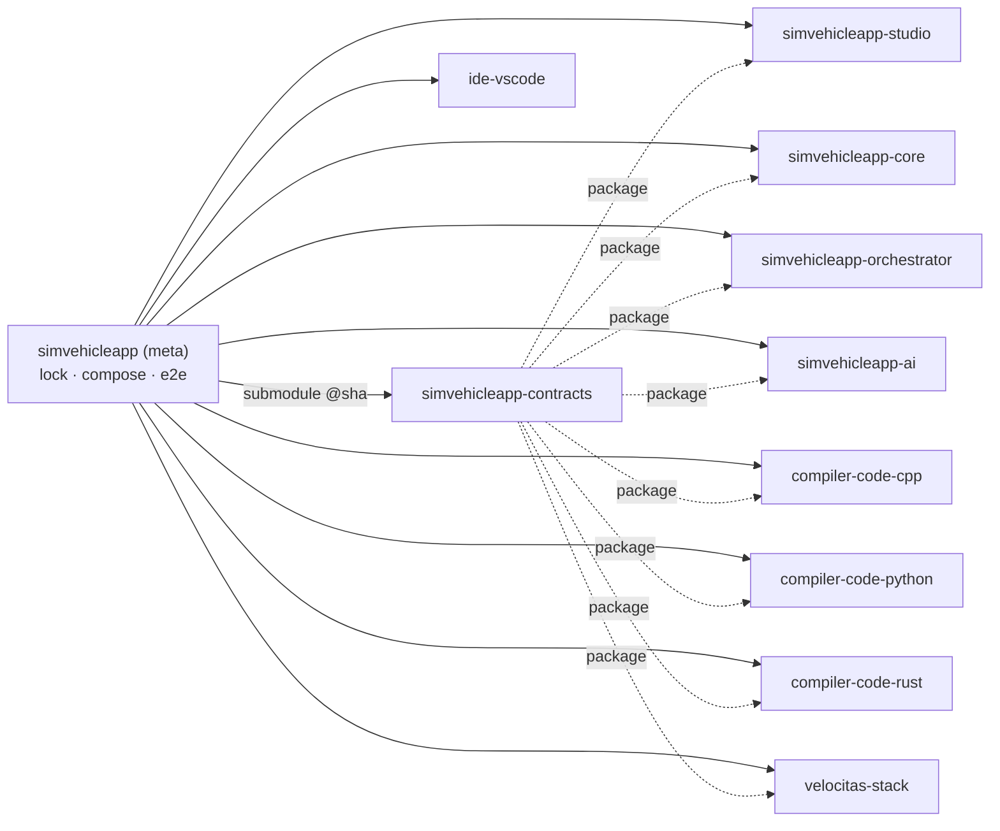

# ADR-0002: Meta-repo `simvehicleapp` + repo con độc lập (git submodule + lock file)

- **Status:** Accepted for **release**; dev phase amended by [ADR-0009](ADR-0009-dev-phase-module-folders.md) (2026-10-01) · **Date:** 2026-09-30 · **Level:** L0
- **Related:** FR-PLT-03, FR-PLT-04, FR-PLT-05, NFR-06; [02-layers-and-modules](../02-layers-and-modules.md); [ADR-0007](ADR-0007-service-decomposition-and-contracts.md)

## Context
PO yêu cầu: hệ thống dạng "monorepo nhiều phần nhiều repo gộp lại"; các khối backend (`compiler-code-<lang>`, VS Code IDE, Velocitas…) là **repo con độc lập** nhưng **có đầy đủ trong hệ thống**; sau này thêm repo con khác vẫn chạy bằng container. Đồng thời AI agent cần một chỗ checkout duy nhất để thấy toàn hệ thống.

## Decision
1. Meta-repo `simvehicleapp` chứa: compose, `.env.example`, `simvehicleapp.lock.yaml`, docs, analysis, E2E test, scripts, và `modules/*` là **git submodule** (mỗi submodule = 1 repo độc lập).
2. Danh sách repo con v1: `simvehicleapp-contracts`, `simvehicleapp-studio`, `simvehicleapp-core`, `simvehicleapp-orchestrator`, `simvehicleapp-ai`, `compiler-code-cpp`, `compiler-code-python`, `compiler-code-rust`, `velocitas-stack`, `ide-vscode`.
3. `simvehicleapp.lock.yaml` là **nguồn sự thật** về version: git SHA + semver + image digest + dải contract hỗ trợ. CI `lock-verify` bắt buộc khớp submodule.
4. Mỗi repo con tuân "Module Contract Checklist" (README, CONTRACT.md, AGENTS.md, Dockerfile, `/healthz`, `/version`, CI độc lập, LICENSE/NOTICE).
5. Code **không** import chéo giữa repo con; chỉ phụ thuộc package `@simvehicleapp/contracts` (npm), `simvehicleapp-contracts` (pypi) hoặc crate tương ứng — sinh từ repo contracts.
6. Phát triển hằng ngày: làm trong submodule (branch riêng), mở PR ở repo con; sau khi merge, PR ở meta-repo bump SHA + lock (`scripts/modules.sh bump <module>`).
7. Giai đoạn M0–M3 (khi contract còn đổi nhiều) cho phép **"dev mode"**: `scripts/modules.sh link` dùng `bun link`/workspace path tới contracts local để tránh publish liên tục.

## Diagram

## Alternatives considered
| Phương án | Ưu | Nhược | Vì sao loại |
|---|---|---|---|
| Monorepo đơn (1 repo, Turborepo workspaces) | Refactor chéo dễ, 1 PR | Không đáp ứng "repo con độc lập"; khó trao quyền/licensing riêng cho compiler-code-* | Trái yêu cầu PO |
| git subtree | Clone đơn giản | Đồng bộ 2 chiều phức tạp, lịch sử lẫn | Kém minh bạch version |
| Polyrepo không meta | Độc lập tối đa | Không có "hệ thống đầy đủ" 1 chỗ, E2E khó | Trái yêu cầu |
| Chỉ image registry (không submodule) | Nhẹ | Agent không đọc được source các khối | Thiếu cho dev |

## Consequences
+ Mỗi khối release độc lập, thay thế được (đổi ngôn ngữ = đổi module). + Có thể license/đóng nguồn riêng từng module sau này.
− Submodule có đường cong học; cần scripts. − Thay đổi contract cần phối hợp nhiều PR (giảm bằng semver + dev mode).

## Implementation
| Task | Module | Milestone |
|---|---|---|
| Tạo 10 repo con từ template module (skeleton + CI + healthz) | all | M0 |
| `scripts/modules.sh` (init, status, bump, link, unlink), `lock-verify.sh` | meta | M0 |
| Publish `@simvehicleapp/contracts` 1.0.0-alpha | contracts | M0 |
| CI `contract-only-deps` trong mỗi repo | all | M0 |

## Verification
`git clone --recurse-submodules` + `scripts/bootstrap.sh` dựng đủ hệ thống; `lock-verify` xanh; thử thay `compiler-code-cpp` bằng stub backend khác qua `SV_BACKENDS` mà không sửa module khác.
