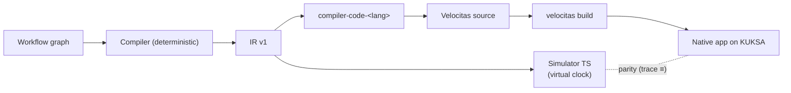

# ADR-0006: Mô hình thực thi hybrid "compile-first" (IR → Simulator + Native Velocitas app)

- **Status:** Accepted (2026-10-03 — PO chấp thuận; triển khai simulator M5, backend M6, parity M11) · **Date:** 2026-09-30 · **Level:** L0
- **Related:** FR-RUN-01..07, FR-CG-07; [08 §1](../08-run-debug-observe.md#1-các-phương-án-đã-phân-tích); Master Plan Part 3

## Context
Sim thực thi workflow bằng executor JS (DAG chạy một lần). Vehicle App Velocitas là tiến trình **event-driven chạy liên tục**, viết bằng C++/Python dùng SDK. PO muốn: workflow → code → build/run trên Velocitas → log về UI, và cũng muốn debug nhanh.

## Decision
1. **IR là nguồn sự thật duy nhất** cho ngữ nghĩa. Graph → IR (compiler) → hai đích:
   - **Simulator** (TypeScript, trong `simvehicleapp-core`) chạy IR với virtual clock — phản hồi < 1 s.
   - **Backend** `compiler-code-<lang>` → source Velocitas + runtime → build → chạy thật trên KUKSA.
2. **Không** dùng executor của Sim để chạy vehicle workflow.
3. **Không** dùng LLM ở bất kỳ bước nào của đường Graph → IR → source (network policy + review).
4. Tương đương ngữ nghĩa được bảo đảm bằng **parity test** (ADR-0042) và **conformance scenario** dùng chung.
5. "Quick Run interpreter app" (thông dịch IR trong một Velocitas app viết sẵn) **hoãn tới M14** (ADR-0048 tuỳ chọn).

## Diagram

## Alternatives considered
Xem bảng A/B/C/D ở [08 §1](../08-run-debug-observe.md#1-các-phương-án-đã-phân-tích).

## Consequences
+ Vừa nhanh vừa ra sản phẩm thật, export được. + Đổi ngôn ngữ không ảnh hưởng simulator.
− Duy trì 1 simulator + N runtime ⇒ phải có conformance chung và parity CI.

## Implementation
| Task | Milestone |
|---|---|
| Simulator | M5 |
| Backend C++ + runtime | M6 |
| Parity | M11 |

## Verification
Parity 100% golden; không có HTTP egress từ compiler/codegen containers (compose network `internal`).
