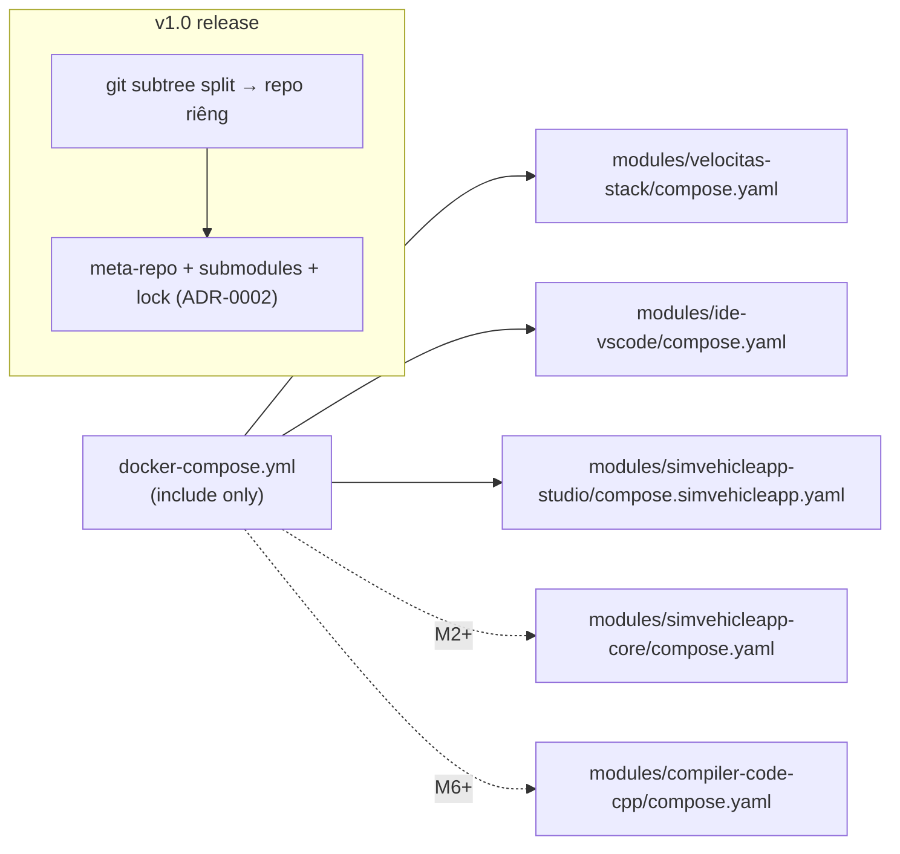

# ADR-0009: Dev phase = một repo, mỗi module một thư mục độc lập, gom bằng `docker-compose.yml` (submodule chỉ khi release)

- **Status:** Accepted (2026-10-01, verified in M0) · **Level:** L0
- **Amends:** [ADR-0002](ADR-0002-meta-repo-and-submodules.md) (ADR-0002 vẫn là mô hình **release**)
- **Related:** FR-PLT-03/04/05; [02](../02-layers-and-modules.md); [M0 spike report](../../docs/spikes/M0-spikes-report.md)

## Context
PO (2026-10-01): *"cơ chế submodule là có thể đem đi release nhưng đây mới là giai đoạn dev nên cần chia rõ folder từng repo rõ ràng và vẫn có thể modify nó một cách độc lập và vẫn gom lại build service bằng docker-compose.yml"*.
Trong dev, contract còn thay đổi liên tục; submodule làm mỗi thay đổi chéo module thành nhiều PR + bump SHA.

## Decision
1. **Một repo git duy nhất** trong giai đoạn dev (M0 → trước release v1.0). Mỗi module là **một thư mục** `modules/<repo-name>/` có ranh giới như một repo thật:
   - tự chứa: `README.md`, (sau) `CONTRACT.md`, `AGENTS.md`, Dockerfile(s), test, và **compose fragment riêng** (`compose.yaml` hoặc `compose.simvehicleapp.yaml` cho fork Sim);
   - chạy/validate được **độc lập**: `docker compose -f modules/<m>/compose.yaml config|up` (đã kiểm: velocitas-stack, ide-vscode, simvehicleapp-studio);
   - không import code module khác (chỉ `simvehicleapp-contracts`), không tham chiếu path `../` sang module khác trong build context.
2. **Root `docker-compose.yml`** chỉ `include:` các fragment ⇒ gom toàn hệ thống. Thứ tự build phụ thuộc image (devcontainer → toolchain → ide) do `scripts/sv build` đảm bảo; IDE dùng `additional_contexts: toolchain: docker-image://${SV_TOOLCHAIN_IMAGE}` để vẫn build độc lập.
3. Tài nguyên dùng chung (network `sv-internal`/`sv-edge`, volume `sv-workspace`, `sv-conan2`, `sv-velocitas`, `sv-ccache`) được **khai báo trong mọi fragment dùng chúng** (compose merge cùng tên khi include) ⇒ fragment nào cũng valid khi chạy một mình.
4. Module gốc từ upstream giữ **provenance**: snapshot không `.git`, file `UPSTREAM.md`/`SIMVEHICLE.md` ghi repo + SHA + ngày; thay đổi của SimVehicleApp lên template Velocitas được áp bằng **script khi build/init** (không sửa file template gốc) để diff upstream luôn sạch.
5. **Release (v1.0):** mỗi `modules/<m>` tách thành repo riêng bằng `git subtree split --prefix modules/<m>` (giữ lịch sử), meta-repo chuyển sang submodule + `simvehicleapp.lock.yaml` đúng như ADR-0002. Script `scripts/release-split.sh` viết ở M11.
6. Quy ước commit trong dev: prefix scope theo module (`velocitas-stack: …`, `studio: …`) để `subtree split` cho lịch sử sạch.

## Diagram

## Alternatives considered
| Phương án | Vì sao không chọn cho dev |
|---|---|
| Submodule ngay từ đầu (ADR-0002) | PO muốn đơn giản giai đoạn dev; thay đổi contract chéo module tốn nhiều PR |
| Nested `.git` trong từng thư mục | Dễ commit nhầm, tooling (IDE, CI) khó; không cần cho tới release |
| Một compose khổng lồ ở root | Module không còn độc lập; khó tách repo khi release |

## Consequences
+ Sửa chéo module trong 1 commit; mỗi module vẫn build/run độc lập; tách repo về sau không mất lịch sử.
− Phải tự giữ kỷ luật ranh giới (CI kiểm path import/build context ở M1+).

## Verification (M0)
`docker compose config` ở root ✔; từng fragment `config -q` độc lập ✔; `scripts/sv smoke` ✔.

## Notes / Deviations

2026-10-03 — Review tài liệu trên checkout `a5f22f4` (có thay đổi chưa commit): root Compose include đúng 3 fragment; `scripts/sv` có thật, contracts chỉ có README placeholder, chưa có CI root hay scripts submodule/lock. Đây là trạng thái dev của Decision 1–5, không phải toàn bộ M0 đã hoàn tất. Đồng bộ analysis 02/12/13, spec meta, phase M0/M11 và ROADMAP; đưa việc split/lock/bootstrap vào M11-T10 theo Decision 5. Bằng chứng chi tiết và phần còn thiếu: [documentation review](../../docs/reports/2026-10-03-documentation-review.md). Giữ nguyên Decision và trạng thái ADR; không chạy lại spike trong review prose này.
