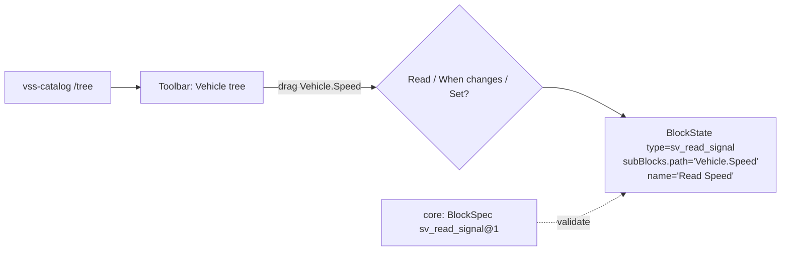

# ADR-0011: Block vehicle trên canvas Sim — block generic tham số hoá bằng VSS path (không dùng custom-blocks)

- **Status:** Accepted (2026-10-04 — PO chấp thuận cùng Notes 2026-10-04) · **Date:** 2026-09-30 · **Level:** L1
- **Related:** FR-BLK-01..09, FR-VSS-02, R3–R5; thay thế Master Plan ADR-001; [00 F1](../00-research-findings.md#24-phát-hiện-quan-trọng--lệch-so-với-master-plan-v2); [11b — bảng 41 block mới ↔ cơ chế Sim tham khảo](../11b-block-inventory-and-migration.md#7-bảng-tổng-41-block-mới--cơ-chế-sim-tham-khảo--vss-minh-hoạ-đã-verify-thật)

## Context
- Master plan định dùng `app/api/custom-blocks` — **không tồn tại ở v0.7.13**, và ở v0.9.6 là **tính năng Enterprise** ⇒ loại.
- Sim đăng ký block tĩnh (`BlockConfig` TS trong `apps/sim/blocks/blocks/*`, import vào `registry.ts`). ~1 200 signal VSS không thể là 1 200 file TS; và đổi VSS không được rebuild frontend.
- PO muốn "mỗi block tương ứng đại diện một tín hiệu VSS".

## Decision
1. **Block type tĩnh, số lượng nhỏ** (xem [05 §2](../05-blocks-and-execution-model.md#2-catalog-block-chi-tiết-v1)): `sv_read_signal`, `sv_set_actuator`, `sv_on_signal_changed`, `sv_read_attribute`, … mỗi block có subBlock `path` kiểu mới **`vss-path-selector`**.
2. **"Mỗi block = một tín hiệu" ở tầng UX:** toolbar có panel **Vehicle** hiển thị cây VSS (lazy từ catalog); kéo một signal ⇒ tạo block generic với `path` đã điền & khoá, **tên hiển thị = tên signal** (vd "Read Speed"), icon/màu theo kind (sensor/actuator/attribute), badge unit/type (kiểu mảng hiện badge `[ ]` + kiểu phần tử, ví dụ "string[]" — xem [ADR-0018](ADR-0018-vss-array-and-full-datatype-coverage.md)).
3. Block definitions đặt trong `apps/sim/blocks/vehicle/*.ts` + 1 điểm đăng ký trong `registry.ts` (`// SV:`). Allowlist toolbar chỉ hiển thị nhóm `sv_*`.
4. **Block definition = 2 phần:**
   - UI config (Sim `BlockConfig`) trong studio.
   - **Semantic definition** (`BlockSpec` JSON: inputs/outputs/props/types/opcode/lowering/version/migrations) trong `simvehicleapp-core/packages/blocks` — compiler & simulator dùng; studio lấy qua `GET /blocks` để validate/type hint. Studio config phải khớp spec (test đồng bộ `block-parity.test.ts`).
5. SubBlock types mới: `vss-path-selector`, `sv-expression` (editor có autocomplete `<…>`), `sv-duration`, `sv-enum` (từ `allowed`), `sv-typed-value` (theo datatype).
6. Block package chuẩn (Master Plan Appendix C) giữ nguyên ý, đặt ở core: `packages/blocks/<name>/{spec.json, semantics.md, migrations.ts, simulator.ts, lowering.ts, <name>.test.ts}`.
7. Curated multi-VSS block (M14) = BlockSpec với `lowering` sinh nhiều node.

## Diagram

## Alternatives considered
| Phương án | Vì sao loại |
|---|---|
| custom-blocks API | Không có ở v0.7.13; EE ở bản mới |
| Sinh file block TS theo VSS lúc build | Vi phạm R4 |
| Registry động hoàn toàn (BlockConfig từ server) | Sim registry là module tĩnh; sửa sâu executor/serializer; rủi ro cao |

## Consequences
+ Ít thay đổi lõi Sim; VSS động. − Cần viết subblock renderer mới và panel Vehicle.

## Implementation
| Task | Milestone |
|---|---|
| BlockSpec schema + 4 block vehicle + subblock `vss-path-selector` | M2 |
| Panel Vehicle + drag-to-create menu | M2 |
| Các block logic/flow/state/comm | M3 |
| `block-parity.test.ts` | M2 |

## Verification
Kéo `Vehicle.Speed` tạo block đúng; đổi release VSS của project → cây đổi mà không build lại studio; `Set` không xuất hiện cho sensor.

## Notes / Deviations (2026-10-04, rà source Sim v0.7.13 trước M2)
- **Vị trí `SubBlockType`**: union nằm ở `packages/workflow-types/src/blocks.ts` (package dùng chung với `apps/realtime`), không phải `apps/sim/blocks/types.ts` (file này chỉ re-export). 5 subBlock type mới (§5) thêm vào union đó với marker `// SV:`; renderer thêm `case` trong `…/editor/components/sub-block/sub-block.tsx` (switch theo `config.type`). Package không được import `apps/*` (boundary check của Sim) — union chỉ là literal type nên không vi phạm.
- **Drag-to-create (§2)**: `onDrop` của canvas (`workflow.tsx`) chỉ đọc `{type, enableTriggerMode}` từ `dataTransfer` rồi gọi `handleToolbarDrop`; nhưng `addBlock(...)` **đã** có tham số `presetSubBlockValues`. ⇒ mở rộng payload drop thêm `name?` + `presetSubBlockValues?` và truyền xuống `addBlock` (sửa nhỏ `// SV:`), không tạo đường tạo block riêng. Đường "add bằng click/command palette" giữ nguyên (block rỗng, chọn path sau).
- **"path đã điền & khoá"**: Sim không có cơ chế khoá từng subBlock. ⇒ "khoá" hiện thực trong chính `vss-path-selector`: khi đã có giá trị thì hiển thị dạng read-only (path + kind/type/unit), đổi path phải bấm hành động "Change" tường minh. Không sửa cơ chế subBlock lõi.
- **Allowlist toolbar (§3)**: đã có từ M01-T05 (`NEXT_PUBLIC_SV_TOOLBAR_ALLOWLIST`, mặc định `sv_*,note`) — block `sv_*` mới tự hiện, không cần sửa thêm.
- **`GET /blocks` (§4)**: do skeleton compiler service phục vụ (M02-T06); studio gọi qua BFF (`lib/sv/api-client.ts`, biến `SV_COMPILER_URL`), không import package core (luật cứng §2).
- **M02-T05 (2026-10-04) — BlockSpec 4 block vehicle** ở `modules/simvehicleapp-core/packages/blocks/<type>/{spec.json, semantics.md}` (`lowering.ts`/`simulator.ts`/`migrations.ts` thêm ở M4/M5 khi có compiler/simulator — chưa tạo file rỗng). Quy ước `handles` dùng **đúng id handle của canvas Sim** để `block-parity.test.ts` so trực tiếp: block category `triggers` ⇒ `{in: [], out: ["source"]}` (Sim không vẽ handle vào/lỗi cho trigger); block bước ⇒ `{in: ["target"], out: ["source", "error"]}`. Lowering ánh xạ `source`→`done` của IR (06 §2.2). **Lệch:** `sv_read_attribute` có thêm handle `error` (06 §2.2 chỉ ghi output `value`) vì Sim luôn vẽ handle lỗi cho block bước và "attribute chưa có giá trị" là ca thật. `sv_set_actuator` thêm prop `onError` (`continue`|`stop`) theo 05 §3.6 ("cấu hình ở block").
- **M02-T09 (2026-10-04) — parity không vượt ranh giới module:** studio không được import core (luật cứng §2) nên giữ **snapshot** body `GET /blocks` ở `apps/sim/blocks/vehicle/block-specs.json`; `block-parity.test.ts` so từng BlockConfig `sv_*` với snapshot (id subBlock = tên prop theo thứ tự, editor theo `kind`, `required`, default, `enum`, `vssKinds`/`vssWrites`, `valueType`, outputs, handle). Snapshot được giữ bằng `scripts/ci/block_specs_sync.py` (cấp meta-repo, CI job `contract-only-deps`; `--write` để sinh lại) — đổi `spec.json` mà quên snapshot ⇒ CI đỏ. **Editor tạm M2** (ghi rõ trong bảng `EDITORS` của test): prop `expression` (`sv_set_actuator.value`) và `duration` (`debounceMs`) dùng `sv-typed-value` cho tới khi `sv-expression`/`sv-duration` có ở M03-T08 (hằng số là biểu thức hợp lệ; duration = `uint32` ms).
- **M02-T10 (2026-10-04) — kéo signal ra canvas:** section "Vehicle" đầu toolbar (cây lazy + tìm kiếm + chọn release). Payload kéo `{type:'sv_signal', svSignal}`; canvas và overlay workflow rỗng (`command-list`) chuyển nó thành sự kiện `sv-signal-drop` ⇒ menu tại con trỏ chỉ liệt kê block hợp lệ theo kind (cùng quy tắc `blocksFor`; mảng không có Set). Chọn ⇒ đi qua đường tạo block có sẵn của Sim (`toolbar-drop-on-empty-workflow-overlay` / `add-block-from-toolbar`, mở rộng `name` + `presetSubBlockValues` → `addBlock`) — không có đường tạo block riêng. Click một signal trong panel (bàn phím) mở cùng menu, block thêm vào giữa viewport.
- **M03-T08 (2026-10-04):** `sv-expression` (react-simple-code-editor + grammar Prism SVX + `TagDropdown` của Sim khi gõ `<`, nút "Signal" chèn `<Vehicle.…>` từ catalog, chọn nhanh `true/false`/`allowed` khi kiểu đích là `$signal`) và `sv-duration` (số + ms/s/min, lưu số nguyên ms, không làm tròn) thay editor tạm của M2: `sv_set_actuator.value` → `sv-expression`, `sv_on_signal_changed.debounceMs` → `sv-duration`; bảng `EDITORS` của `block-parity.test.ts` không còn mục tạm. Kiểm cú pháp/kiểu hiển thị qua `POST /lint` (M03-T11) — studio không import parser của core (luật cứng §2).
- **M03-T10 (2026-10-04) — container:** `sv_repeat`, `sv_while`, `sv_parallel` **không** có BlockConfig riêng; canvas dùng container `loop`/`parallel` của Sim (UI, kéo block vào trong, realtime đã có) và graph adapter (M4) ánh xạ bằng `lib/sv/container-mapping.ts`: `loop`+`for` → `sv_repeat` (`iterations`→`count`, 1…10 000), `loop`+`while` → `sv_while` (`whileCondition`, `iterations`→`maxIterations`, mặc định 1 000), `parallel`+`count` → `sv_parallel` (`join: all`); `intervalMs` = 0. Các mode không có nghĩa với xe (`forEach`, `doWhile`, parallel `collection`) bị ẩn trong trình chỉnh container và trả `CONTAINER_INVALID` nếu gặp. Toolbar mặc định thêm `loop,parallel`. `join any/none` và `intervalMs` khác 0 cần thêm trường cho container (chưa làm — ghi follow-up).
- **M14 #1 (2026-10-07) — §7 hiện thực bằng [ADR-0045](ADR-0045-curated-multi-vss-blocks.md) (Proposed, theo uỷ quyền PO 2026-10-06 — chờ PO xác nhận):** BlockSpec không có trường `lowering` tự do; block curated dùng category `composite` + trường khai báo `members: [{output, path}]` (path có placeholder `{prop}`), compiler desugar thành chuỗi `vehicle.read` — cùng ý "sinh nhiều node" của §7, không opcode IR mới. Tên block: `sv_battery_status`, `sv_door_status`, `sv_climate_status` (thay `sv_semantic_*` của 05/11b).
