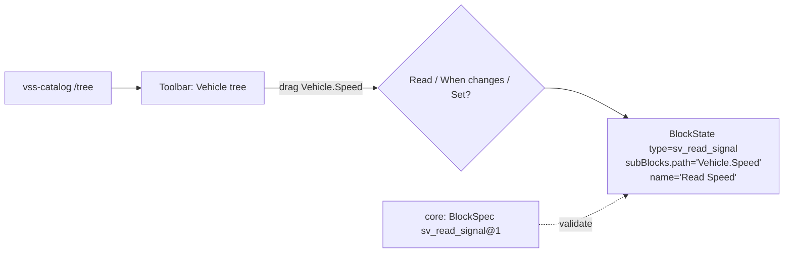

# ADR-0011: Block vehicle trên canvas Sim — block generic tham số hoá bằng VSS path (không dùng custom-blocks)

- **Status:** Proposed · **Date:** 2026-09-30 · **Level:** L1
- **Related:** FR-BLK-01..09, FR-VSS-02, R3–R5; thay thế Master Plan ADR-001; [00 F1](../00-research-findings.md#24-phát-hiện-quan-trọng--lệch-so-với-master-plan-v2); [11b — bảng 41 block mới ↔ cơ chế Sim tham khảo](../11b-block-inventory-and-migration.md#7-bảng-tổng-41-block-mới--cơ-chế-sim-tham-khảo--vss-minh-hoạ-đã-verify-thật)

## Context
- Master plan định dùng `app/api/custom-blocks` — **không tồn tại ở v0.7.13**, và ở v0.9.6 là **tính năng Enterprise** ⇒ loại.
- Sim đăng ký block tĩnh (`BlockConfig` TS trong `apps/sim/blocks/blocks/*`, import vào `registry.ts`). ~1 200 signal VSS không thể là 1 200 file TS; và đổi VSS không được rebuild frontend.
- PO muốn "mỗi block tương ứng đại diện một tín hiệu VSS".

## Decision
1. **Block type tĩnh, số lượng nhỏ** (xem [05 §2](../05-blocks-and-execution-model.md#2-catalog-block-chi-tiết-v1)): `sv_read_signal`, `sv_set_actuator`, `sv_on_signal_changed`, `sv_read_attribute`, … mỗi block có subBlock `path` kiểu mới **`vss-path-selector`**.
2. **"Mỗi block = một tín hiệu" ở tầng UX:** toolbar có panel **Vehicle** hiển thị cây VSS (lazy từ catalog); kéo một signal ⇒ tạo block generic với `path` đã điền & khoá, **tên hiển thị = tên signal** (vd "Read Speed"), icon/màu theo kind (sensor/actuator/attribute), badge unit/type (kiểu mảng hiện badge `[ ]` + kiểu phần tử, ví dụ "string[]" — xem [ADR-0018](ADR-0018-vss-array-and-full-datatype-coverage.md)).
3. Block definitions đặt trong `apps/sim/blocks/vehicle/*.ts` + 1 điểm đăng ký trong `registry.ts` (`// SV:`). Allowlist toolbar chỉ hiển thị nhóm `sv_*`.
4. **Block definition = 2 phần:**
   - UI config (Sim `BlockConfig`) trong studio.
   - **Semantic definition** (`BlockSpec` JSON: inputs/outputs/props/types/opcode/lowering/version/migrations) trong `simvehicleapp-core/packages/blocks` — compiler & simulator dùng; studio lấy qua `GET /blocks` để validate/type hint. Studio config phải khớp spec (test đồng bộ `block-parity.test.ts`).
5. SubBlock types mới: `vss-path-selector`, `sv-expression` (editor có autocomplete `<…>`), `sv-duration`, `sv-enum` (từ `allowed`), `sv-typed-value` (theo datatype).
6. Block package chuẩn (Master Plan Appendix C) giữ nguyên ý, đặt ở core: `packages/blocks/<name>/{spec.json, semantics.md, migrations.ts, simulator.ts, lowering.ts, <name>.test.ts}`.
7. Curated multi-VSS block (M14) = BlockSpec với `lowering` sinh nhiều node.

## Diagram

## Alternatives considered
| Phương án | Vì sao loại |
|---|---|
| custom-blocks API | Không có ở v0.7.13; EE ở bản mới |
| Sinh file block TS theo VSS lúc build | Vi phạm R4 |
| Registry động hoàn toàn (BlockConfig từ server) | Sim registry là module tĩnh; sửa sâu executor/serializer; rủi ro cao |

## Consequences
+ Ít thay đổi lõi Sim; VSS động. − Cần viết subblock renderer mới và panel Vehicle.

## Implementation
| Task | Milestone |
|---|---|
| BlockSpec schema + 4 block vehicle + subblock `vss-path-selector` | M2 |
| Panel Vehicle + drag-to-create menu | M2 |
| Các block logic/flow/state/comm | M3 |
| `block-parity.test.ts` | M2 |

## Verification
Kéo `Vehicle.Speed` tạo block đúng; đổi release VSS của project → cây đổi mà không build lại studio; `Set` không xuất hiện cho sensor.
