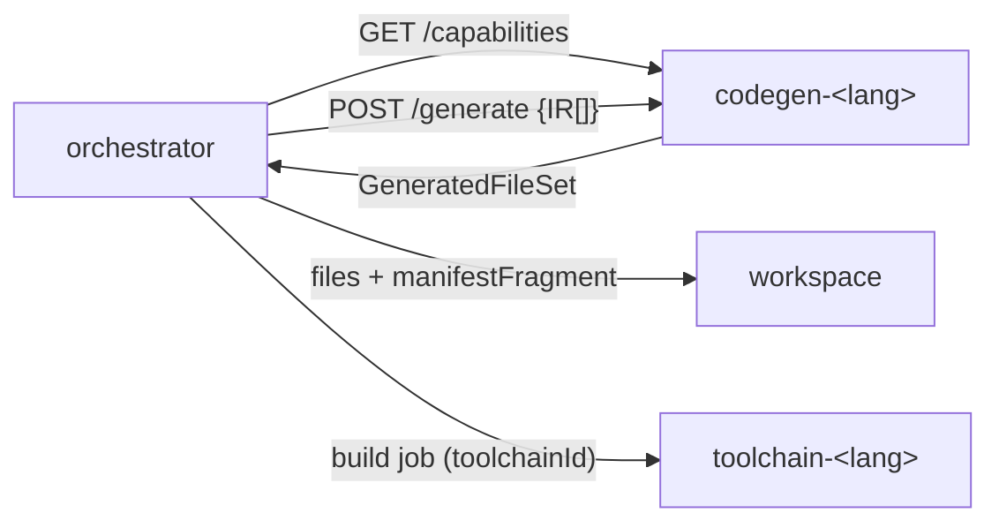

# ADR-0020: Backend Plugin Contract — `compiler-code-<lang>` là service thuần, thay thế được

- **Status:** Proposed · **Date:** 2026-09-30 · **Level:** L1
- **Related:** FR-CG-02, R10; [07 §1–2](../07-codegen-backends.md); ADR-0002, ADR-0007

## Context
PO: "kết hợp với một cục repo riêng để gen code cpp/rust/python… muốn đổi ngôn ngữ chỉ cần đổi cục này (compiler-code-<ngôn ngữ>)". Codegen phải tất định, không ghi đĩa trực tiếp (workspace là single writer), không gọi LLM.

## Decision
1. Mỗi ngôn ngữ = 1 repo `compiler-code-<lang>` gồm: generator (service HTTP), runtime library ngôn ngữ đó, template overlay, conformance, `backend.yaml`.
2. API v1: `GET /capabilities`, `POST /generate` (IR[] → GeneratedFileSet), `GET /runtime/files`, `GET /template-overlay/files`, `/healthz`, `/version` (schema trong contracts).
3. **Luật:** thuần/tất định; không I/O ngoài package; không mạng (compose network `internal`); chỉ sinh trong `ownedRoots`; AppManifest trả fragment; header DO NOT EDIT + irHash; source map bắt buộc.
4. Orchestrator khám phá backend qua env `SV_BACKENDS=cpp=http://codegen-cpp:4110,python=…`; compiler S7 dùng `/capabilities` (cache 60 s).
5. Generator viết bằng **TypeScript** cho mọi ngôn ngữ (dùng chung types IR từ contracts, tooling thống nhất); runtime viết bằng ngôn ngữ đích.
6. Mỗi backend kèm **toolchain id** (`toolchain-cpp`) — nối với velocitas-stack qua Toolchain API (ADR-0025), không phụ thuộc code.

## Diagram

## Alternatives considered
| Phương án | Vì sao loại |
|---|---|
| Backend là thư viện import vào orchestrator | Không độc lập repo/container; đổi ngôn ngữ phải rebuild orchestrator |
| Backend ghi thẳng workspace | Vi phạm single writer, khó atomic/rollback |
| CLI thay vì HTTP | Cần exec trong container khác; HTTP đơn giản hơn trong compose |
| Generator viết bằng ngôn ngữ đích | 3 tech stack cho tooling, khó chia sẻ types IR |

## Consequences
+ Đổi/ thêm ngôn ngữ không chạm core/studio. − Thêm 1 hop mạng (không đáng kể).

## Verification
Stub backend `compiler-code-echo` (test fixture) thay được `cpp` trong E2E mà không sửa module khác; determinism test ở mỗi backend.
