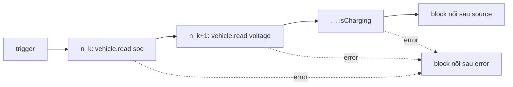

# ADR-0045: Block curated đa-VSS là BlockSpec `composite` với `members`, desugar thành chuỗi `vehicle.read`

- **Status:** Proposed
- **Date:** 2026-10-07
- **Level:** L2 Component
- **Deciders:** Claude Code theo uỷ quyền PO 2026-10-06 — chờ PO xác nhận
- **Related:** FR-BLK-07 (P2, R5); [ADR-0011](ADR-0011-block-model-on-canvas.md) §7; [ADR-0014](ADR-0014-ir-v1.md); [05 §1, §2](../05-blocks-and-execution-model.md); [11b](../11b-block-inventory-and-migration.md) `sv_semantic_*`; [phases/M14](../phases/M14-services-curated-multiuser.md) #1 (Master Plan Phase 23)

## Context
- ADR-0011 §7 đã định hướng: block curated đa-VSS = BlockSpec có `lowering` sinh nhiều node. Contract `block-spec.v1`
  hiện chỉ có `opcode` (một node) và category `composite` chưa được block nào dùng.
- Người dùng no-code muốn "trạng thái pin / cửa / điều hoà" như một bước, không phải kéo 4–5 block Read signal.
- Dữ kiện catalog (đã kiểm `modules/velocitas-stack/vss/vss_rel_{4.0,4.2}.json`, 2026-10-07): các tín hiệu chọn dưới
  đây có mặt ở **cả** v4.0 và v4.2 với cùng kind/datatype/unit:
  - Pin: `Vehicle.Powertrain.TractionBattery.StateOfCharge.Current` (float %),
    `…TractionBattery.CurrentVoltage` (float V), `…TractionBattery.CurrentCurrent` (float A),
    `…TractionBattery.Charging.IsCharging` (boolean).
  - Cửa: `Vehicle.Cabin.Door.<Row>.<Side>.IsOpen`/`IsLocked` (actuator boolean), `IsChildLockActive` (sensor boolean).
  - Điều hoà: `Vehicle.Cabin.HVAC.AmbientAirTemperature`, `Vehicle.Exterior.AirTemperature` (float °C),
    `Vehicle.Cabin.HVAC.Station.<Row>.<Seat>.Temperature` (int8 °C), `FanSpeed` (uint8 %),
    `Vehicle.Cabin.HVAC.IsAirConditioningActive` (boolean).
- `vehicle.read` đã có ở simulator và cả ba backend (C++/Python/Rust, conformance 46/46). Simulator: đọc lỗi (chưa có
  giá trị/timeout) ⇒ handle `error` nếu nối, không thì log + đi tiếp (05 §3.6).

## Decision
1. `block-spec.v1` thêm trường **tuỳ chọn** `members: [{ output, path }]` (thay đổi additive, specVersion giữ `1.x`):
   - Chỉ hợp lệ khi `category = "composite"` và `opcode = "vehicle.read"`.
   - `path` là VSS path, có thể chứa placeholder `{prop}` thay bằng giá trị prop `enum` cùng tên của block (vd.
     `Vehicle.Cabin.Door.{door}.IsOpen`).
   - Mỗi member PHẢI có output cùng tên trong `outputs` với type `$signal` (datatype/unit của path member).
2. Compiler PHẢI desugar block composite thành **chuỗi node `vehicle.read`**, một node mỗi member theo thứ tự `members`;
   `next` của member k là member k+1, member cuối nối handle `source` của block; `next.error` của mọi member là handle
   `error` của block. Node đầu mang id của block (các cạnh vào trỏ vào nó); member sau có `src.inserted = true`,
   `reason = "composite member <output>"`. Ref `<Block.output>` thành `$ref` tới `value` của node member tương ứng.
   ⇒ **Không** opcode IR mới, **không** đổi IR schema, simulator hay backend.
3. Prop `source` (`latest-from-trigger` | `fresh-read`) áp cho mọi member như `sv_read_signal`.
4. S3 PHẢI kiểm từng path member (sau khi thay placeholder) như path của Read signal: không tồn tại ⇒
   `VEHICLE_PATH_NOT_FOUND`, là branch ⇒ `VEHICLE_PATH_IS_BRANCH` (field = prop placeholder, hoặc không field khi path cố
   định). **Không** thêm mã diagnostic mới.
5. Ba block đầu (P2, category `composite`, màu nâu trên canvas):
   - `sv_battery_status` → `soc`, `voltage`, `current`, `isCharging`.
   - `sv_door_status` (prop `door`: `Row1.DriverSide` | `Row1.PassengerSide` | `Row2.DriverSide` | `Row2.PassengerSide`)
     → `isOpen`, `isLocked`, `isChildLockActive`.
   - `sv_climate_status` (prop `station`: `Row1.Driver` | `Row1.Passenger`) → `cabinTemperature`,
     `outsideTemperature`, `setTemperature`, `fanSpeed`, `isAirConditioningActive`.
6. Thêm block curated sau này = thêm `spec.json` + `semantics.md` + BlockConfig; KHÔNG được viết lowering riêng theo từng
   block. Block composite chỉ đọc; block curated ghi (vd. "Lock all doors") cần ADR khác.

## Diagram

## Alternatives considered
| Phương án | Ưu | Nhược | Vì sao loại |
|---|---|---|---|
| Opcode IR mới `vehicle.read_many` | Một node, snapshot "nguyên tử" | Đổi IR + simulator + 3 runtime + 3 generator; databroker không có đọc nguyên tử nhiều path trong `sdv.databroker.v1` đã dùng | Chi phí lớn, không thêm ngữ nghĩa thật |
| Output = `$signal` trực tiếp (không node, như ref `<Vehicle.X>`) | Không node | Giá trị đọc tại lúc dùng, không phải lúc block chạy; không có handle `error` | Sai kỳ vọng "chụp trạng thái" |
| Macro phía studio (thả 4 Read signal) | Không đổi compiler | Canvas rối, mất ý nghĩa "một bước", không sửa được nhóm | Trái mục tiêu FR-BLK-07 |
| Lowering TS riêng mỗi block | Linh hoạt | Mỗi block một đoạn code compiler; khó review/kiểm | Khai báo `members` đủ cho mọi block chỉ đọc |

## Consequences
- Tích cực: block curated mới chỉ là dữ liệu (spec + UI); mọi backend hỗ trợ ngay; trace/highlight theo `src.blockId`.
- Tiêu cực / nợ: nhiều node IR cùng `blockId` (trace có nhiều `node.enter` cho một block); các member được đọc lần lượt
  trong cùng lượt chạy — với `latest-from-trigger` không yield nên vẫn là một ảnh chụp nhất quán trong strand, với
  `fresh-read` mỗi member là một yield point.
- Ảnh hưởng module: contracts (schema + types + CHANGELOG), core (`packages/blocks`, compiler lint/compile), studio
  (BlockConfig, màu, `block-specs.json`), fixtures (conformance C39). Simulator và `compiler-code-*`: không đổi code.

## Implementation
| Task | Module | Milestone |
|---|---|---|
| Schema `members` + types + CHANGELOG | simvehicleapp-contracts | M14 #1 |
| 3 spec + semantics + đăng ký | simvehicleapp-core/blocks | M14 #1 |
| S3 kiểm member, desugar chuỗi `vehicle.read` | simvehicleapp-core/compiler | M14 #1 |
| BlockConfig + màu composite + block-specs sync | simvehicleapp-studio | M14 #1 |
| Conformance `C39-composite-status` (+ `ir.json`) | contracts fixtures ⇒ simulator + C++/Python/Rust | M14 #1 |

## Verification
- Unit compiler: số node, thứ tự `next`, `error`, `$ref`, `src.inserted`; path member không tồn tại ⇒
  `VEHICLE_PATH_NOT_FOUND`; tất định (hai lần cùng bytes).
- `block-parity.test.ts` (studio ↔ spec) PASS.
- Conformance C39 PASS trên simulator và P1 của C++/Python/Rust (CI).
- Phase 23 gate (Master Plan): ≥ 3 block curated mẫu dùng được trên canvas.

## Notes / Deviations
