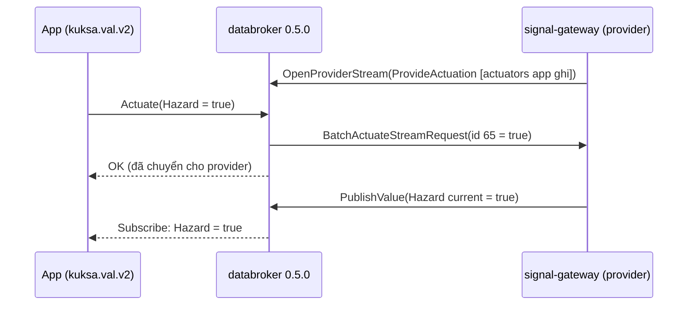

# ADR-0047: Chuyển sang `kuksa.val.v2` từng backend trên databroker 0.5.0, signal-gateway làm provider, rồi mới nâng databroker

- **Status:** Proposed
- **Date:** 2026-10-07
- **Level:** L1 Subsystem
- **Deciders:** Claude Code theo uỷ quyền PO 2026-10-06 — chờ PO xác nhận
- **Related:** [ADR-0024](ADR-0024-databroker-api-and-runtime-stack.md) §7 (kế hoạch v2), [00 §3.5–3.8](../00-research-findings.md),
  [ADR-0040](ADR-0040-python-backend.md), [ADR-0041](ADR-0041-rust-backend-feasibility.md), [ADR-0042](ADR-0042-semantic-parity-testing.md);
  spike [docs/spikes/kuksa-val-v2](../../docs/spikes/kuksa-val-v2/README.md); [phases/M14](../phases/M14-services-curated-multiuser.md) #5

## Context
- Hiện tại (ADR-0024): databroker **0.5.0** `--enable-databroker-v1`; cả ba backend dùng `sdv.databroker.v1`
  (C++ SDK mặc định, Python SDK 0.15.7 chỉ có v1, Rust host dùng stub `sdv_proto` của `kuksa-rust-sdk`); signal-gateway
  mirror target → current bằng `kuksa.val.v1`.
- Upstream (kiểm 2026-10-07, chi tiết trong spike): **databroker 0.7.0 đã xoá `sdv.databroker.v1`**; mới nhất 0.7.1 chỉ
  phục vụ `kuksa.val.v1` + `kuksa.val.v2`. Velocitas Python SDK mới nhất vẫn v0.15.7 (chỉ v1). `kuksa-client` 0.6.0 và
  `kuksa-rust-sdk` 0.2.2 có stub v2; C++ SDK chọn bằng `KUKSA_DATABROKER_API=kuksa.val.v2`.
- Spike trên 0.5.0: v2 chạy song song với `sdv.databroker.v1`; `Actuate` không provider ⇒ `UNAVAILABLE`; provider qua
  `OpenProviderStream` nhận actuation theo **id số**, một actuator một provider (`ALREADY_EXISTS`); current đổi khi
  provider `PublishValue`.
- Hệ quả: nâng databroker ≥ 0.7 trước khi cả ba backend dùng v2 ⇒ mọi app sinh ra **không chạy** được.

## Decision
1. **Giữ pin databroker 0.5.0** (phục vụ cả `sdv.databroker.v1` và `kuksa.val.v2`) trong suốt quá trình chuyển. KHÔNG được
   nâng lên ≥ 0.7 cho tới khi bước 4 xong và gate bên dưới PASS.
2. **signal-gateway thành provider v2** cho stack dev, thay mirror target → current: khi Run bắt đầu, mở
   `OpenProviderStream` claim đúng các actuator app ghi (IR `signals[].access` có `write`, như `PUT /mirror` hiện tại);
   mỗi `BatchActuateStreamRequest` ⇒ `PublishValue` giá trị đó làm current (tra id ↔ path bằng `ListMetadata`); đóng
   stream khi Run kết thúc. Actuator đã có provider khác (`ALREADY_EXISTS`) ⇒ báo trên UI, không ép.
3. **Runtime mỗi backend có hai host API**, chọn bằng `SV_DATABROKER_API` = `sdv.databroker.v1` (mặc định tới khi gate
   PASS) | `kuksa.val.v2`: Rust (stub `v2_proto` của `kuksa-rust-sdk`), C++ (`KUKSA_DATABROKER_API` của SDK), Python
   (stub v2 của `kuksa-client` — license Apache-2.0, cần mục license-compliance). Ngữ nghĩa runtime (strand, write ack =
   `Actuate` OK, subscribe) không đổi; ghi = `Actuate`/`BatchActuate`.
4. Thứ tự: Rust → C++ → Python, mỗi bước parity P3 7/7 với `kuksa.val.v2` + provider của signal-gateway; sau đó đổi
   mặc định sang v2, rồi mới ADR mới nâng databroker (0.7.x) + bỏ `--enable-databroker-v1`.
5. **Không trộn** API cho cùng actuator trong một Run (app v2 + mirror v1) — signal-gateway chọn provider v2 hay mirror
   v1 theo API của generation đang chạy.

## Diagram

## Alternatives considered
| Phương án | Ưu | Nhược | Vì sao loại |
|---|---|---|---|
| Nâng thẳng databroker 0.7.1 | Mới, có fix bảo mật | Xoá `sdv.databroker.v1` ⇒ cả ba backend hỏng | Vỡ toàn bộ app |
| Giữ v1 mãi | Không việc | Bị khoá ở 0.6.x, không nhận fix tương lai | Nợ tích luỹ |
| mock-provider làm provider | Có sẵn | Chỉ đọc `mock.py` lúc start, không điều khiển được trong stack (ADR-0024 Notes S-4) | Không động theo Run |
| Python tự sinh stub từ proto | Không thêm dependency | Duy trì protoc/stub riêng | `kuksa-client` đã có, cùng nguồn Eclipse |

## Consequences
- Tích cực: lộ trình tới databroker 0.7.x không làm gãy app; Rust làm mẫu (đã có stub v2 trong lock hiện tại).
- Tiêu cực / nợ: hai host API song song một thời gian; signal-gateway thêm vai provider; Python thêm `kuksa-client`.
- Ảnh hưởng module: signal-gateway, `compiler-code-{rust,cpp,python}` (runtime host), velocitas-stack (env, toolchain
  wheel/crate), orchestrator (truyền API của generation cho signal-gateway).

## Implementation
| Task | Module | Milestone |
|---|---|---|
| Spike v2 + provider trên 0.5.0 | docs/spikes | M14 #5 ✔ (2026-10-07) |
| signal-gateway provider v2 (id ↔ path, mở/đóng theo Run) | signal-gateway | M14 #5 sau |
| Rust host `kuksa.val.v2` + parity P3 | compiler-code-rust | M14 #5 sau |
| C++ (`KUKSA_DATABROKER_API`) + parity P3 | compiler-code-cpp | M14 #5 sau |
| Python (`kuksa-client` v2) + license + parity P3 | compiler-code-python | M14 #5 sau |
| Đổi mặc định v2; ADR nâng databroker 0.7.x | velocitas-stack | sau gate |

## Verification
- Spike (đã chạy, 2026-10-07): output trong [README spike](../../docs/spikes/kuksa-val-v2/README.md).
- Mỗi backend: conformance P1 không đổi; parity P3 7/7 với `SV_DATABROKER_API=kuksa.val.v2`.
- Gate nâng databroker: cả ba backend P3 7/7 trên v2 + signal-gateway provider; E2E live (tutorial, m12-python-live).

## Notes / Deviations
- 2026-10-07: ADR-0024 §7 dự kiến "chuyển C++ trước khi Python SDK hỗ trợ v2"; thực tế Velocitas Python SDK vẫn chưa hỗ
  trợ, nhưng runtime Python của SimVehicleApp dùng client raw nên có thể dùng stub v2 của `kuksa-client` — không phải
  chờ SDK. Rust đi trước vì stub v2 đã có trong dependency đang khoá.
