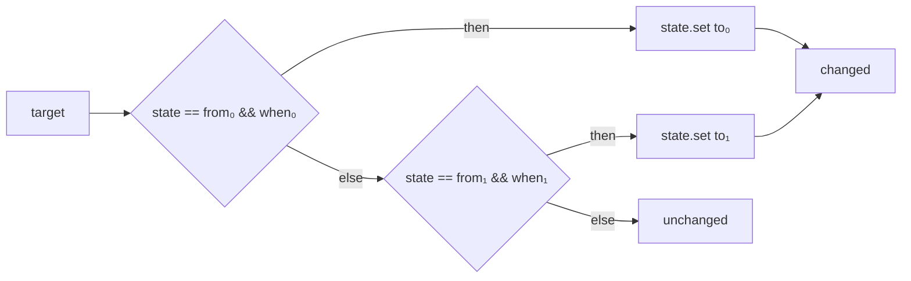

# ADR-0049: Bộ lọc (`state.filter`), state machine (desugar) và sub-workflow (hoãn)

- **Status:** Proposed
- **Date:** 2026-10-07
- **Level:** L2 Component
- **Deciders:** Claude Code theo uỷ quyền PO 2026-10-06 — chờ PO xác nhận
- **Related:** FR-BLK-08 (P2/P3, R11); [05 §2.6](../05-blocks-and-execution-model.md#26-state) (`sv_filter`, `sv_rate`, `sv_state_machine`); [06](../06-ir-and-compiler.md) (opcode `state.filter`, `state.rate` đã có trong enum IR v1); [ADR-0012](ADR-0012-execution-semantics.md); [ADR-0014](ADR-0014-ir-v1.md); [ADR-0045](ADR-0045-curated-multi-vss-blocks.md) (desugar nhiều node); [phases/M14](../phases/M14-services-curated-multiuser.md) #7

## Context
- Schema IR v1 (`modules/simvehicleapp-contracts/schemas/ir.v1.schema.json`, `nodeOpcode`) **đã liệt kê**
  `state.filter`, `state.rate`, nhưng chưa có args/ngữ nghĩa, chưa block, simulator hay backend nào hiện thực.
- Tiền lệ trạng thái theo node: `logic.in_range` mode `hysteresis` giữ trạng thái theo `node.id` suốt vòng đời app ở
  simulator và cả ba runtime (C++ `kInRange`, Python, Rust) — conformance đã PASS.
- 05 §2.6 dự kiến `sv_state_machine` với opcode `fsm.*`. Mọi phần của nó (so trạng thái, điều kiện, gán) đã có:
  `control.branch` + `state.set`. ADR-0045 đã đưa cơ chế compiler sinh nhiều node cho một block.
- Sub-workflow/function cần compiler đọc **nhiều graph** của project (hiện `/compile` nhận một graph), quy tắc
  tham số/kết quả, phát hiện đệ quy, và studio chọn workflow đích — thay đổi kiến trúc ở compiler, orchestrator, studio.
- Lỗi phát hiện khi khảo sát (2026-10-07): block biến (`sv_var_set`/`sv_var_get`/`sv_counter`) trỏ tới biến chưa khai
  báo làm compiler ném ngoại lệ (`undefined is not an object (evaluating 'v.type')`) thay vì trả diagnostic.

## Decision
1. **`sv_filter` → `state.filter`** (opcode IR v1 sẵn có; không đổi schema IR):
   - args: `value` (`$expr` số), `mode` ∈ `moving-average` | `exponential` | `median`, `window` (số nguyên 1…1000,
     cho `moving-average`/`median`), `alpha` (số thực trong (0, 1], cho `exponential`).
   - outputs: `value` (`double`, đơn vị của `value` vào), `samples` (`uint32`, số mẫu trong cửa sổ ≤ `window`; với
     `exponential` là tổng số mẫu đã nhận, dừng ở 4 294 967 295).
   - Trạng thái theo `node.id`, sống suốt vòng đời app (như hysteresis), mọi run dùng chung; reset khi app khởi động lại.
   - Ngữ nghĩa số học (PHẢI giống hệt nhau ở simulator và mọi runtime, `double` IEEE-754):
     - `moving-average`: cửa sổ N mẫu gần nhất (cũ → mới); kết quả = tổng cộng dồn **theo thứ tự cũ → mới** chia số mẫu.
     - `exponential`: mẫu đầu `y = x`; sau đó `y = y + alpha * (x − y)`.
     - `median`: bản sao cửa sổ sắp tăng dần; lẻ ⇒ phần tử giữa; chẵn ⇒ `(a + b) / 2` của hai phần tử giữa.
   - `value` lỗi (`no_value`…) ⇒ handle `error` như mọi node; mẫu không được thêm.
2. **`sv_state_machine` desugar** (không opcode `fsm.*`): props `name` (biến workflow giữ trạng thái), `transitions`
   (list `{from, when, to}`; `from` trống = mọi trạng thái); handle ra `changed`, `unchanged`. Compiler sinh với mỗi
   dòng i một `control.branch` (điều kiện `<biến> == from_i && when_i`, kiểu `from`/`to` = kiểu biến) và một
   `state.set` (gán `to_i`, rồi đi `changed`); `else` của dòng cuối đi `unchanged`. **Dòng đầu tiên khớp thắng**; chỉ
   một chuyển trạng thái mỗi lần chạy. Node đầu mang id block, node sau `src.inserted = true`.
3. Compiler PHẢI báo `BLOCK_PROPERTY_INVALID` (`data.reason = "unknown_variable"`) trên field `name` khi block biến/state
   machine trỏ tới biến chưa khai báo — không còn ném ngoại lệ. Không thêm mã diagnostic mới.
4. **Sub-workflow/function: hoãn** (không làm ở M14 này). Điều kiện để làm: ADR riêng về compile nhiều graph
   (`/compile` nhận project, inline có giới hạn độ sâu, cấm đệ quy), tham số/kết quả có kiểu, UI chọn workflow.
5. **`sv_rate` (`state.rate`): hoãn** — phụ thuộc khoảng thời gian thực giữa hai mẫu nên giá trị trên xe thật lệch theo
   jitter (parity P3 chỉ so được với dung sai giá trị, chưa có); làm khi có nhu cầu.

## Diagram

## Alternatives considered
| Phương án | Ưu | Nhược | Vì sao loại |
|---|---|---|---|
| Opcode `fsm.step` riêng | Một node, trace gọn | Thêm opcode ở simulator + 3 runtime + 3 generator cho ngữ nghĩa đã có | Desugar đủ, không rủi ro parity |
| Filter là hàm SVX (`avg(x, 5)`) | Không block mới | Hàm có trạng thái trong biểu thức thuần, phá folding/inline (ADR-0014 Notes §11) | Trái mô hình biểu thức thuần |
| `rate-limit`/`state.rate` ngay | Đủ bộ | Phụ thuộc thời gian thực ⇒ khó parity | Hoãn (Decision 5) |
| Sub-workflow inline ở studio | Không đổi compiler | Mất cập nhật khi workflow con đổi; trùng code | Không phải "function" thật |

## Consequences
- Tích cực: filter dùng được cho tín hiệu nhiễu (tốc độ, nhiệt độ, SoC); state machine không đổi runtime; sửa crash
  compiler với biến chưa khai báo.
- Tiêu cực / nợ: `state.filter` thêm code ở 4 nơi (simulator, C++/Python/Rust runtime + generator); state machine nhiều
  node cùng `blockId`. Sub-workflow và `state.rate` còn nợ.
- Ảnh hưởng module: core (blocks, compiler, simulator), `compiler-code-{cpp,python,rust}` (runtime, emitter,
  `backend.yaml`), contracts (IR_SPEC semantics, conformance C40/C41), studio (BlockConfig).

## Implementation
| Task | Module | Milestone |
|---|---|---|
| Lint biến chưa khai báo (Decision 3) | core/compiler | M14 #7 |
| `sv_state_machine` spec + desugar (dùng chung cơ chế nhiều node của ADR-0045) | core | M14 #7 |
| `sv_filter` spec + lowering + simulator | core | M14 #7 |
| `state.filter` runtime + emitter + `backend.yaml` | compiler-code-cpp/python/rust | M14 #7 |
| Conformance C40 (filter), C41 (state machine) + `ir.json` | contracts fixtures | M14 #7 |
| BlockConfig + block-specs sync + block reference | studio, docs | M14 #7 |

## Verification
- Unit compiler: desugar state machine (thứ tự, `then`/`else`, `changed`/`unchanged`, kiểu `from`/`to`), biến chưa
  khai báo ⇒ diagnostic; tất định.
- Conformance C40/C41 PASS trên simulator và P1 của C++/Python/Rust (CI) — cùng số `double` tuyệt đối.
- `block-parity.test.ts` PASS.

## Notes / Deviations
### 2026-10-07 — hiện thực
- Compiler: cơ chế "một block ⇒ nhiều node" của ADR-0045 tổng quát thành `Part` (`compile.ts`), composite và state machine
  dùng chung; golden IR cũ (GW-A..G, C01..C39) **không đổi byte**.
- `state.filter`: simulator + runtime C++ (`FilterState`, build đã `-ffp-contract=off`), Python (cộng bằng vòng lặp — `sum()`
  của CPython bù sai số nên khác), Rust (`partial_cmp` sort ổn định, giữ thứ tự ±0 như JS/Python). Conformance P1 local:
  Python 49/49, Rust 49/49 (rustfmt/clippy sạch), C++ C39–C41 PASS; simulator 1114 test core PASS.
- Lệch 05 §2.6: không có opcode `fsm.*` (desugar); `sv_state_machine` category `state` nhưng có handle nhánh như block flow.
