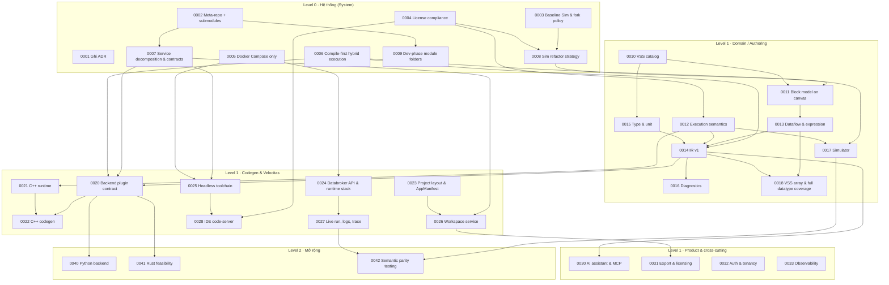

# ADR Index — từ tổng quan lớn đến chức năng cụ thể

> ADR = Architecture Decision Record. Mỗi ADR ghi **một** quyết định: bối cảnh → quyết định → phương án đã loại → hệ quả → việc cần làm → cách kiểm chứng.
> Trạng thái ban đầu của tất cả: **Proposed**. Chuyển **Accepted** theo [roadmap §4](../13-implementation-roadmap.md#4-quy-tắc-chuyển-trạng-thái-adr). Template: [TEMPLATE.md](TEMPLATE.md).

> Hiện có 34 ADR. Status trong từng file là nguồn kiểm prerequisite. 2026-10-03: PO chấp thuận ADR-0004/0006/0007 (Accepted) — đủ ADR cho gate M0; ADR-0002 Accepted cho release, dev được điều chỉnh bởi ADR-0009. Xem [review và bằng chứng](../../docs/reports/2026-10-03-documentation-review.md); không coi review tài liệu là chấp thuận ADR.

## 1. Cây phân cấp quyết định

## 2. Danh sách
| ADR | Tiêu đề | Level | Milestone cần Accepted |
|---|---|---|---|
| [0001](ADR-0001-record-architecture-decisions.md) | Ghi quyết định kiến trúc bằng ADR — **Accepted** | L0 | M0 ✔ |
| [0002](ADR-0002-meta-repo-and-submodules.md) | Meta-repo + repo con độc lập (git submodule + lock) | L0 | M0 |
| [0003](ADR-0003-upstream-baseline-and-fork-policy.md) | Baseline Sim v0.7.13 & chính sách fork — **Accepted** | L0 | M0 ✔ |
| [0004](ADR-0004-license-compliance.md) | Tuân thủ license (gỡ `ee/`, clean-room Scratch, Open VSX) + [denylist opcode Scratch](scratch-opcode-denylist.md) | L0 | M0 |
| [0005](ADR-0005-docker-compose-only.md) | Docker Compose là mode chạy duy nhất — **Accepted** | L0 | M0 ✔ |
| [0006](ADR-0006-compile-first-execution-model.md) | Mô hình thực thi hybrid compile-first | L0 | M0 |
| [0007](ADR-0007-service-decomposition-and-contracts.md) | Phân rã service, tầng & contract | L0 | M0 |
| [0008](ADR-0008-sim-refactor-strategy.md) | Chiến lược refactor Sim | L0 | M1 |
| [0009](ADR-0009-dev-phase-module-folders.md) | **Dev phase: module folders + root compose (submodule khi release)** — Accepted | L0 | M0 ✔ |
| [0010](ADR-0010-vss-catalog.md) | VSS Catalog service | L1 | M2 |
| [0011](ADR-0011-block-model-on-canvas.md) | Block vehicle trên canvas Sim (generic + VSS-driven) | L1 | M2 |
| [0012](ADR-0012-execution-semantics.md) | Ngữ nghĩa thực thi (trigger/run/yield/policy) | L1 | M3 |
| [0013](ADR-0013-dataflow-and-expression-language.md) | Dataflow bằng tham chiếu + expression language | L1 | M3 |
| [0014](ADR-0014-ir-v1.md) | Canonical IR v1 | L1 | M4 |
| [0015](ADR-0015-type-and-unit-system.md) | Hệ kiểu & đơn vị | L1 | M4 |
| [0016](ADR-0016-diagnostics-catalog.md) | Catalog diagnostics | L1 | M4 |
| [0017](ADR-0017-simulator.md) | Simulator IR + virtual clock | L1 | M5 |
| [0018](ADR-0018-vss-array-and-full-datatype-coverage.md) | **VSS array & full datatype coverage** (UI→expression→IR→codegen→runtime) | L1 | M3/M4 |
| [0020](ADR-0020-backend-plugin-contract.md) | Backend plugin contract (`compiler-code-<lang>`) | L1 | M6 |
| [0021](ADR-0021-cpp-runtime-library.md) | Runtime C++ (strand, policies, trace) | L1 | M6 |
| [0022](ADR-0022-cpp-codegen-strategy.md) | Chiến lược sinh C++ | L1 | M6 |
| [0023](ADR-0023-velocitas-project-layout-and-manifest.md) | Layout project Velocitas & merge AppManifest | L1 | M7 |
| [0024](ADR-0024-databroker-api-and-runtime-stack.md) | Databroker API & runtime stack compose | L1 | M8 (spike M0) |
| [0025](ADR-0025-headless-velocitas-toolchain.md) | Toolchain Velocitas headless | L1 | M7 (spike M0) |
| [0026](ADR-0026-workspace-service.md) | Workspace service (single writer, atomic) | L1 | M7 |
| [0027](ADR-0027-live-run-logs-and-trace.md) | Live run, log, trace streaming | L1 | M8 |
| [0028](ADR-0028-ide-code-server.md) | IDE code-server | L1 | M9 |
| [0030](ADR-0030-ai-assistant-mcp.md) | AI assistant & MCP | L1 | M10 |
| [0031](ADR-0031-export-and-licensing.md) | Export & licensing hooks | L1 | M9 |
| [0032](ADR-0032-auth-and-tenancy.md) | Auth & tenancy | L1 | M11 |
| [0033](ADR-0033-observability.md) | Observability | L1 | M11 |
| [0040](ADR-0040-python-backend.md) | Python backend | L2 | M12 |
| [0041](ADR-0041-rust-backend-feasibility.md) | Rust backend feasibility | L2 | M13 |
| [0042](ADR-0042-semantic-parity-testing.md) | Semantic parity testing | L2 | M11 |

ADR dự kiến viết sau (M14): 0043 gRPC service interface, 0044 standalone service apps, 0045 curated multi-VSS blocks, 0046 per-run runtime stack & multi-user, 0047 migrate `kuksa.val.v2`, 0048 Quick Run interpreter (tuỳ chọn).

## 3. Ánh xạ ADR bắt buộc của Master Plan v2
| Master Plan | ADR ở đây | Ghi chú |
|---|---|---|
| ADR-001 custom-blocks vs registry | **0011** | custom-blocks là tính năng Enterprise ⇒ không dùng |
| ADR-002 sync upstream | **0003** | |
| ADR-003 source map | **0022** §Source map + **0027** | |
| ADR-004 expression parser | **0013** | tự viết Pratt parser |
| ADR-005 versioning runtime | **0021** §Versioning | vendored MVP, Conan package P2 |

## 4. Review pass 2026-10-01 — sai lệch/khoảng trống đã sửa (research trực tiếp source, không đoán)
| ADR | Vấn đề tìm thấy | Đã sửa bằng |
|---|---|---|
| 0030 + [00](../00-research-findings.md) | **MCP TS SDK ghi sai "v2.2.0"** — package chưa từng có major version 2 | `npm view @modelcontextprotocol/sdk versions` → thật là `1.31.0` (2026-09-28); sửa cả 2 file + bắt buộc re-verify tại M10 |
| 0032 | **Mâu thuẫn**: ghi "SSO nằm trong ee/ ⇒ bị gỡ, cần ADR riêng" trong khi [11a](../11a-ee-clean-room-replacement.md) đã đúng là chỉ UI thuộc ee/ | Đọc `apps/sim/lib/auth/auth.ts`: backend là plugin MIT `@better-auth/sso@1.6.11` (cùng version `better-auth`), chỉ 1 hằng số import từ `ee/`; DB schema cũng sẵn (Apache) |
| 0022 | "Spike M6" bỏ ngỏ: path VSS trùng keyword C++ xử lý ra sao; và `.clang-format` thật dùng số nào | Đọc source `vehicle-model-generator` (`cpp_keywords.py`, `cpp_generator.py`): không escape tên member, nhưng quy tắc VSS (bắt buộc viết hoa) + keyword C++ (luôn viết thường) khiến trùng là bất khả thi về cấu trúc; đọc trực tiếp `.clang-format` của template (đã vendor sẵn trong repo) xác nhận `IndentWidth:4, ColumnLimit:100` đúng như hedge — cả hai đóng hẳn, không cần spike |
| 0023 | "Spike" bỏ ngỏ: key tuỳ biến `x-sv-managed` trong AppManifest có an toàn không | Đọc source CLI (`app-manifest.ts`) + `velocitas_lib` (Python): cả hai chỉ `JSON.parse`/`json.loads` thuần, không hề validate schema/`additionalProperties` ở bất kỳ đâu trong toolchain Velocitas |
| 0013 | Lưỡng lự "Monaco/CodeMirror" cho editor expression | `apps/sim/package.json` đã có sẵn `@monaco-editor/react`+`monaco-editor`, không có CodeMirror ⇒ chốt Monaco, không thêm thư viện |
| 0010 | Node schema VSS thiếu field `comment`; chưa có ca test thật cho `deprecation` | Tải trực tiếp `vss_rel_4.0.json`/`vss_rel_4.2.json`, liệt kê đủ key thật + ví dụ `deprecation` thật từ v4.2 (`Vehicle.Body.RefuelPosition`) |
| 0004 | "Danh sách tên opcode Scratch phổ biến" chỉ là câu nói suông, không thể implement CI | Tạo [scratch-opcode-denylist.md](scratch-opcode-denylist.md) (nguồn Scratch Wiki, không phải source code) |
| 0031 | Chưa chọn thư viện ký Ed25519 | Xác nhận `node:crypto` core hỗ trợ Ed25519 sẵn (Node ≥ 12), không cần dependency |
| 0001/0003/0005 | Status "Proposed" dù đã được thực thi/verify thật trong M0 | Bump **Accepted** kèm bằng chứng cụ thể (baseline SHA dùng thật, M0 spike report) |
