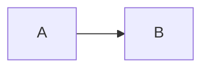

# ADR-XXXX: <Tiêu đề ngắn, dạng mệnh đề quyết định>

- **Status:** Proposed | Accepted | Superseded by ADR-YYYY | Deprecated
- **Date:** YYYY-MM-DD
- **Level:** L0 System | L1 Subsystem | L2 Component
- **Deciders:** <tên/vai trò>
- **Related:** requirements (FR-/NFR-), ADR khác, tài liệu analysis

## Context
Vấn đề, ràng buộc, dữ kiện đã verify (có link nguồn/commit).

## Decision
Quyết định cụ thể, đo được. Dùng "PHẢI/KHÔNG ĐƯỢC".

## Diagram

## Alternatives considered
| Phương án | Ưu | Nhược | Vì sao loại |
|---|---|---|---|

## Consequences
- Tích cực:
- Tiêu cực / nợ kỹ thuật:
- Ảnh hưởng tới module:

## Implementation
| Task | Module | Milestone |
|---|---|---|

## Verification
Test/gate nào chứng minh quyết định được thực hiện đúng.

## Notes / Deviations
Ghi sai khác giữa tài liệu và source thật khi implement (Master Plan Part 15 #6).
